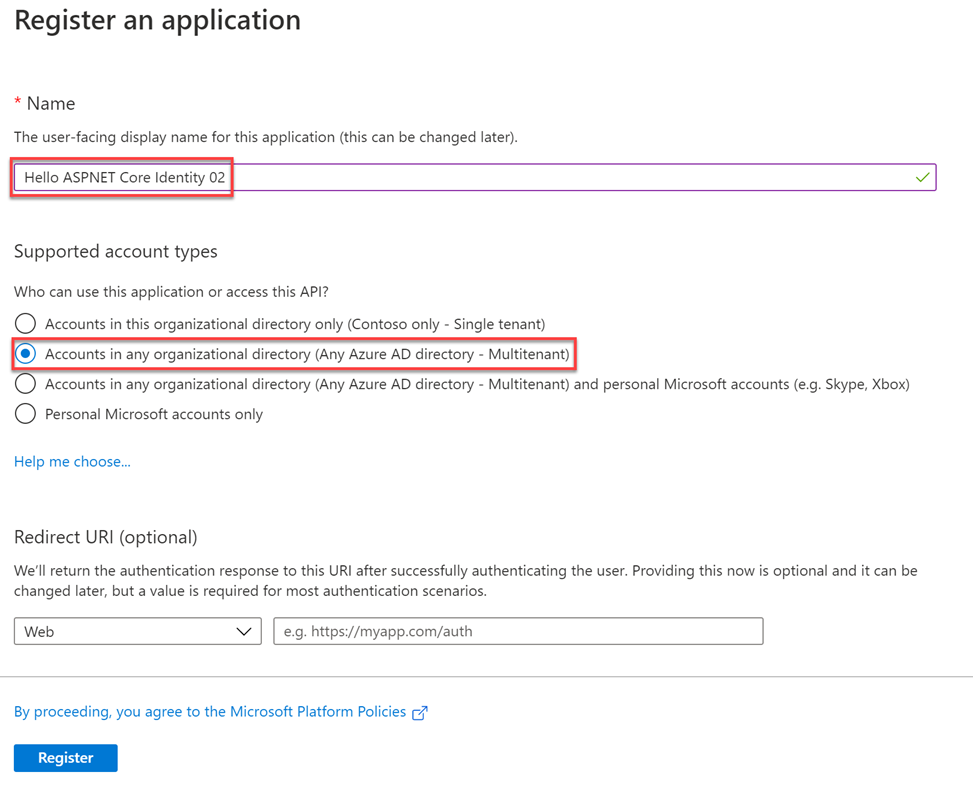

# Exercise 2: Implementing authentication

This exercise will demonstrate the different account types that are used within the Microsoft identity platform.

**Note**:
This exercise demonstrates signing into a web application using two different accounts. These two accounts will come from two organizations, one of them being the organization where the Azure AD application is registered. Therefore, in order to complete the exercise, you'll need access to two user accounts in different Azure AD directories.

## Task 1: Create application that only allows single organization sign in

In this task, you will register an application in the Azure portal that allows users from the current organization to sign in.
### Register a single-tenant Azure AD application

1. From the Azure portal [https://portal.azure.com](https://portal.azure.com/), navigate to **Azure Active Directory**.

1. Select **Manage > App registrations** in the left-hand navigation.

1. On the **App registrations** page, select **New registration**.

1. On the **Register an application** page, set the values as follows:

    - **Name**: Hello ASPNET Core Identity 01

    - **Supported account types**: Accounts in this organizational directory only (Single tenant)

    

1. Select **Register** to create the application.

1. On the **Hello ASPNET Core Identity 01** page, copy the values **Application (client) ID** and **Directory (tenant) ID**; you'll need these values later in this exercise.

    

1. On the **Hello ASPNET Core Identity 01** page, select the **Add a Redirect URI** link under the **Redirect URIs**.

1. Locate the section **Redirect URIs** and add the following two URLs:

    - **https://localhost:3007**

    - **https://localhost:3007/signin-oidc**

1. Add the following **Logout URL**: **https://localhost:3007/signout-oidc**

1. Locate the section **Implicit grant** and select both **Access tokens** and **ID tokens**. This tells Azure AD to return these tokens the authenticated user if requested.

1. Select **Save** when finished setting these values.


## Task 2: Create a single organization ASP.NET core web application

In this first application, you'll create an ASP.NET Core web application that allows users from the current organization to sign in and display their information.
1. Open your command prompt, navigate to a directory where you want to save your work, create a new folder, and change directory into that folder. For example:

    ```powershell
    Cd c:/LabFiles
    md SingleOrg
    cd SingleOrg
    ```

1. Execute the following command to create a new ASP.NET Core MVC web application:

    ```powershell
    dotnet new mvc --auth SingleOrg
    ```

1. Open the folder in Visual Studio code by executing from the project directory: `code .`

### Configure the web application with the Azure AD application you created

1. Locate and open the **./appsettings.json** file in the ASP.NET Core project.

1. Set the **AzureAd.Domain** property to the domain of your Azure AD tenant where you created the Azure AD application (*for example: contoso.onmicrosoft.com*).

1. Set the **AzureAd.TenantId** property to the **Directory (tenant) ID** you copied when creating the Azure AD application in the previous step.

1. Set the **AzureAd.ClientId** property to the **Application (client) ID** you copied when creating the Azure AD application in the previous step.

### Update the web application's launch configuration

1. Locate and open the **./Properties/launchSettings.json** file in the ASP.NET Core project.

1. Set the **iisSettings.iisExpress.applicationUrl** property to **https://localhost:3007**.

1. Set the **iisSettings.iisExpress.sslPort** property to **3007**.

### Update the user experience

1. Finally, update the user experience of the web application to display all the claims in the OpenID Connect ID token.

1. Locate and open the **./Views/Home/Index.cshtml** file.

1. Add the following code to the end of the file:

    ```powershell
    @if (User.Identity.IsAuthenticated)
    {
    <div>
        <table cellpadding="2" cellspacing="2">
            <tr>
                <th>Claim</th>
                <th>Value</th>
            </tr>
            @foreach (var claim in User.Claims)
            {
                <tr>
                    <td>@claim.Type</td>
                    <td>@claim.Value</td>
                </tr>
            }
        </table>
    </div>
    }
    ```

## Task 3: Build and test the single organization web app

1. Execute the following command in a command prompt to compile and run the application:

    ```powershell
    dotnet build
    dotnet run
    ```

1. Open a browser and navigate to the url **https://localhost:5001**. The web application will redirect you to the Azure AD sign in page.

1. Sign in using a Work and School account from your Azure AD directory. Azure AD will redirect you back to the web application. Notice some of the details from the claims included in the ID token.

    

1. Take special note of the **tenantid** and **upn** claim. These claims indicate the ID of the Azure AD directory and ID of the user that signed in. Make a note of these values to compare them to other options in a minute.

1. Now try logging in as a user from a different organization. Select the **Sign out** link in the top left. Wait for Azure AD and the web application signs out the current user. When the web application reloads, repeat the sign in process, except this time try signing in as a user from a different organization or use a Microsoft Account.

1. Notice Azure AD will reject the user's sign in, explaining that the user's account doesn't exist in the current tenant.

1. Stop the web server by pressing **CTRL+C** in the command prompt.

## Task 4: Create application that allows any organization's users to sign in

In this task, you will register an application in the Azure portal that allows users from any organization or Microsoft Accounts to sign in.
### Register a multi-tenant Azure AD application

1. From the Azure portal [https://portal.azure.com](https://portal.azure.com/), navigate to **Azure Active Directory**.

1. Select **Manage > App registrations** in the left-hand navigation.

1. On the **App registrations** page, select **New registration**.

1. On the **Register an application** page, set the values as follows:

    - **Name:** Hello ASPNET Core Identity 02

    - **Supported account types**: Accounts in any organizational directory only (Any Azure AD directory - Multitenant)

    

1. Select **Register** to create the application.

1. On the **Hello ASPNET Core Identity 02** page, copy the values **Application (client) ID** and **Directory (tenant) ID**; you'll need these values later in this exercise.

1. On the **Hello ASPNET Core Identity 02** page, select the **Add a Redirect URI** link under the **Redirect URIs**.

1. Locate the section **Redirect URIs** and add the following two URLs:

    - **https://localhost:3007**

    - **https://localhost:3007/signin-oidc**

1. Add the following **Logout URL**: **https://localhost:3007/signout-oidc**

1. Locate the section **Implicit grant** and select both **Access tokens** and **ID tokens**. This tells Azure AD to return these tokens the authenticated user if requested.

1. Select **Save** when finished setting these values.


## Task 5: Create a multiple organization ASP.NET core web application

In this second application, you'll create an ASP.NET Core web application that allows users from any organization or Microsoft Accounts to sign in and display their information.

1. Open your command prompt, navigate to a directory where you want to save your work, create a new folder, and change directory into that folder. For example:

    ```powershell
    Cd c:/LabFiles
    md MultiOrg
    cd MultiOrg
    ```

1. Execute the following command to create a new ASP.NET Core MVC web application:

    ```powershell
    dotnet new mvc --auth MultiOrg
    ```

1. Open the folder in Visual Studio code by executing from the project directory: `code .`

### Configure the web application with the Azure AD application you created

1. Locate and open the **./appsettings.json** file in the ASP.NET Core project.

1. Set the **AzureAd.ClientId** property to the **Application (client) ID** you copied when creating the Azure AD application in the previous step.

### Update the web application's launch configuration

1. Locate and open the **./Properties/launchSettings.json** file in the ASP.NET Core project.

1. Set the **iisSettings.iisExpress.applicationUrl** property to **https://localhost:3007**.

1. Set the **iisSettings.iisExpress.sslPort** property to **3007**.

### Update the user experience

1. Finally, update the user experience of the web application to display all the claims in the OpenID Connect ID token.

1. Locate and open the **./Views/Home/Index.cshtml** file.

1. Add the following code to the end of the file:

    ```powershell
    @if (User.Identity.IsAuthenticated)
    {
    <div>
        <table cellpadding="2" cellspacing="2">
            <tr>
                <th>Claim</th>
                <th>Value</th>
            </tr>
            @foreach (var claim in User.Claims)
            {
                <tr>
                    <td>@claim.Type</td>
                    <td>@claim.Value</td>
                </tr>
            }
        </table>
    </div>
    }
    ```

1. Save the above all changes.

## Task 6: Build and test the multiple organization web app

1. Execute the following command in a command prompt to compile and run the application:

    ```powershell
    dotnet build
    dotnet run
    ```

1. Open a browser and navigate to the url **https://localhost:5001**. The web application will redirect you to the Azure AD sign in page.

1. Sign in using a Work and School account from your Azure AD directory. Azure AD will redirect you back to the web application. Notice some of the details from the claims included in the ID token.

    

1. Take special note of the **tenantid** and **upn** claim. These indicate the ID of the Azure AD directory and ID of the user that signed in. Make a note of these values to compare them to other options in a minute.

1. Now try logging in as a user from a different organization. Select the **Sign out** link in the top left. Wait for Azure AD and the web application signs out the current user.

1. This time, the user is prompted to first trust the application:

    

1. Select **Accept**.

1. Notice the web application's page loads with different claims, specifically for the **tenantid** and **upn** claim. This indicates the user is not from the current directory where the Azure AD application is registered:

    

1. Stop the web server by going back to the running project in Visual Studio Code. From the Terminal, press **CTRL+C** in the command prompt.

## Review

In this exercise, you learned how to create different types of Azure AD applications and use an ASP.NET Core application to support the different sign in options that support different types of accounts.


### [Go to exercise 03 instructions -->](04-Exercise-3-Implementing-application-that-supports-B2B.md)

### [<-- Back to readme](../README.md)