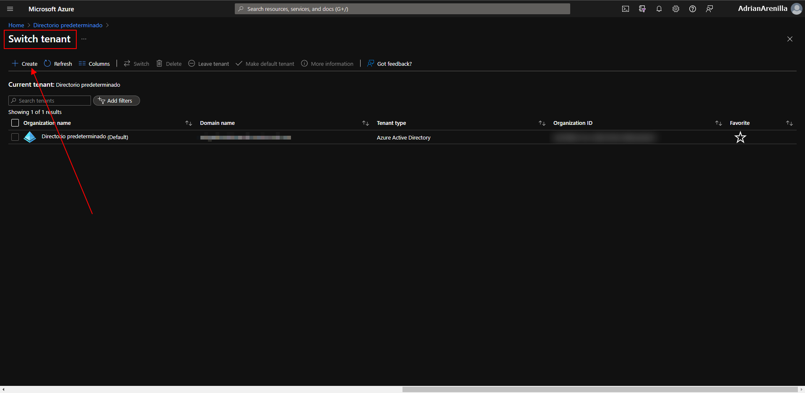
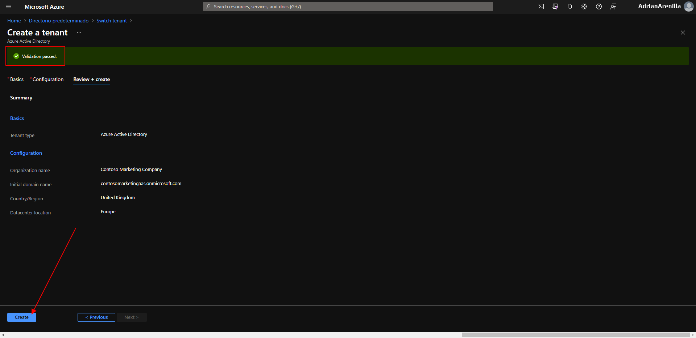
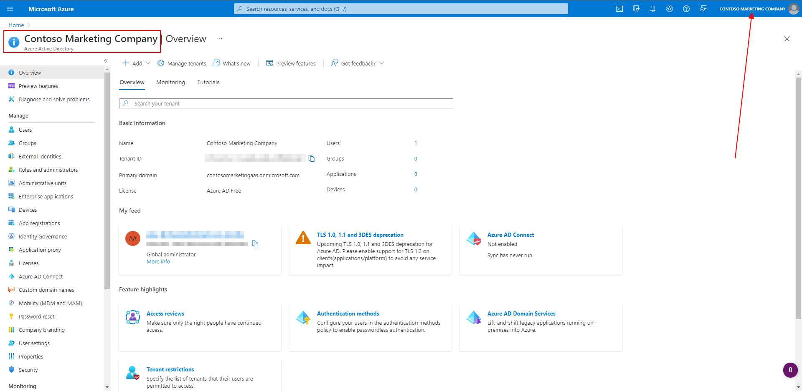
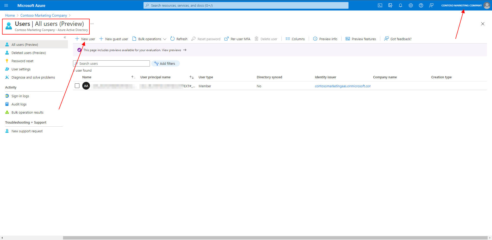
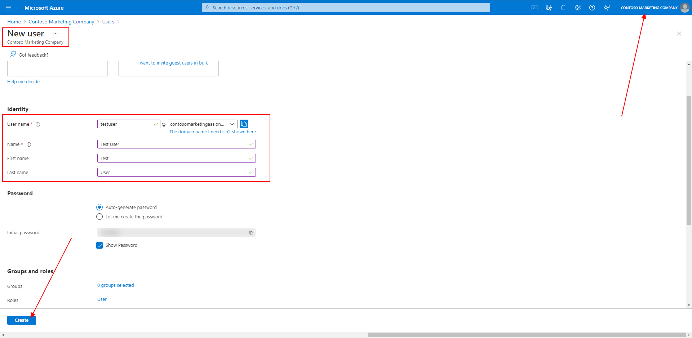
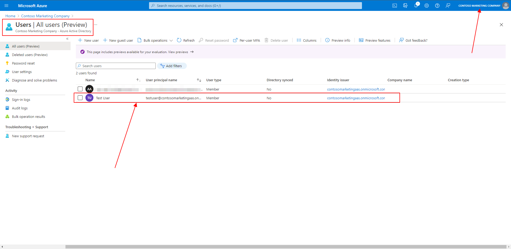
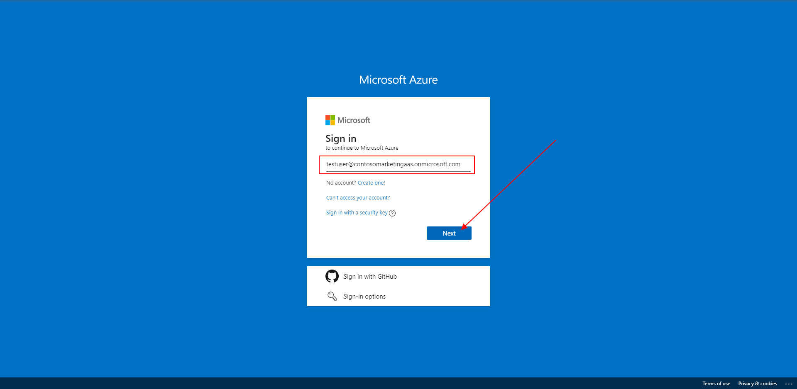
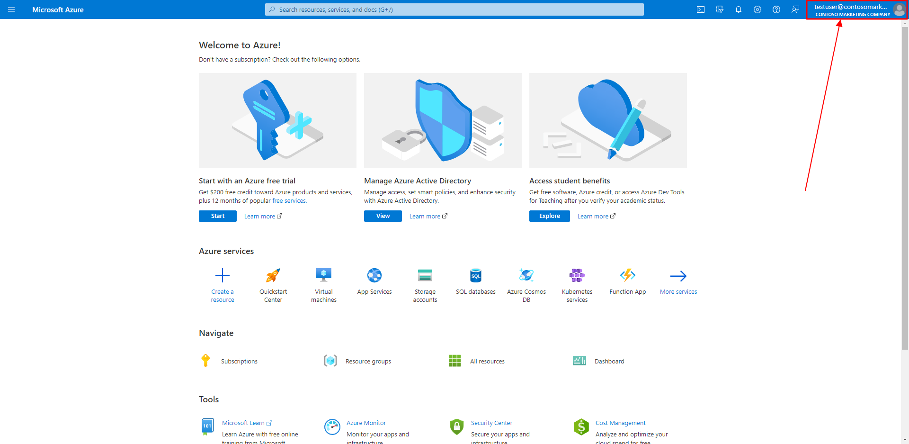
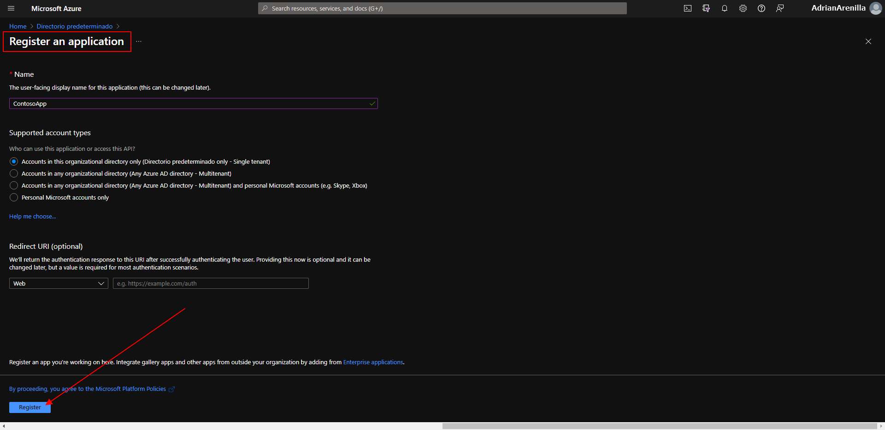
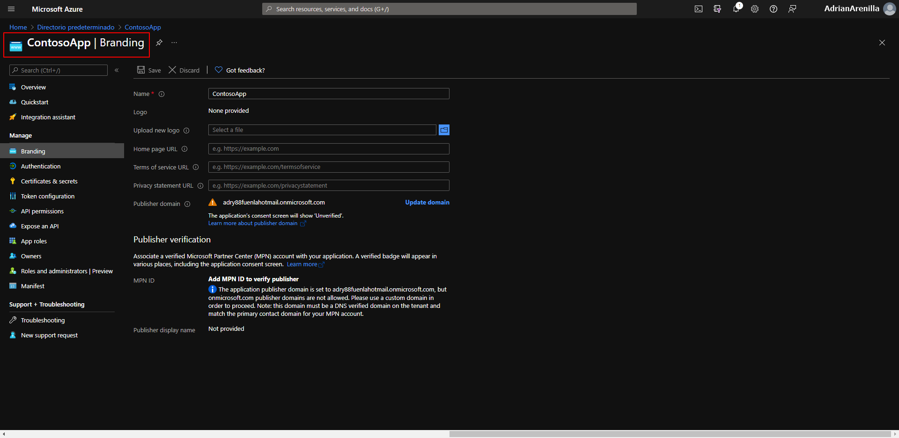

# Microsoft Ms-600 (Adrián Arenilla Seco) - LAB 01

## Exercise 01: Registering an application in Azure Active Directory
### [Go to exercise 01 instructions -->](02-Exercise-1-Registering-an-application-in-Azure-Active-Directory.md)

Go to create an Active Directory tenant.

Create a new tenant.

Change to the new directory and verify that it has been created correctly.

Create a user in new Active Directory tenant.

Create a user in new Active Directory tenant.

Verify the new user created.

Sign in with your new *testuser@contosomarketingxx@onmicrosoft.com* account.

Verify that you are logged in correctly.

Register a new application.

Branding of the application.
