# Microsoft Ms-600 (Adrián Arenilla Seco) - LAB 01

## Exercise 2: Implementing authentication
### [Go to exercise 02 instructions -->](03-Exercise-2-Implementing-authentication.md)

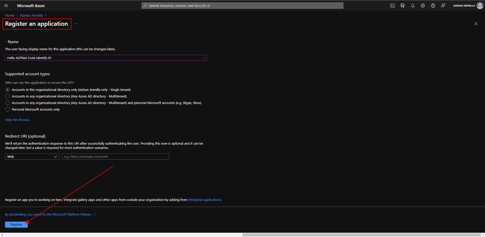
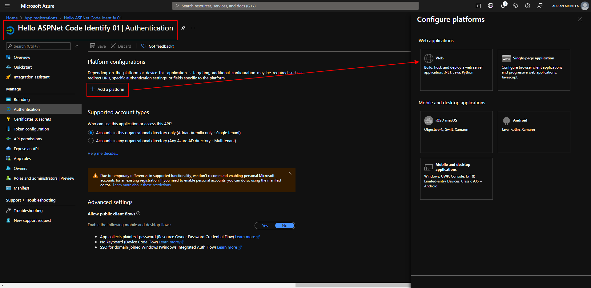
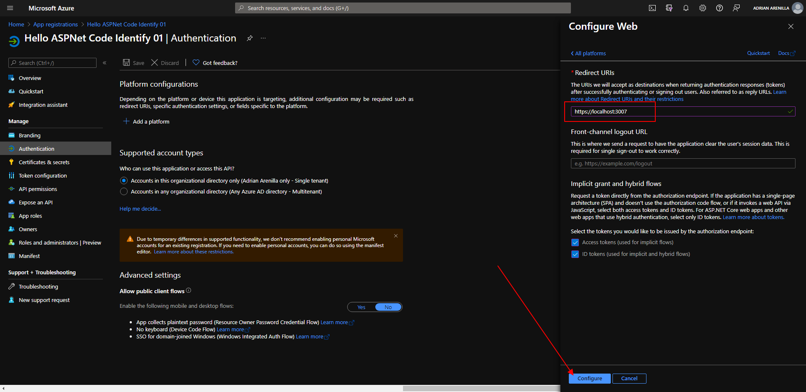
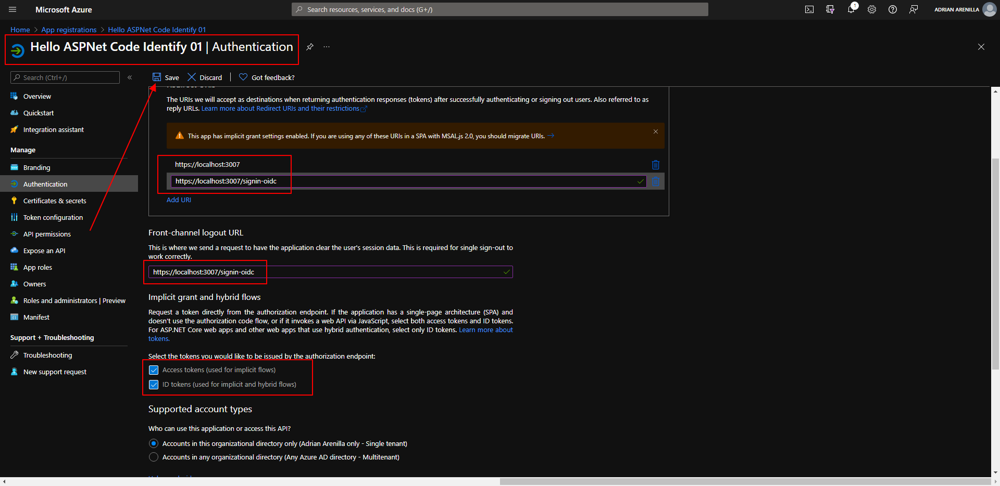
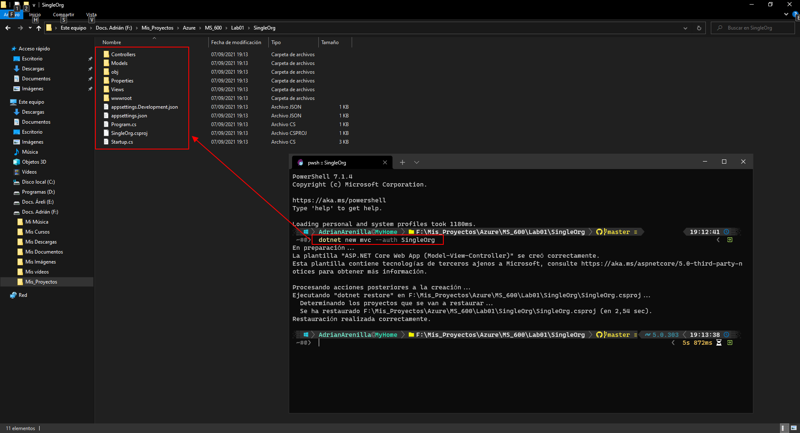
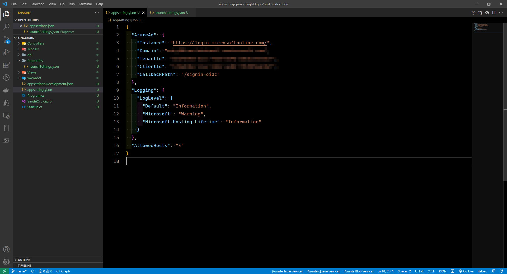
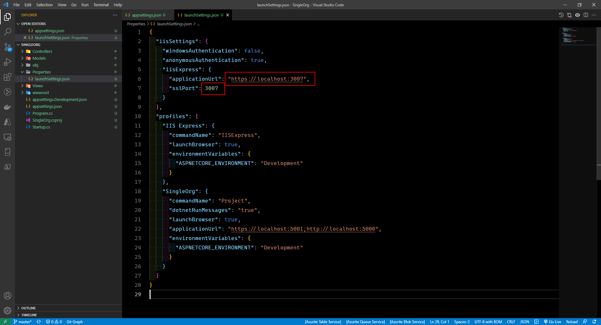
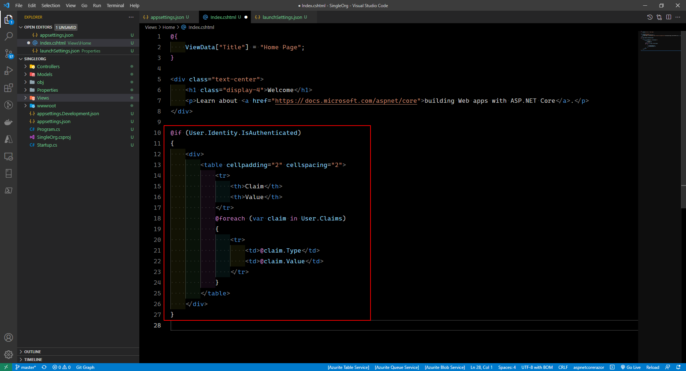
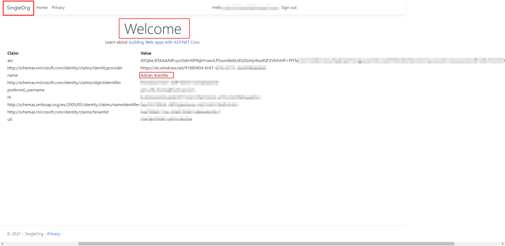
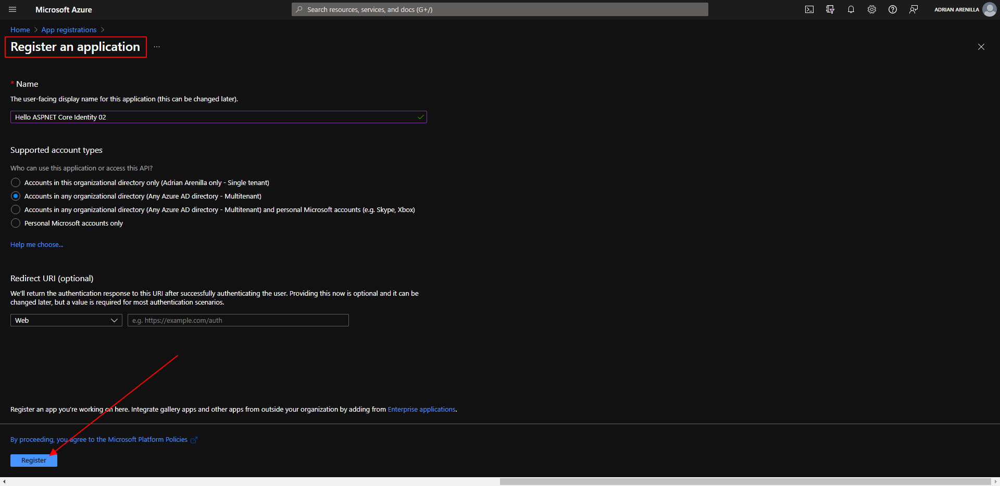
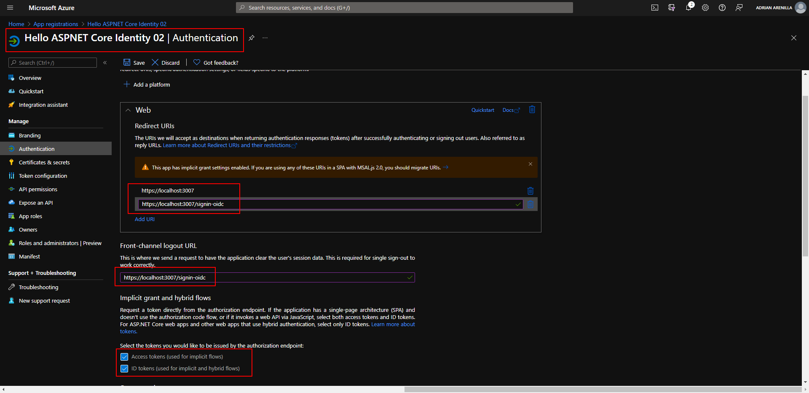
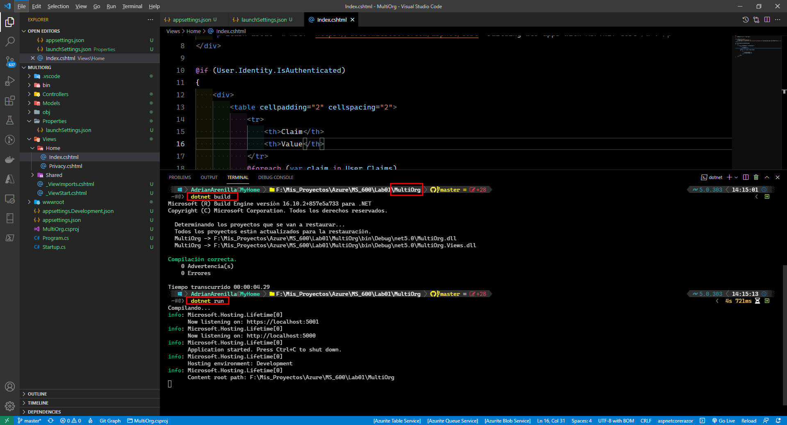
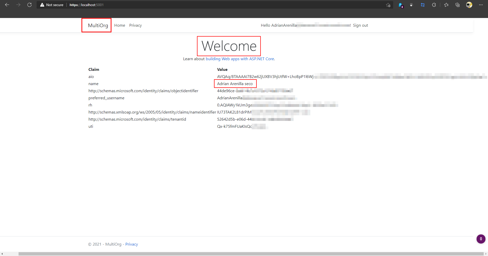
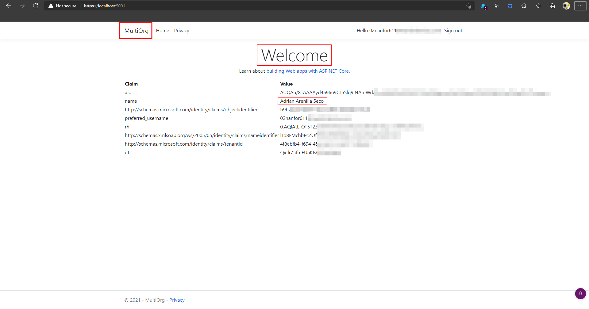

### [<-- Back to readme](../../../../)