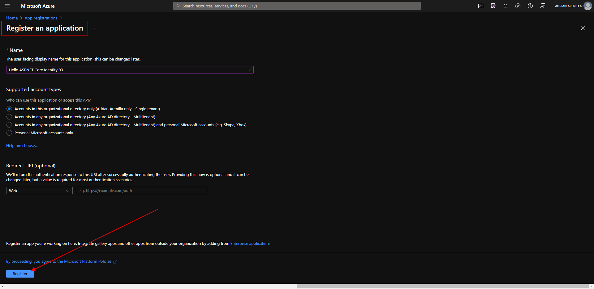
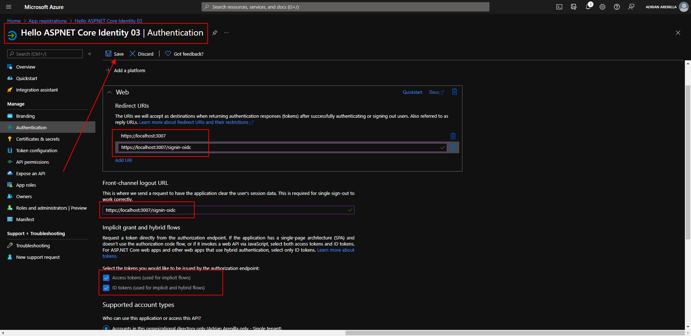
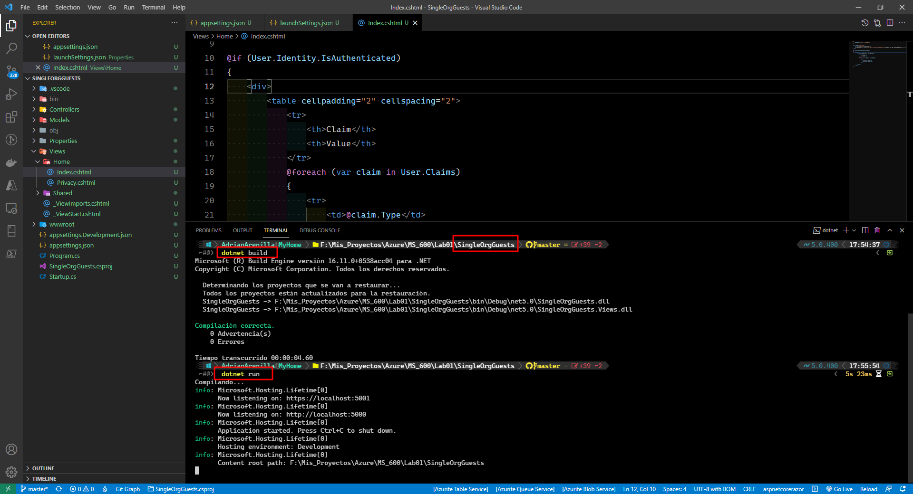
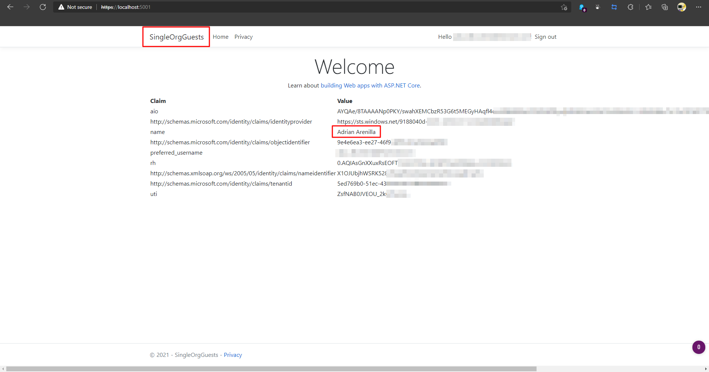
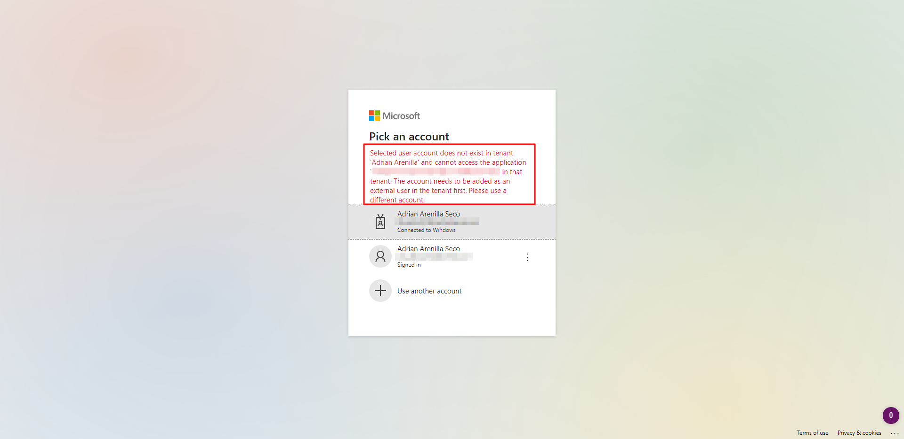
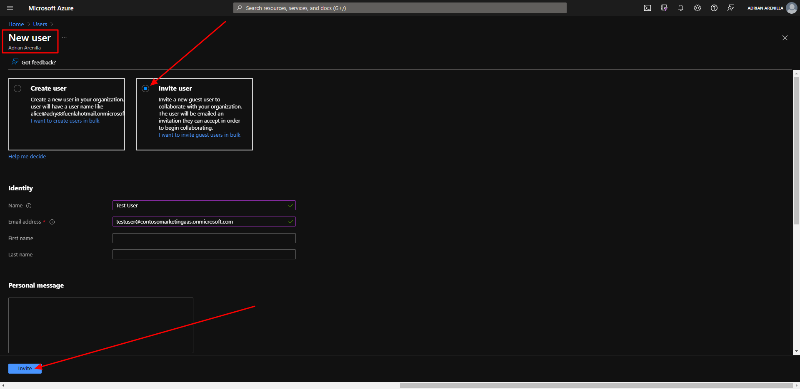
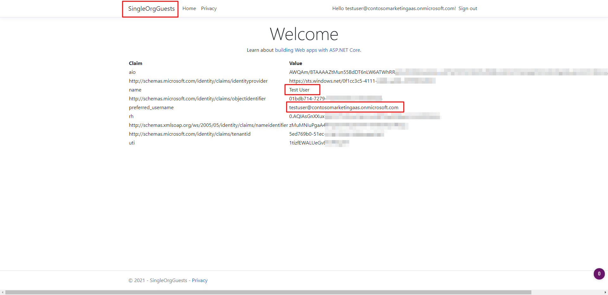

# Microsoft Ms-600 (Adrián Arenilla Seco) - LAB 01

## Exercise 3: Implementing application that supports B2B
### [Go to exercise 03 instructions -->](04-Exercise-3-Implementing-application-that-supports-B2B.md)

