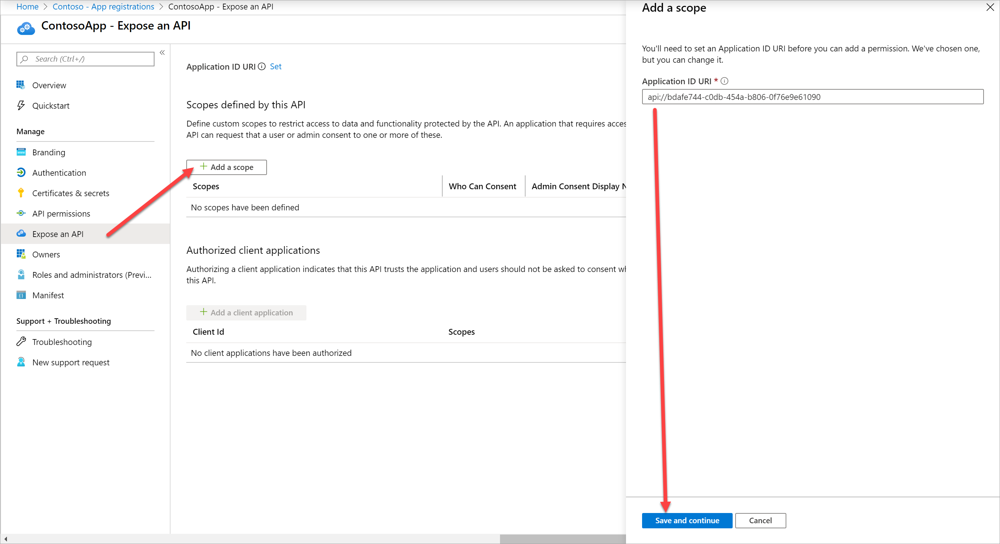
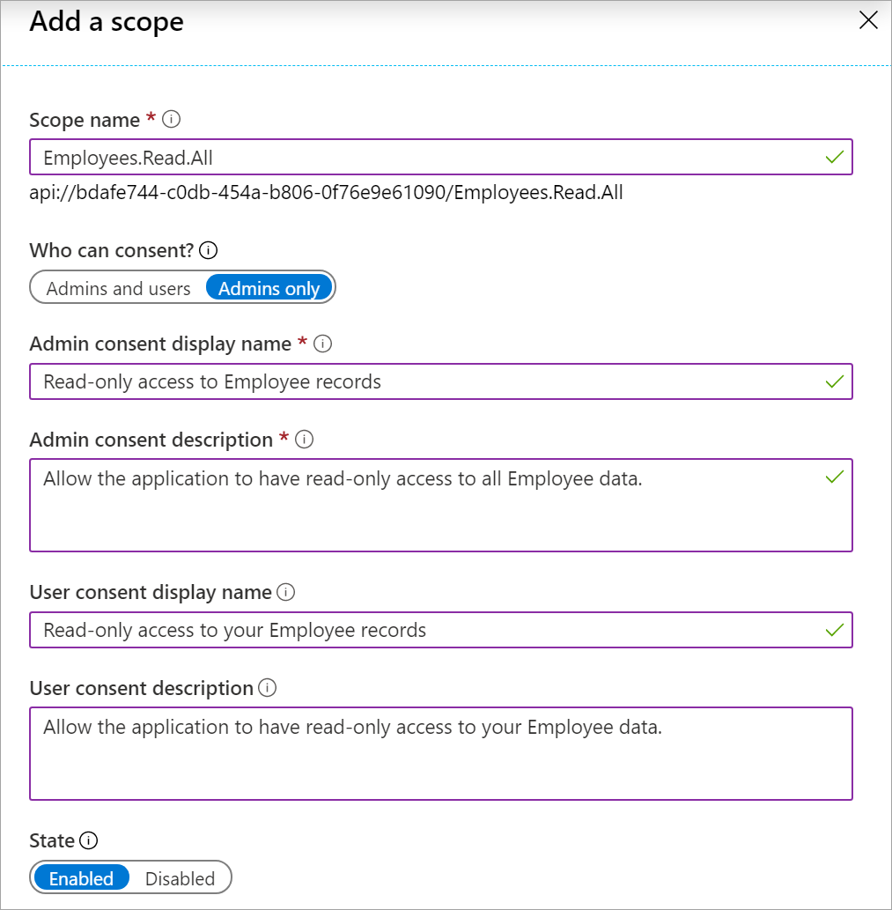
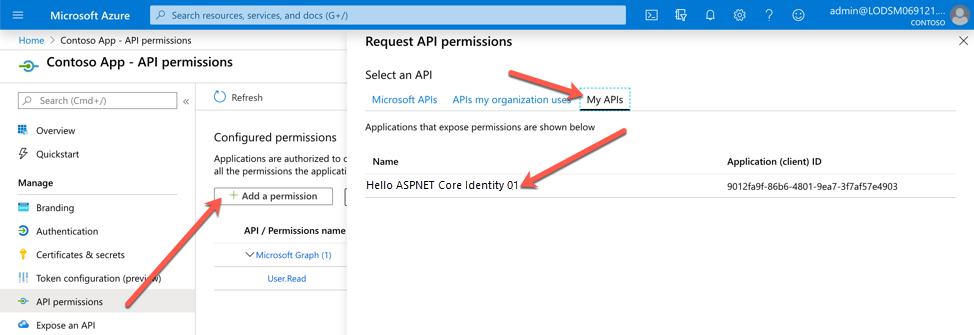

# Exercise 4: Configuring permissions to consume an API

In this exercise, you'll learn how to configure an application to expose a new scope to make it available to client applications.
## Task 1: Navigate to an application to configure

1. In the left-hand navigation pane of the Azure portal, select the **Azure Active Directory** service and then select **App registrations**.

1. Find and select the application you want to configure such as **ContosoApp**. Once you've selected the app, you'll see the application's **Overview** or main registration page.

1. Navigate to **Expose an API**.

## Task 2: Add a scope

1. In the **Scopes defined by this API** section, select **Add a scope**.

1. If you have not set an **Application ID URI**, you will see a prompt to enter one. Enter your application ID URI or use the one provided and then select **Save and continue**.

    

1. When the **Add a scope** page appears, enter your scope's information:

    1. In the **Scope name** textbox, enter a meaningful name for your scope. For example, **Employees.Read.All**.

    1. For **Who can consent**, select whether this scope can be consented to by users, or if admin consent is required. Select **Admins only** for higher-privileged permissions.

    1. Provide a user-friendly **Admin consent display name** and **Admin consent description**.

1. Provide a user-friendly **User consent display name** and **User consent description**.

1. Set the **State** and select **Add scope** when you're done.

1. Your Add a Scope pane should look similar to the image below.



### Expose a new scope or role through the application manifest

Now that you learned how to create a new scope using the UI, next you will add a new scope through the application manifest.

1. In the left navigation menu of your app, select **Manifest**.

1. A web-based manifest editor opens, allowing you to **Edit** the manifest within the portal. Optionally, you can select **Download** and edit the manifest locally, and then use **Upload** to reapply it to your application.

1. Scroll down until you find the **oauth2Permissions** collection.

1. Below is the JSON element that was added to the oauth2Permissions collection.

    ```json
    {
      "adminConsentDescription": "Allow the application to have read-only access to all Employee data.",
      "adminConsentDisplayName": "Read-only access to Employee records",
      "id": "ede407eb-3c3a-4918-9e2e-803d2298e247",
      "isEnabled": true,
      "type": "User",
      "userConsentDescription": "Allow the application to have read-only access to your Employee data.",
      "userConsentDisplayName": "Read-only access to your Employee records",
      "value": "Employees.Read.All"
    }
    ```

    **Note:** The id value must be generated programmatically or by using a GUID generation tool such as guidgen. The id represents a unique identifier for the scope as exposed by the web API. Once a client is appropriately configured with permissions to access your web API, it is issued an OAuth 2.0 access token by Azure AD. When the client calls the web API, it presents the access token that has the scope (scp) claim set to the permissions requested in its application registration.

You can expose additional scopes later as necessary. Consider that your web API might expose multiple scopes associated with a variety of different functions. Your resource can control access to the web API at runtime by evaluating the scope (scp) claim(s) in the received OAuth 2.0 access token.
    

## Task 3: Add a client application and API permissions

### Add permissions scope to Hello ASPNET Core Identity 01

1. Navigate back to **App registrations**.

1. Select the ContosoApp you created earlier in this lab and copy the **Application (client) ID**.

1. Navigate back to the **Overview** page for your **Hello ASPNET Core Identity 01** app.

1. Navigate to **Expose an API**.

1. Under the **Authorized client applications** section, select **Add a client application**.

1. Paste the Application (client) ID you copied from the **ContosoApp** app into the **Client ID** text box.

1. Check the API scope presented under the **Authorize** scope.

1. Select **Add application**.

### Add permissions to access Web APIs for ContosApp

1. Navigate back to **App registrations** and select **ContosApp**.

1. Select **API permissions** and then select the **Add a permission** button.

1. From the Request API permissions dialog, select **My APIs**. You should now see your Hello ASPNET Core Identity 01 app available to select.

1. Select **Hello ASPNET Core Identity 01**.

    

1. Expand **Employees (1),** select **Employees.Read.All** and then select **Add permissions**.

1. Wait for **Preparing the consent** to finish then select **Grant admin consent for Contoso**.

1. From the **Permissions requested** dialog, select **Yes**.

1. Your **ContosoApp** is now configured and authorized to use the API permissions from the **Hello ASPNET Core Identity 01** app.

1. This exercise is now complete.

## Review

In this exercise, you learned how to define scope and how to authorize applications to make the API calls.


### [Go to exercise 05 instructions -->](../Exercise_05/06-Exercise-5-Implementing-authorization-to-consume-an-API.md)

### [<-- Back to readme](../../../)