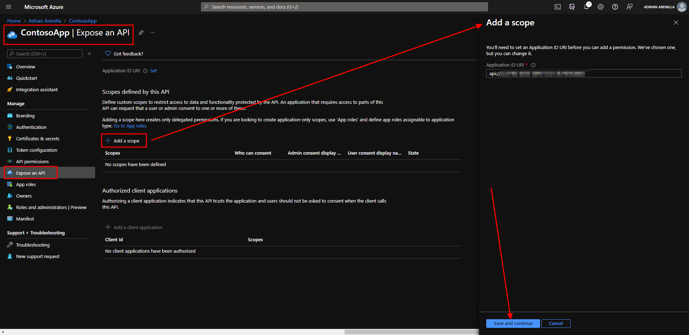
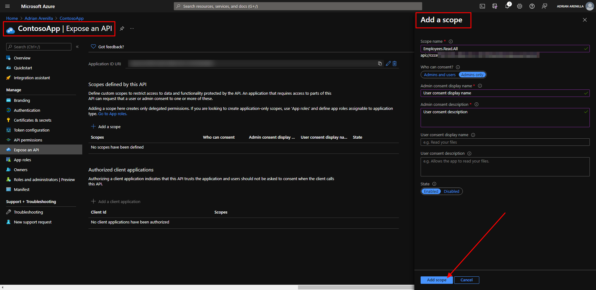
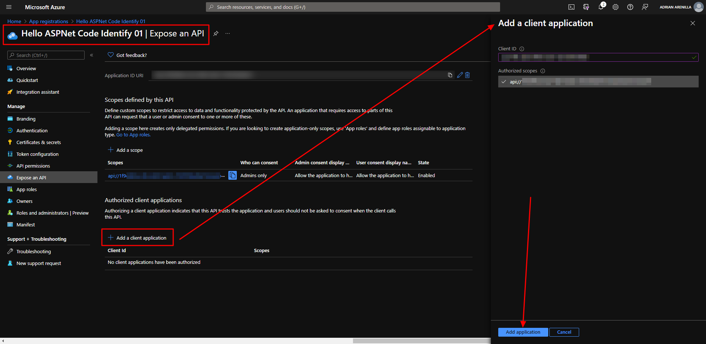
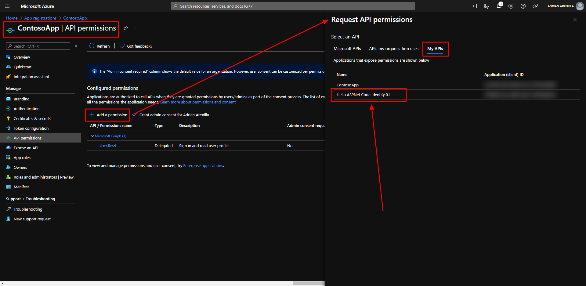
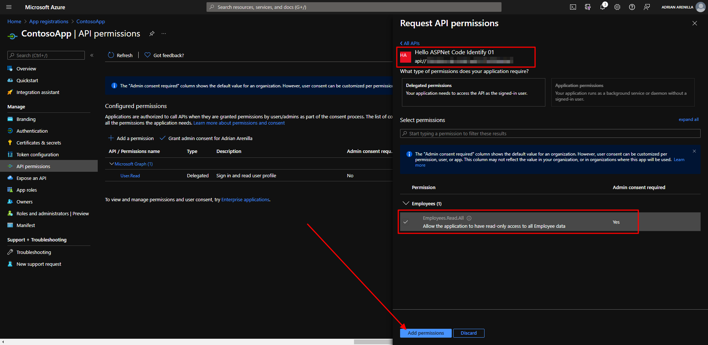
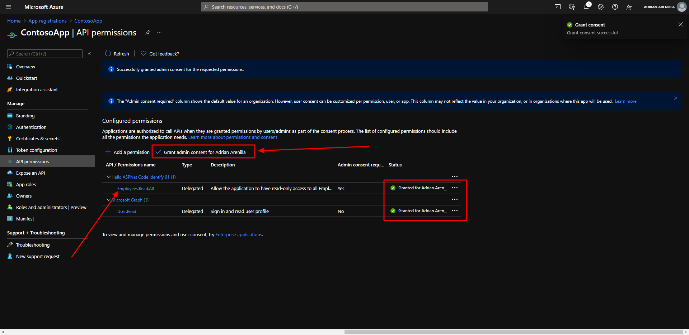

# Microsoft Ms-600 (Adrián Arenilla Seco) - LAB 01

## Exercise 4: Configuring permissions to consume an API
### [Go to exercise 04 instructions -->](05-Exercise-4-Configuring-permissions-to-consume-an-API.md)

Add a scope.

Add a scope.

Add a client application.

Add permissions scope to Hello ASPNET Core Identity 01.

Add permissions to access Web APIs for ContosApp.

To finish then select Grant admin consent for Contoso.

### [<-- Back to readme](../../../../)