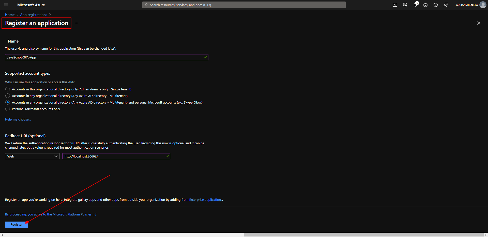
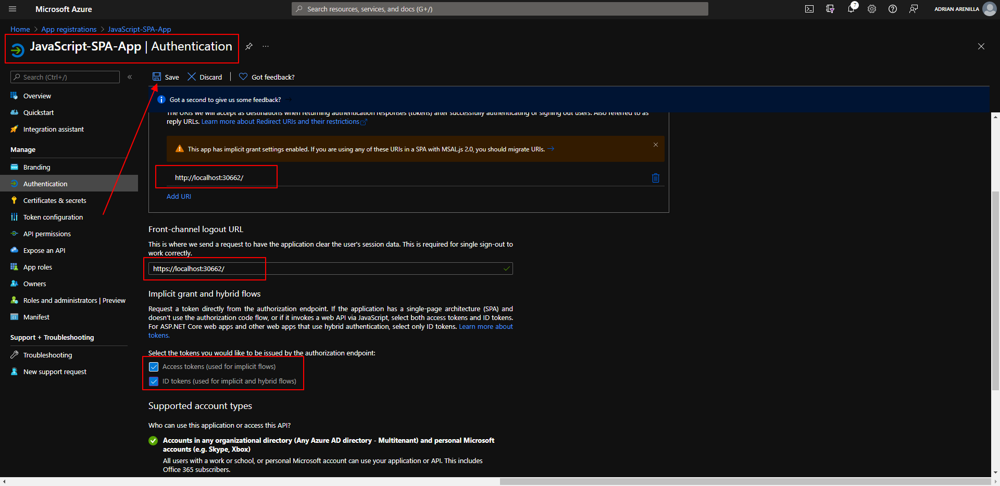
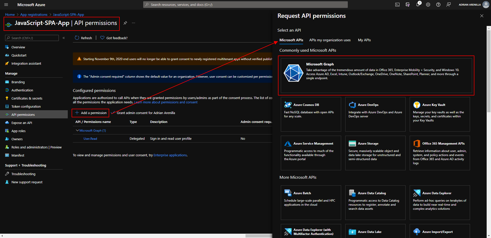
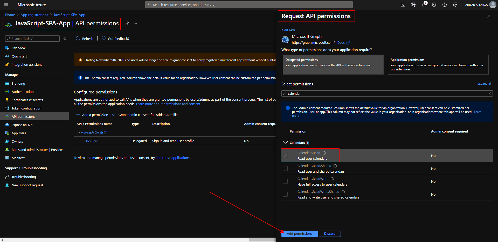
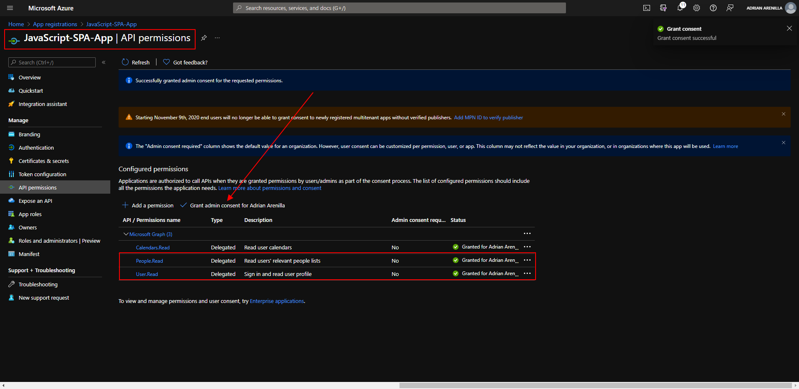
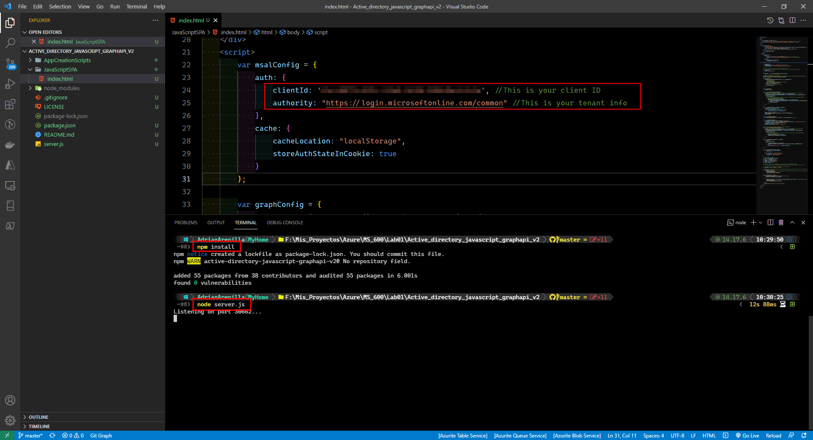
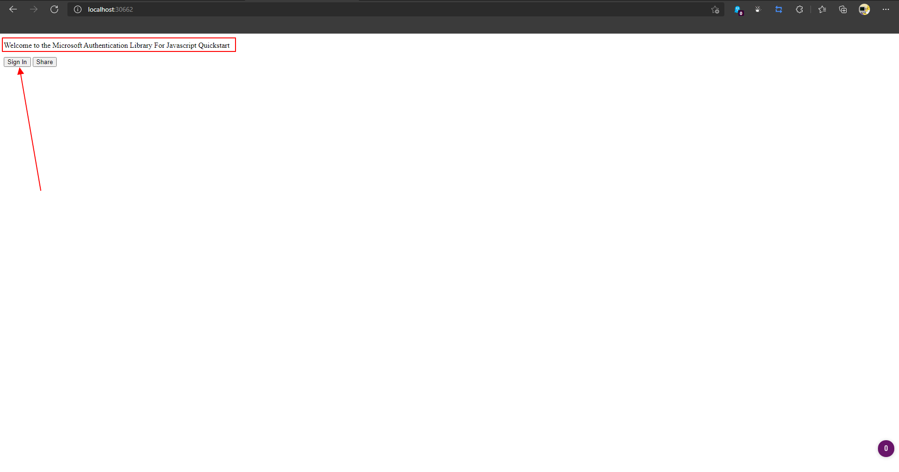
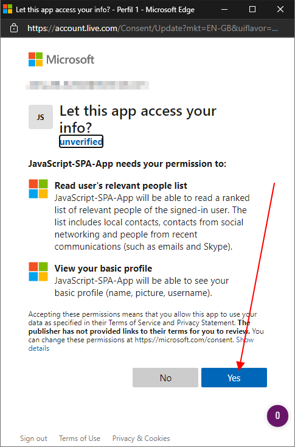
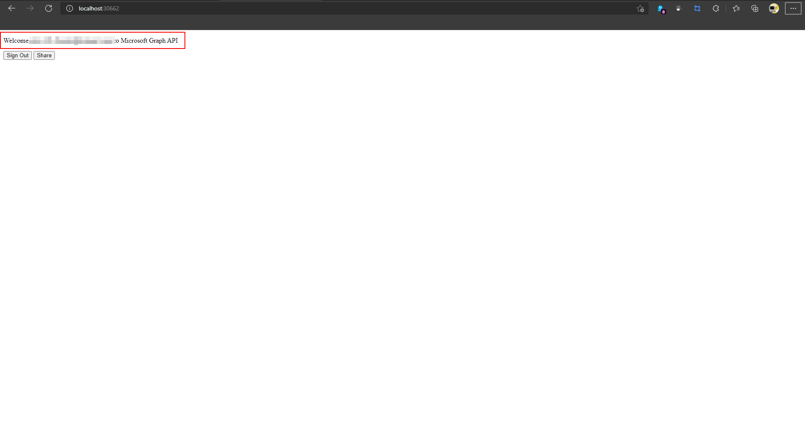

# Microsoft Ms-600 (Adrián Arenilla Seco) - LAB 01

## Exercise 5: Implementing authorization to consume an API
### [Go to exercise 05 instructions -->](06-Exercise-5-Implementing-authorization-to-consume-an-API.md)

Register an application.

Add a Redirect URI of web applications. 

Add a Redirect URI. 

Select both Access tokens and ID tokens and save.

Add a new request API permissions of type Microsoft Graph.

Update the App API permissions.

Select Grant admin consent for the app JavaScript-SPA-App.

Update solution code.

Run the application and select Sign in.

If the Permissions requested dialog opens, select Yes.

You should now be authenticated successfully.

### [<-- Back to readme](../../../../)