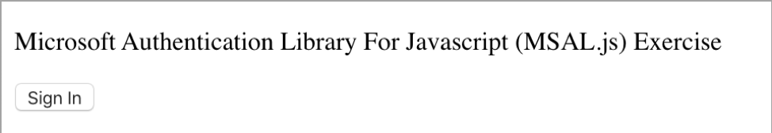
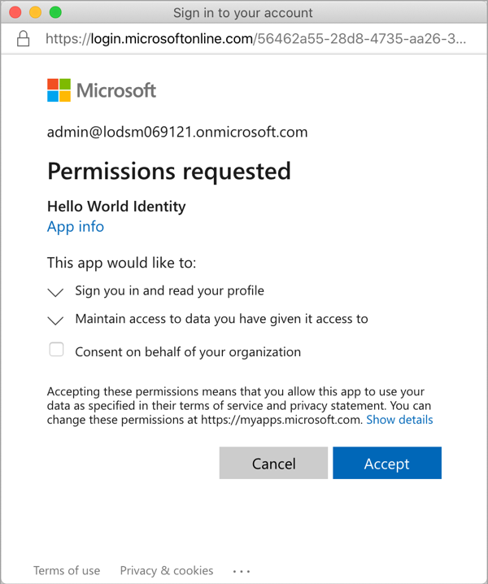
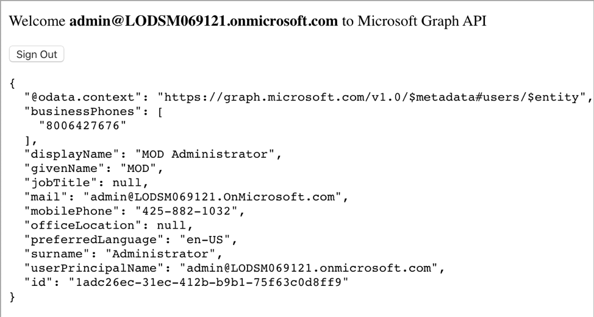

# Exercise 6: Creating a service to access Microsoft Graph

In this exercise, you'll create an Azure AD application and single page application for a user to sign in and display their information on the page. This application will use MSAL.js for the access token request.

## Task 1: Single page web application

In this application, you'll create an ASP.NET Core web application that allows users from the current organization to sign in and display their information.

### Create a Node.js web application

1. Open your command prompt, navigate to a directory where you want to save your work, create a new folder, and change directory into that folder. For example:

    ```powershell
    cd c:/LabFiles
    md HelloWorldIdentity
    cd HelloWorldIdentity
    ```

1. Execute the following command to create a new Node.js application:

    ```powershell
    npm init -y
    ```

1. Install the Node.js webserver **express** and HTTP request middleware **morgan** into the application:

    ```powershell
    npm install express morgan
    ```

1. Open the project in Visual Studio code by executing:

    ```powershell
    code .
    ```

1. Create a new file **server.js** in the root of the folder and add the following JavaScript to it. This code will start the web server:

    ```javascript
    var express = require('express');
    var app = express();
    var morgan = require('morgan');
    var path = require('path');
    var port = 3007;
    app.use(morgan('dev'));
    // set the front-end folder to serve public assets.
    app.use(express.static('web'));
    // set up our one route to the index.html file.
    app.get('*', function (req, res) {
      res.sendFile(path.join(__dirname + '/index.html'));
    });
    // Start the server.
    app.listen(port);
    console.log(`Listening on port ${port}...`);
    console.log('Press CTRL+C to stop the web server...');
    ```

### Create a web page for the user to sign in and display details

Create a new folder **web** in the current folder and add a new file **index.html** in the folder. Add the following code to the **index.html** file:

```html
<!DOCTYPE html>
<html>
<head>
    <title>Getting Started with Microsoft identity</title>
    <script src="https://cdnjs.cloudflare.com/ajax/libs/bluebird/3.5.5/bluebird.min.js"></script>
    <script src="https://alcdn.msftauth.net/lib/1.1.3/js/msal.min.js"></script>
</head>
<body>
    <div class="container">
        <div>
            <p id="WelcomeMessage">Microsoft Authentication Library For Javascript (MSAL.js) Exercise</p>
            <button id="SignIn" onclick="signIn()">Sign In</button>
        </div>
        <div>
            <pre id="json"></pre>
        </div>
    </div>
    <script>
        var msalConfig = {
            auth: {
                clientId: '',
                authority: '',
                redirectURI: ''
            },
            cache: {
                cacheLocation: "localStorage",
                storeAuthStateInCookie: true
            }
        };
        var graphConfig = {
            graphMeEndpoint: "https://graph.microsoft.com/v1.0/me",
            requestObj: {
                scopes: ["user.read"]
            }
        };
        var msalApplication = new Msal.UserAgentApplication(msalConfig);
        // init the auth handling on the page
        initPage();
        // TODO: add CODE before this line
        // TODO: add FUNCTIONS before this line
        function initPage() {
            // Browser check variables
            var ua = window.navigator.userAgent;
            var msie = ua.indexOf('MSIE ');
            var msie11 = ua.indexOf('Trident/');
            var msedge = ua.indexOf('Edge/');
            var isIE = msie > 0 || msie11 > 0;
            var isEdge = msedge > 0;
            // if you support IE, recommendation: sign in using Redirect APIs vs. popup
            // Browser check variables
            // can change this to default an experience outside browser use
            var loginType = isIE ? "REDIRECT" : "POPUP";
            // runs on page load, change config to try different login types to see what is best for your application
            switch (isIE) {
                case true:
                    document.getElementById("SignIn").onclick = function () {
                        msalApplication.loginRedirect(graphConfig.requestObj);
                    };
                    // avoid duplicate code execution on page load in case of iframe and popup window
                    if (msalApplication.getAccount() && !msalApplication.isCallback(window.location.hash)) {
                        updateUserInterface();
                        acquireTokenRedirectAndGetUser();
                    }
                    break;
                case false:
                    // avoid duplicate code execution on page load in case of iframe and popup window
                    if (msalApplication.getAccount()) {
                        updateUserInterface();
                        acquireTokenPopupAndGetUser();
                    }
                    break;
                default:
                    console.error('Please set a valid login type');
                    break;
            }
        }
    </script>
</body>
</html>
```

**Note**:
The remainder of this exercise instructs you to add code to this **index.html** file. Pay close attention where you add the code using the using the two **TODO:** comments for placement.

1. Add the following function to the **index.html** file immediately before the **// TODO: add FUNCTIONS before this line** comment that will configure the welcome message for the page:

    ```javascript
    function updateUserInterface() {
        var divWelcome = document.getElementById('WelcomeMessage');
        divWelcome.innerHTML = `Welcome <strong>${msalApplication.getAccount().userName}</strong> to Microsoft Graph API`;
        var loginbutton = document.getElementById('SignIn');
        loginbutton.innerHTML = 'Sign Out';
        loginbutton.setAttribute('onclick', 'signOut();');
    }
    ```

1. Next, add the following functions to **index.html** immediately before the **// TODO: add FUNCTIONS before this line** comment.

    - These functions request an access token from Microsoft identity and submit a request to Microsoft Graph for the current user's information. The function **acquireTokenPopupAndGetUser()** uses the popup approach that works for all modern browsers while the **acquireTokenRedirectAndGetUserFromMSGraph()** function uses the redirect approach that is suitable for Internet Explorer:

        ```javascript
        function acquireTokenPopupAndGetUser() {
            msalApplication.acquireTokenSilent(graphConfig.requestObj)
                .then(function (tokenResponse) {
                    getUserFromMSGraph(graphConfig.graphMeEndpoint, tokenResponse.accessToken, graphAPICallback);
                }).catch(function (error) {
                    console.log(error);
                    if (requiresInteraction(error.errorCode)) {
                        msalApplication.acquireTokenPopup(graphConfig.requestObj).then(function (tokenResponse) {
                            getUserFromMSGraph(graphConfig.graphMeEndpoint, tokenResponse.accessToken, graphAPICallback);
                        }).catch(function (error) {
                            console.log(error);
                        });
                    }
                });
        }
        function acquireTokenRedirectAndGetUser() {
            msalApplication.acquireTokenSilent(graphConfig.requestObj).then(function (tokenResponse) {
                getUserFromMSGraph(graphConfig.graphMeEndpoint, tokenResponse.accessToken, graphAPICallback);
            }).catch(function (error) {
                console.log(error);
                if (requiresInteraction(error.errorCode)) {
                    msalApplication.acquireTokenRedirect(graphConfig.requestObj);
                }
            });
        }
        function requiresInteraction(errorCode) {
            if (!errorCode || !errorCode.length) {
                return false;
            }
            return errorCode === "consent_required" ||
                            errorCode === "interaction_required" ||
                            errorCode === "login_required";
        }
        ```

    
    **Note:** These functions first attempt to retrieve the access token silently from the currently signed in user. If the user needs to sign in, the functions will trigger either the popup or redirect authentication process. The redirect approach to authenticating requires an extra step. The MSAL application on the page needs to see if the current page was requested based on a redirect from Azure AD. If so, it needs to process information in the URL request provided by Azure AD.
1. Add the following function immediately before the **// TODO: add FUNCTIONS before this line** comment:

    ```javascript
    function authRedirectCallBack(error, response) {
        if (error) {
            console.log(error);
        } else {
            if (response.tokenType === "access_token") {
                getUserFromMSGraph(graphConfig.graphMeEndpoint, response.accessToken, graphAPICallback);
            } else {
                console.log("token type is:" + response.tokenType);
            }
        }
    }
    ```

1. Configure MSAL to use this function by adding the following line immediately before the **// TODO: add CODE before this line** comment:

    ```javascript
    msalApplication.handleRedirectCallback(authRedirectCallBack);
    ```

    1. Once the user is authenticated, the code can submit a request to Microsoft Graph for the current user's information. The two **acquireToken*()** functions pass the access token acquired from Azure AD to the function:
1. Add the following function immediately before the **// TODO: add FUNCTIONS before this line** comment:

    ```javascript
    function getUserFromMSGraph(endpoint, accessToken, callback) {
        var xmlHttp = new XMLHttpRequest();
        xmlHttp.onreadystatechange = function () {
            if (this.readyState == 4 && this.status == 200)
                callback(JSON.parse(this.responseText));
        }
        xmlHttp.open("GET", endpoint, true);
        xmlHttp.setRequestHeader('Authorization', 'Bearer ' + accessToken);
        xmlHttp.send();
    }
    function graphAPICallback(data) {
        document.getElementById("json").innerHTML = JSON.stringify(data, null, 2);
    }
    ```

1. Finally, add the following two functions to implement a sign in and sign out capability for the button on the page. Add the following function immediately before the **// TODO: add FUNCTIONS before this line** comment:

    ```javascript
    function signIn() {
        msalApplication.loginPopup(graphConfig.requestObj)
            .then(function (loginResponse) {
                updateUserInterface();
                acquireTokenPopupAndGetUser();
            }).catch(function (error) {
                console.log(error);
            });
    }
    function signOut() {
        msalApplication.logout();
    }
    ```

## Task 2: Register a new application

1. From the Azure portal [https://portal.azure.com](https://portal.azure.com/), navigate to **Azure Active Directory**.

1. Select **Manage > App registrations** in the left-hand navigation.

1. On the **App registrations** page, select **New registration**.

1. On the **Register an application** page, set the values as follows:

    - **Name**: Hello World Identity

    - **Supported account types**: Accounts in this organizational directory only (Single tenant)

    - **Redirect URI**: Web = http://localhost:3007

1. Select **Register** to create the application.

1. On the **Hello World Identity** page, copy the values **Application (client) ID** and **Directory (tenant) ID**; you'll need these values later in this exercise.

1. On the **Hello World Identity** page, select the **1 web, 0 public** **client** link under the **Redirect URIs**.

1. Locate the section **Implicit grant** and select both **Access tokens** and **ID tokens**.

1. Select **Save** when finished setting these values.

## Task 3: Update the web page with the Azure AD application details

The last task is to configure the web page to use the Azure AD application.
1. Go back to the project in Visual Studio Code.

1. Open the **index.html** file and locate the **var msalConfig =** **{}** code. The auth object contains three properties you need to set as follows:

    - **clientId:** set to the Azure AD application's ID

    - **authority:** set to **https://login.microsoftonline.com/{{DIRECTORY_ID}}**, replacing the **{{DIRECTORY_ID}}** with the Azure AD directory ID of the Azure AD application.

    - **redirectURI:** set to the Azure AD application's redirect URI: **http://localhost:3007**

## Task 4: Test the web application

1. To test the web page, first start the local web server. In the command prompt, execute the following command from the root of the project:

    ```powershell
    node server.js
    ```

1. Next, open a browser and navigate to **http://localhost:3007**. The page initially contains a default welcome message and sign in button.

    

1. Select the **sign in** button.

1. Depending on the browser, you are using, a popup window will load or the page will redirect to the Azure AD sign in prompt.

1. Sign in using a **Work or School Account** and accept the permissions requested for the application by selecting **Accept**.

    

1. Depending on the browser you're using, the popup will disappear, or you will be redirected back to the web page. When the page loads, MSAL will request an access token and request your information from Microsoft Graph. After the request complete, it will display the results on the page:

    

1. Stop the web server by going back to the running project in Visual Studio Code. From the Terminal, press **CTRL+C** in the command prompt.

## Review

In this exercise, you created an Azure AD application and single page application for a user to sign in and display their information on the page.


### [<-- Back to readme](../../../)
