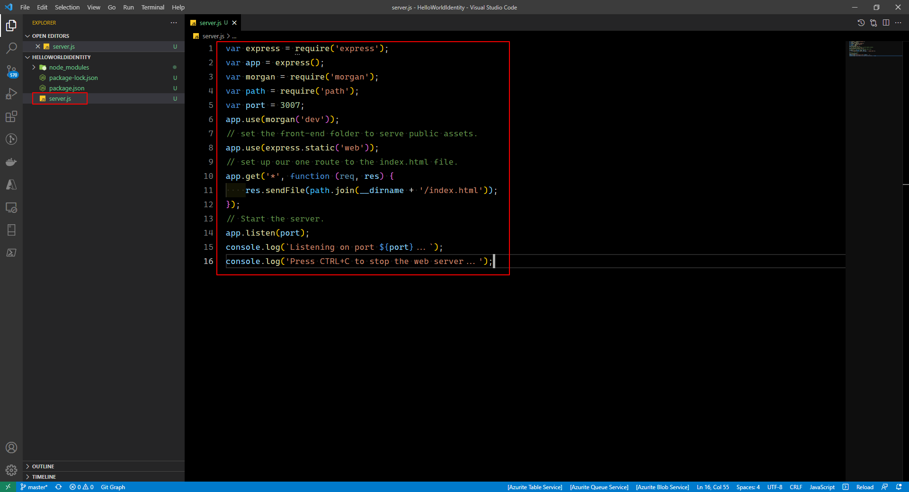
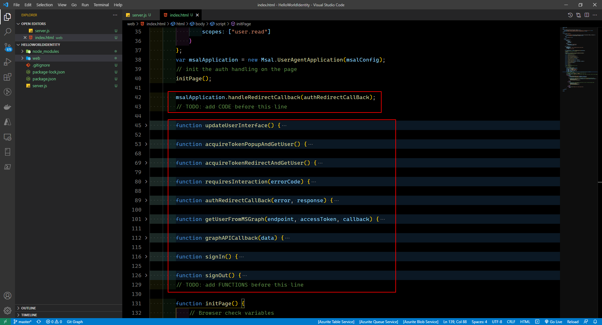
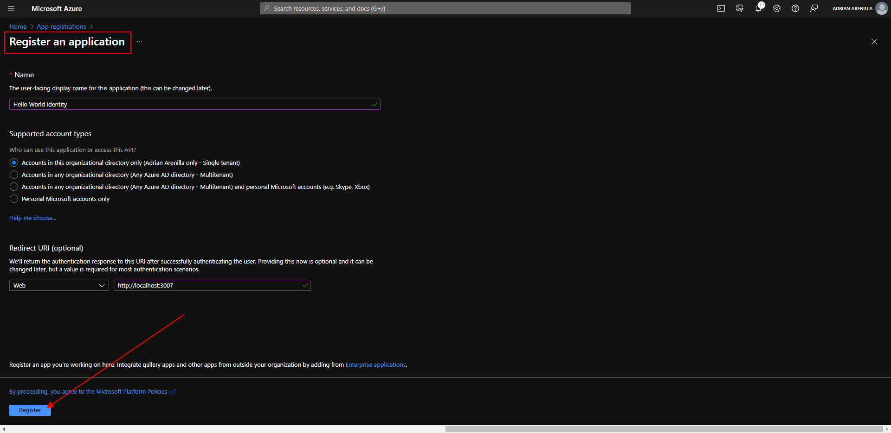
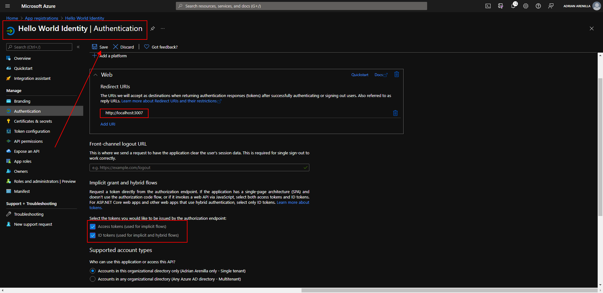
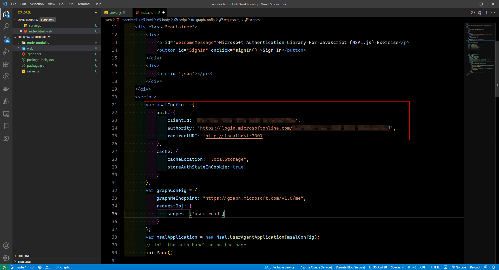
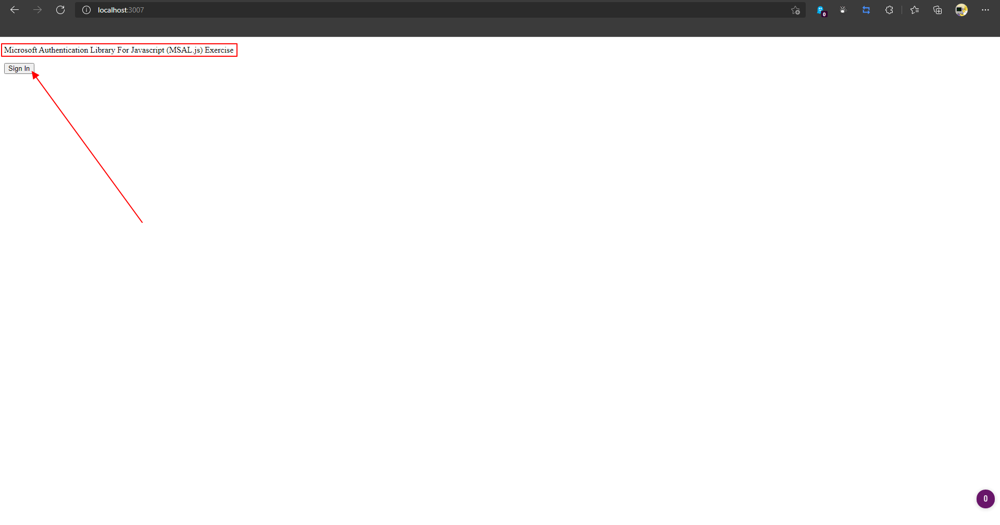
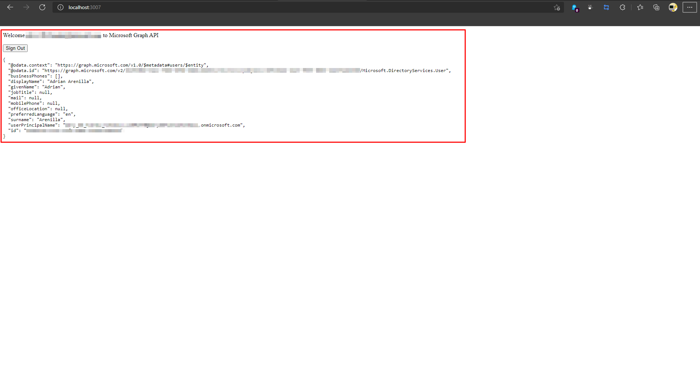

# Microsoft Ms-600 (Adrián Arenilla Seco) - LAB 01

## Exercise 6: Creating a service to access Microsoft Graph
### [Go to exercise 06 instructions -->](07-Exercise-6-Creating-a-service-to-access-Microsoft-Graph.md)

### [<-- Back to readme](../../../../)