# Microsoft Ms-600 (Adrián Arenilla Seco) - LAB 02

### [Go to Student manual -->](01-Student-lab-manual.md)

## Exercise 01: Using query parameters when querying Microsoft Graph via HTTP
### [Go to exercise 01 instructions -->](02-Exercise-1-Using-query-parameters-when-querying-Microsoft-Graph-via-HTTP.md)

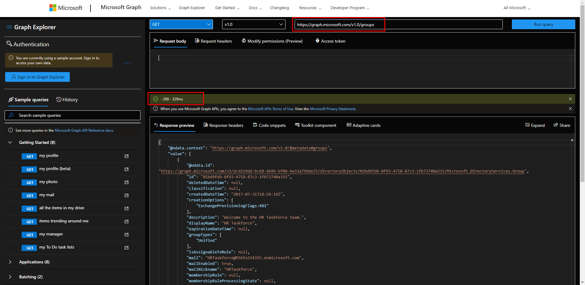
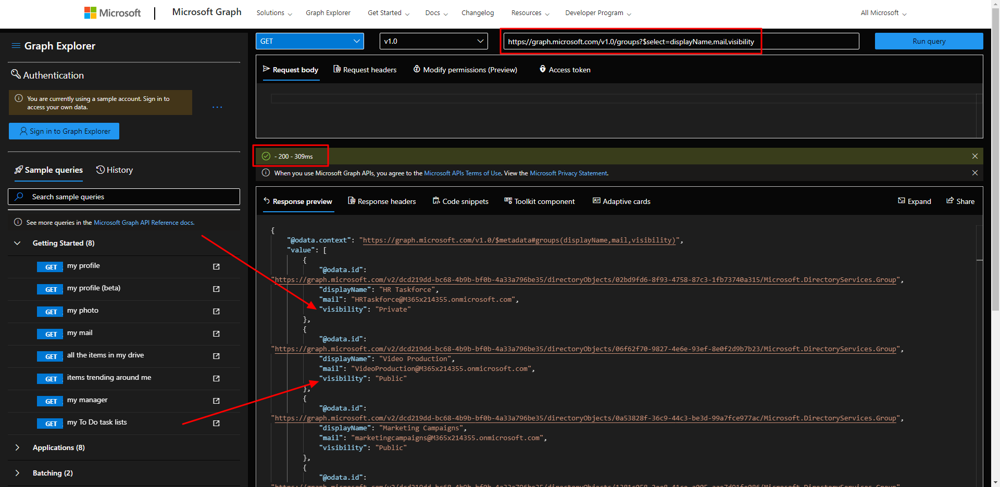
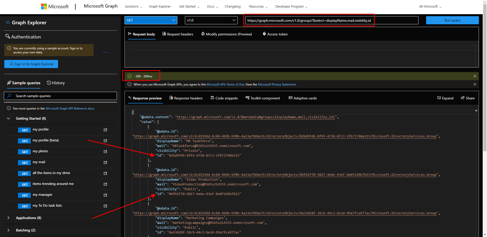
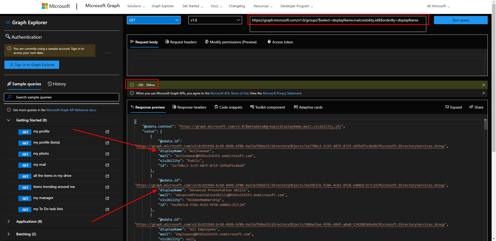
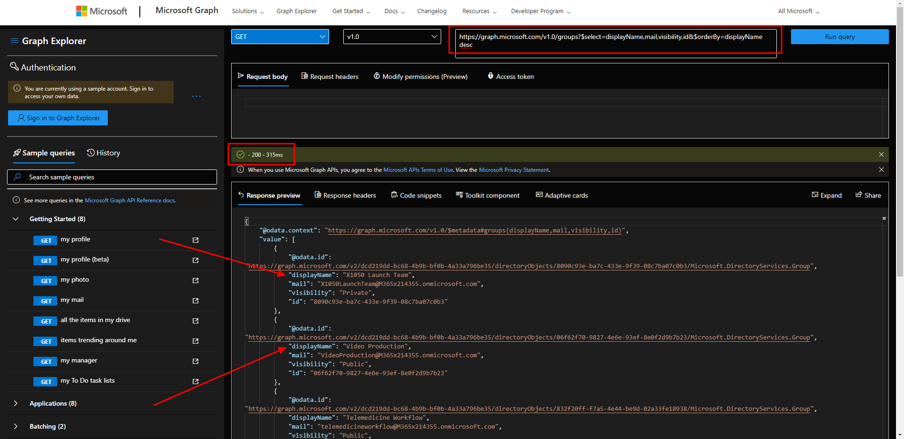
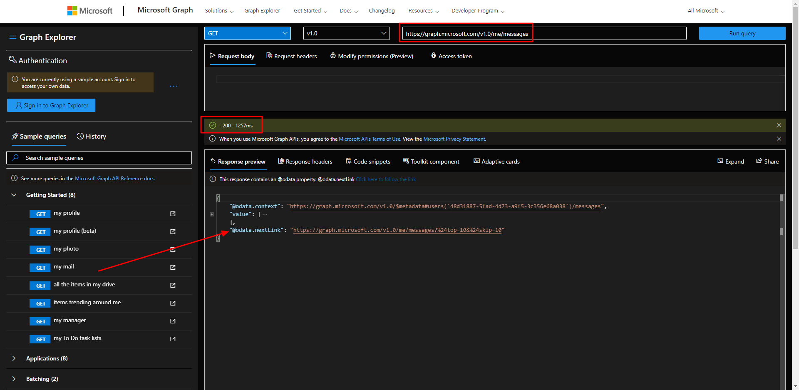
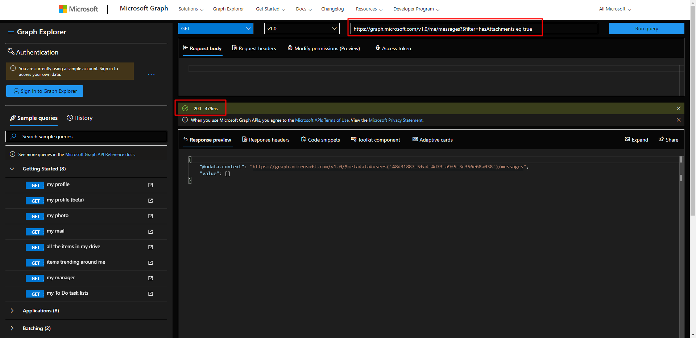
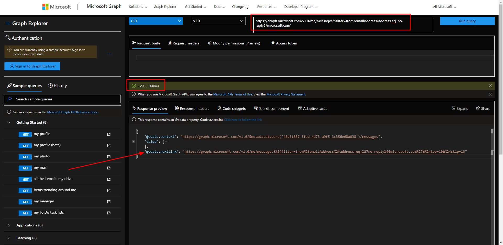
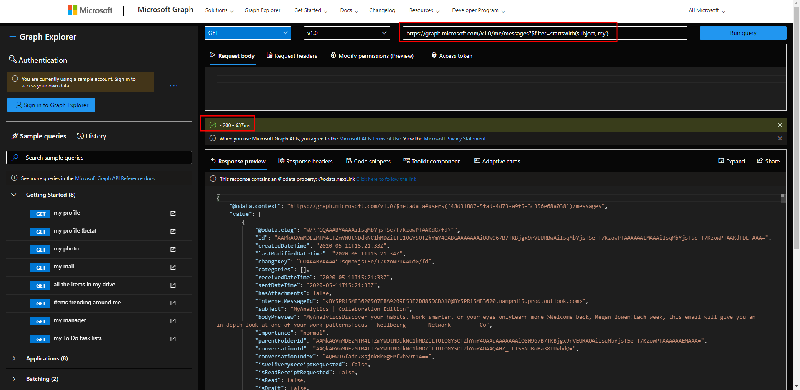

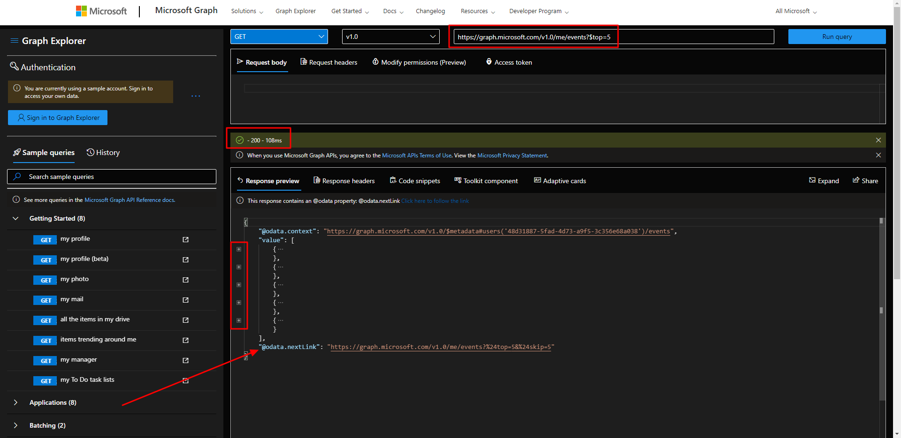

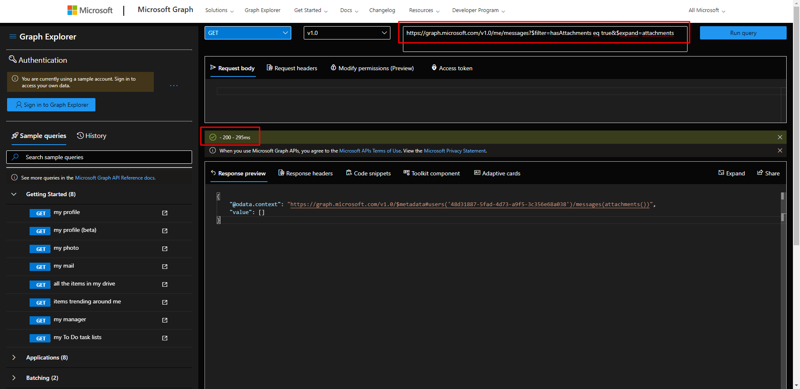
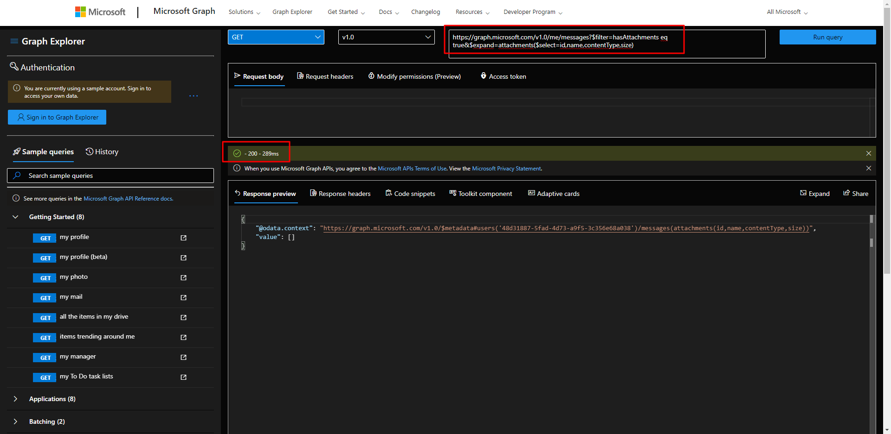

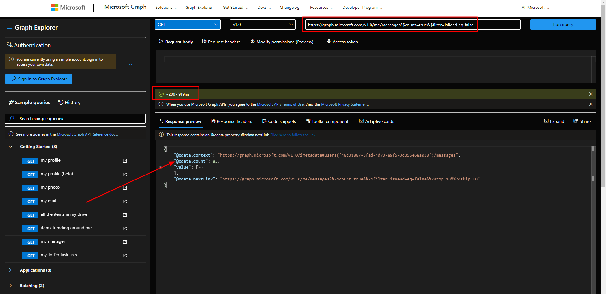
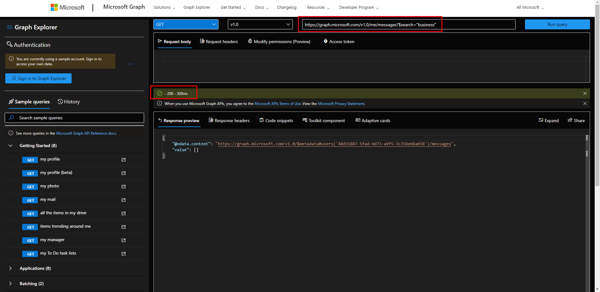
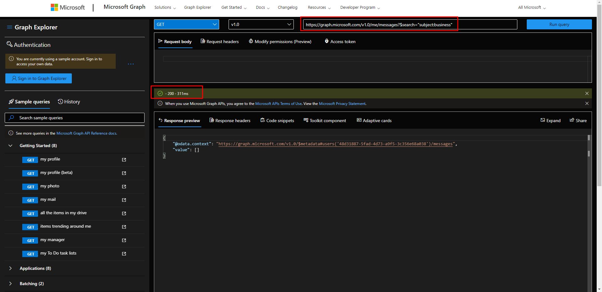

## Exercise 02: Retrieve and control information returned from Microsoft Graph
### [Go to exercise 02 instructions -->](03-Exercise-2-Retrieve-and-control-information-returned-from-Microsoft-Graph.md)

## Exercise 03: Using change notifications and track changes with Microsoft Graph
### [Go to exercise 03 instructions -->](04-Exercise-3-Using-change-notifications-and-track-changes-with-Microsoft-Graph.md)

## Exercise 04: Reduce traffic with batched requests
### [Go to exercise 04 instructions -->](05-Exercise-4-Reduce-traffic-with-batched-requests.md)

## Exercise 05: Understand throttling in Microsoft Graph
### [Go to exercise 05 instructions -->](06-Exercise-5-Understand-throttling-in-Microsoft-Graph.md)

## Exercise 06: Querying user data from Microsoft Graph
### [Go to exercise 06 instructions -->](07-Exercise-6-Querying-user-data-from-Microsoft-Graph.md)

### [<-- Back to readme](../../../)