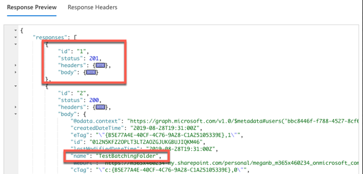

# Exercise 4: Reduce traffic with batched requests

In this exercise, you'll use the Graph Explorer to create and issue a single request that contains multiple child requests. This batching of requests enables developers to submit multiple requests in a single round-trip request to Microsoft Graph, creating more optimized queries.

## Task 1: Sign in to Microsoft Graph Explorer

The tool Graph Explorer enables developers to create and test queries using the Microsoft Graph REST API. Previously in this module, you used the Graph Explorer as an anonymous user and executed queries using the sample data collection.

In this example, you'll sign in to Microsoft Graph with a real user.

1. Open a browser and navigate to [https://developer.microsoft.com/graph/graph-explorer](https://developer.microsoft.com/graph/graph-explorer)

    

1. Select the **Sign in to Graph Explorer** button in the leftmost panel and enter the credentials of a Work and School account.

1. After signing in, click **select permissions** and verify that the user has the permissions to submit the requests in this exercise. You must have at least these minimum permissions:

    - **Mail.Read**

    - **Calendars.Read**

    - **Files.ReadWrite**

    

## Task 2: Submit three (3) GET requests in a single batch

All batch requests are submitted as HTTP POSTs to a specific endpoint: [https://graph.microsoft.com/v1.0/$batch](https://graph.microsoft.com/v1.0/\$batch). The **\$batch** query parameter is what tells Microsoft Graph to unpack the requests submitted in the body.

1. Set the request to an HTTP **POST** and the endpoint of the request to [https://graph.microsoft.com/v1.0/$batch](https://graph.microsoft.com/v1.0/\$batch).

1. Add the following JSON code to the **Request Body** input box. This JSON code will issue three requests:

    - Request the current user's **displayName**, **jobTitle**, and **userPrincipalName** properties.

    - Request the current user's email messages that are marked with high importance.

    - Request all the current user's calendar events.

        ```json
        {
            "requests":
            [
                {
                    "url": "/me?$select=displayName,jobTitle,userPrincipalName",
                    "method": "GET",
                    "id": "1"
                },
                {
                    "url": "/me/messages?$filter=importance eq 'high'&$select=from,subject,receivedDateTime,bodyPreview",
                    "method": "GET",
                    "id": "2"
                },
                {
                    "url": "/me/events",
                    "method": "GET",
                    "id": "3"
                }
            ]
        }
        ```

    

1. Select the **Run Query** button.

1. Observe the results in the **Response Preview** box at the bottom of the page.

    

Notice the response includes three individual responses within the responses collection. Also notice for response id:3, the data that was returned, as indicated by the @odata.nextLink property, is from the **/me/events** collection. This query matches the third request in the initial request submitted.

## Task 3: Combine POST and GET requests in a single batch request

Batch requests can also include both **POST** and **GET** requests.

In this example, you'll submit a request that creates a new folder in the current user's OneDrive [for Business] and then requests the newly created folder. If the first request failed, the second request should come back empty as well.

1. Enter the following JSON code to the **Request Body** input box. This will issue three requests:

    ```json
    {
        "requests":
        [
            {
                "url": "/me/drive/root/children",
                "method": "POST",
                "id": "1",
                "body": {
                    "name": "TestBatchingFolder",
                    "folder": {}
                },
                "headers": {
                    "Content-Type": "application/json"
                }
            },
            {
                "url": "/me/drive/root/children/TestBatchingFolder",
                "method": "GET",
                "id": "2",
                "DependsOn": [
                    "1"
                ]
            }
        ]
    }
    ```

1. Select the **Run Query** button.

1. Observe the results in the **Response Preview** box at the bottom of the page. Notice that this response contains two objects. The first request resulted in an HTTP 201 message that says the item, or folder, was created. The second request was also successful, and the name of the folder returned matched the folder the first request created.

    

## Review

In this exercise, you used Microsoft Graph to demonstrate how you can combine multiple requests using a single request. This capability of submitting batch requests using the $batch query parameter enables you to optimize your applications to minimize the number of requests to Microsoft Graph.


### [Go to exercise 05 instructions -->](06-Exercise-5-Understand-throttling-in-Microsoft-Graph.md)

### [<-- Back to readme](../../../)
