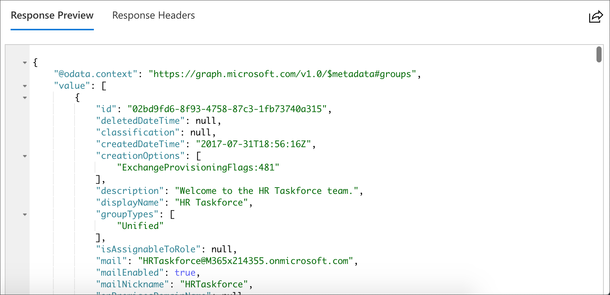
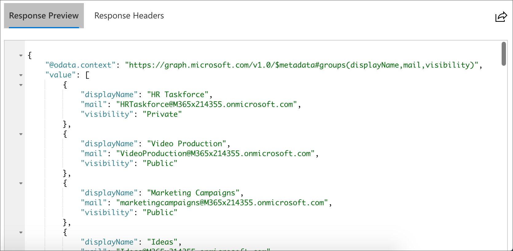
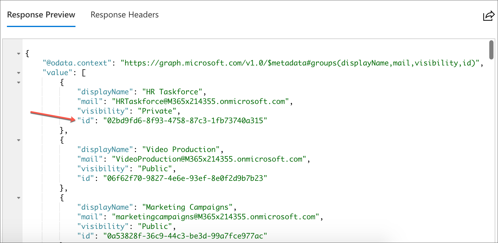
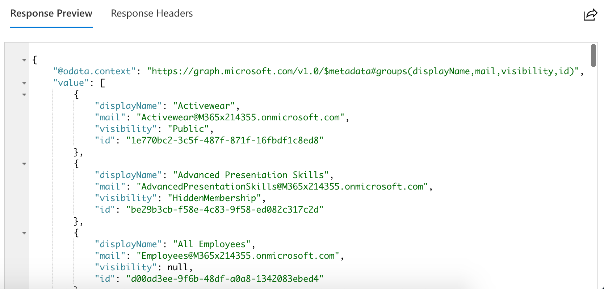
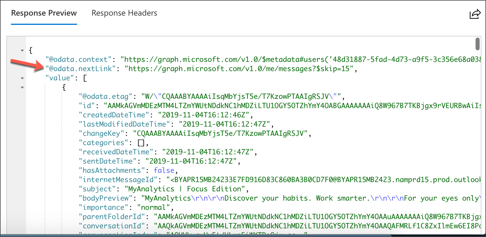

# Exercise 1: Using query parameters when querying Microsoft Graph via HTTP

**NOTE:**
Users may sign in with their Microsoft account or use the default sample account to complete the following tasks.

By the end of this exercise you will be able to:

- Use **`$filter`** query parameter.

- Use **`$select`** query parameter.

- Order results using **`$orderby`** query parameter.

- Set page size of results using **`$skip`** and **`$top`** query parameters.

- Expand and retrieve resources using **`$expand`** query parameter.

- Retrieve the total count of matching resources using **`$count`** query parameter.

- Search for resources using **`$search`** query parameter.

## Task 1: Go to the Graph Explorer

1. Open the Microsoft Edge browser.

1. Go to this link: [https://developer.microsoft.com/en-us/graph/graph-explorer](https://developer.microsoft.com/en-us/graph/graph-explorer).

    This page allows users to interact with Microsoft Graph without writing any code. Microsoft Graph Explorer provides sample data to use for read operations.

    **NOTE:**
Some organizations may not allow users to sign in or consent to specific scopes required for some operations.

## Task 2: Use \$select to retrieve only some object properties

1. In the **request URL** box amend the request to be: <br> `https://graph.microsoft.com/v1.0/groups`

1. Select **Run Query**. 

    This lists all the groups in the tenant that the current user can see in the **Response Preview** pane at the bottom of the page. Note there are many properties returned per record.

    

1. Select the **Response Headers** tab.

    Note the value of the **`content-length`** header. This shows how much data was returned in the response for this request.

1. To reduce the response to only include the necessary properties, you can make use of the **`$select`** parameter. Update the **request URL** box to the following:

    `https://graph.microsoft.com/v1.0/groups?$select=displayName,mail,visibility`

    

1. Select **Run Query.**

    In the **Response Headers** tab note the new value for the **`content-length`** header. There is a much smaller amount of data returned now.

1. Select the **Response Preview** tab.

    Note only the selected properties are returned. To allow an application to interact directly with an object in Microsoft Graph, it is best to have the unique identifier for that object.

1. With this in mind, amend your query to include the **`ID`** property:

    `https://graph.microsoft.com/v1.0/groups?$select=displayName,mail,visibility,id`

1. Select **Run Query**.

    

## Task 3: Use \$orderby to sort results

When presenting data to end users it’s often necessary to use a sort order other than the default provided by Microsoft Graph. This should be done using the **`$orderby`** parameter. Continuing from the previous task, sort the groups by the **`displayName`** property.

1. Change the request URL box to:

    `https://graph.microsoft.com/v1.0/groups?$select=displayName,mail,visibility,id&$orderBy=displayName`

1. Select **Run Query**.

    **The sorted set** of groups is shown in the **Response Preview** pane.

    
    
    **NOTE:**
    Many properties cannot be used for sorting. For example, if you were to use mail in the **`$orderby`** you would receive an HTTP 400 response like this:
    
    ```http
    {
        "error": {
            "code": "Request_UnsupportedQuery",
            "message": "Unsupported sort property 'mail' for 'Group'.",
            "innerError": {
                "request-id": "582643b8-7ac2-415a-b58b-59009ec63ec1",
                "date": "2019-10-24T19:54:55"
            }
        }
    }
    ```

1. Set the sort direction using either **asc** or **desc** like this:

    `https://graph.microsoft.com/v1.0/groups?$select=displayName,mail,visibility,id&$orderBy=displayName desc`

## Task 4: Use \$filter to retrieve a subset of data available

1. In the **request URL** box amend the request to:

    `https://graph.microsoft.com/v1.0/me/messages`

1. Select **Run Query**.

    This shows a list of messages for the current **Response Preview** pane at the bottom of the page.
    
    Note the response also includes an **`@odata.nextLink`** property. This allows developers to fetch additional pages of results and, by its presence, indicates there may be a large possible number of results. To find just the email messages that have attachments, add a filter.

    

1. Add a filter so the **request URL** box contains the following:

    `https://graph.microsoft.com/v1.0/me/messages?$filter=hasAttachments eq true`


1. Select **Run Query**. 

    The results are shown in the **Response Preview** pane. Note there is no **`@odata.nextLink`** this time. This indicates all the matching records have been returned in the request. If there is an **`@odata.nextLink`** it should be used to fetch additional pages of results. It’s possible to compose queries that traverse object properties as well. For instance, to find mail sent from a specific email address.

1. Change the **request URL** box to:

    `https://graph.microsoft.com/v1.0/me/messages?$filter=from/emailAddress/address eq 'no-reply@microsoft.com'`

1. Select **Run Query**.

    The results are shown in the **Response Preview** pane. Note there are multiple pages of results as indicated by the presence of **`@odata.nextLink`**. Some properties support the use of a start with operator.

1. Enter the following into the **request URL** box:

    `https://graph.microsoft.com/v1.0/me/messages?$filter=startswith(subject,'my')`

1. Select **Run Query**.

    The results are shown in the **Response Preview** pane.

1. Some collection properties can be used in **`$filter`** using a Lambda expression.

    For example, to find all groups that have the Unified type, enter the following query into the request URL box:

    `https://graph.microsoft.com/v1.0/groups?$filter=groupTypes/any(c: c eq 'Unified')`

1. Select **Run Query**.

    The list of groups that have the Unified type is shown in the **Response Preview** pane.

## Task 5: Use \$skip and \$top for explicit pagination of results

1. In the request URL box change the request to:

    `https://graph.microsoft.com/v1.0/me/events`

1. Select **Run Query**.

    The results are shown in the **Response Preview** pane.

    Note the **`@odata.nextLink`** property finishes in **`$skip 10`**. This is the default first page size for the **`/events`** resource. Different resources have different default first page sizes. The size of the first page and subsequent pages may not be the same. Edit the query to fetch an explicit number of results. **`$top`** is used to set maximum the number of results to be returned.

1. In the request URL box amend the request to:

    `https://graph.microsoft.com/v1.0/me/events?$top=5`


1. Select **Run Query**.

    The results are shown in the **Response Preview** pane.

    Note the **`@odata.nextLink`** property finishes in **`$skip 5`**. Using the next link here would fetch the next five records in the data set. To fetch the next page set the `\$skip `value to `5`:

    `https://graph.microsoft.com/v1.0/me/events?$top=5&$skip=5`

    This is the same as the **`@odata.nextLink`** returned for this resource. The **`$skip`** value tells Microsoft Graph to start returning results after the number provided here.

1. Select **Run Query**.

    The results are shown in the **Response Preview** pane. The value returned contains an **`@odata.nextLink`** that can be followed. If a client needs to load all data from a specific resource or query it should keep following the **`@odata.nextLink`** until it is no longer present in the results.

    **NOTE:**
    The formula for composing manual pagination queries is this:

    `?\$top={pageSize}&\$skip={pageSize\*(pageNumber - 1)}`

## Task 6: Expand and retrieve resources using \$expand query parameter

In this exercise you will fetch the attachments from the mail of the current user. In a previous task you found the messages for the current user, which have attachments. In the request URL box amend the request to perform this query again.

1. In the **request URL** box amend the request to:

    `https://graph.microsoft.com/v1.0/me/messages?$filter=hasAttachments eq true`

1. Select **Run Query**.

The results are shown in the **Response Preview** pane. Note when examining the results there is no information provided about the attachments. Amend the query to fetch information about the messages' attachments.

1. In the **request URL** box amend the request to:

    `https://graph.microsoft.com/v1.0/me/messages?$filter=hasAttachments eq true&$expand=attachments`

1. Select **Run Query**.

    The results are shown in the **Response Preview** pane.

    Note the attachment objects included in the response include the **`contentBytes`** property. This is the actual file content and can cause the application to fetch far more data than might be desired.

1. Select the **Response Headers** tab.

    Note the value for the **`content-length`** header.

1. Amend the query to use **`$select`** on the **`$expanded`** attachments collection. In the **request URL** box amend the request to:

    `https://graph.microsoft.com/v1.0/me/messages?$filter=hasAttachments eq true&$expand=attachments($select=id,name,contentType,size)`

1. Select **Run Query**.

    Note the new value for the `content-length` header is much smaller than the previous request.

1. Select **Response Preview**. 

    Note that for each attachment, in addition to the explicitly requested properties, there are some additional **`@odata`** properties.

## Task 7: Use \$count to discover the total number of matching resources

1. In the request URL box amend the request to:

    `https://graph.microsoft.com/v1.0/me/messages?$count=true`

1. Select **Run Query**.

    In the **Response Preview** pane there is an additional property shown **`@odata.count`**. This value shows the total number of resources that match the provided query. Note that as no query has been explicitly provided, the **`@odata.count`** value is that of all resources at this path.

1. Add a query, in this instance query to see how many unread messages the current user has. In the **request URL** box amend the request to:

    `https://graph.microsoft.com/v1.0/me/messages?$count=true&$filter=isRead eq false`

1. Select **Run Query**.

    In the **Response Preview** pane, the first page displays matching results. Note the **`@odata.count`** value is updated to reflect the query passed via the **`$filter`** parameter.

## Task 8: Use \$search to discover the total number of matching resources

1. In the request URL box amend the request to:

    `https://graph.microsoft.com/v1.0/me/messages?$search="business"`

2. Select **Run Query**.

    In the **Response Preview** the messages that have matches for the keyword supplied are shown. Note the number of messages that match (4). The scope of the search can be adjusted specifying property names that are recognized by the KQL syntax.

   See [https://docs.microsoft.com/en-us/graph/query-parameters#search-parameter](https://docs.microsoft.com/en-us/graph/query-parameters) for more information.

3. Amend the **request URL** box to scope the search to only target the subject field. In the **request URL** box amend the request to:

    `https://graph.microsoft.com/v1.0/me/messages?$search="subject:business"`

4. Select **Run Query**.

    In the **Response Preview** the messages that have matches in the specified property are shown. Note there should be fewer results (3).

## Review

In this exercise, you learned how to make use of query parameters:

- Fetch resources with properties matching certain parameters by using the **`$filter`** query parameter.

- Fetch only the necessary data by using the **`$select`** query parameter.

- Set the order of results using **`$orderby`** query parameter.

- Set page size of results using **`$skip`** and **`$top`** query parameters.

- Expand and retrieve additional resources using **`$expand`** query parameter.

- Retrieve the total count of matching resources using **`$count`** query parameter.

- Search for resources using **`$search`** query parameter.


### [Go to exercise 02 instructions -->](../Exercise_02/03-Exercise-2-Retrieve-and-control-information-returned-from-Microsoft-Graph.md)

### [<-- Back to readme](../../../)