# Microsoft Ms-600 (Adrián Arenilla Seco) - LAB 02

## Exercise 1: Using query parameters when querying Microsoft Graph via HTTP
### [Go to exercise 01 instructions -->](02-Exercise-1-Using-query-parameters-when-querying-Microsoft-Graph-via-HTTP.md)

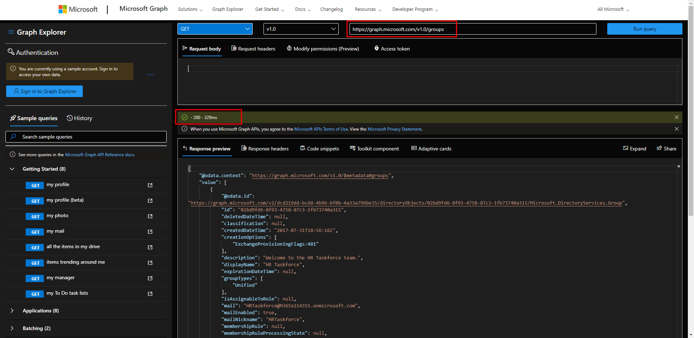

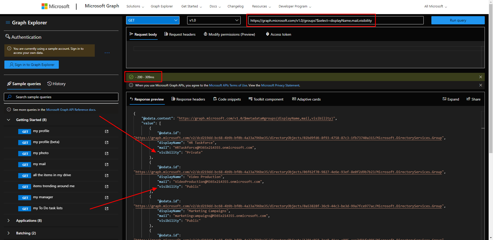

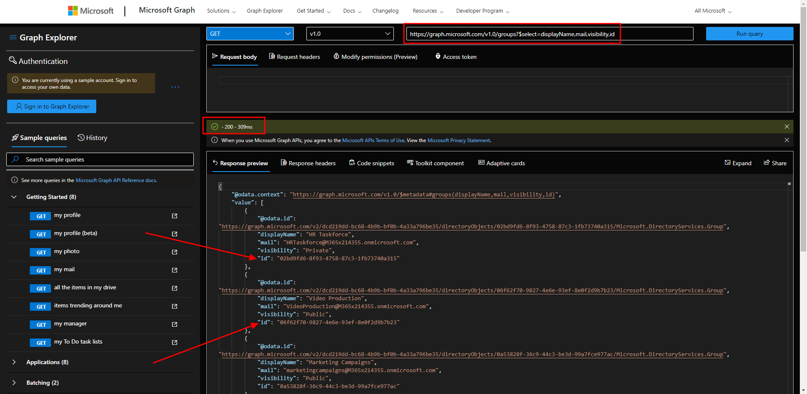

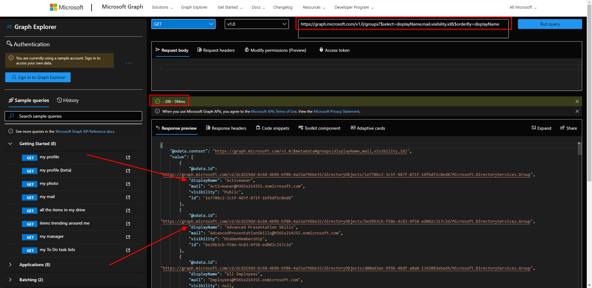

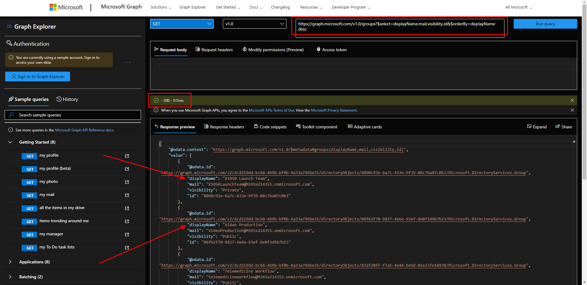

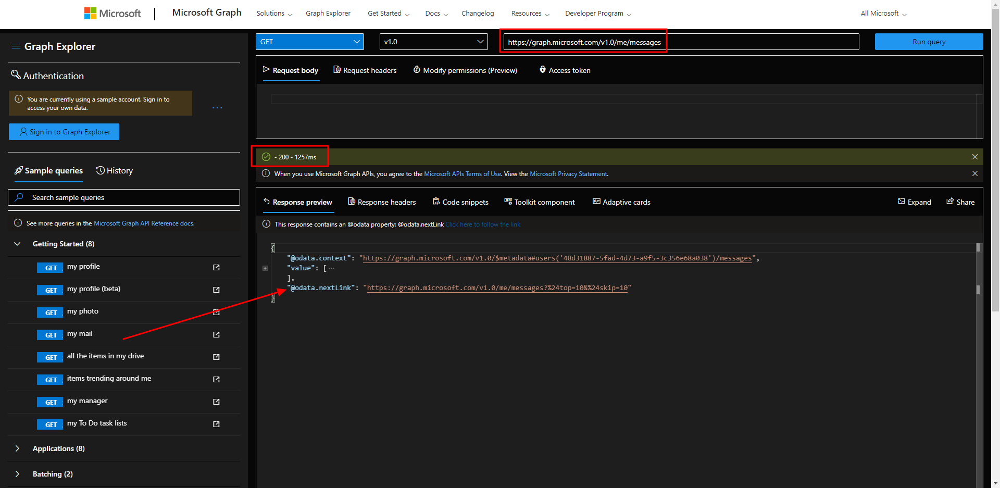

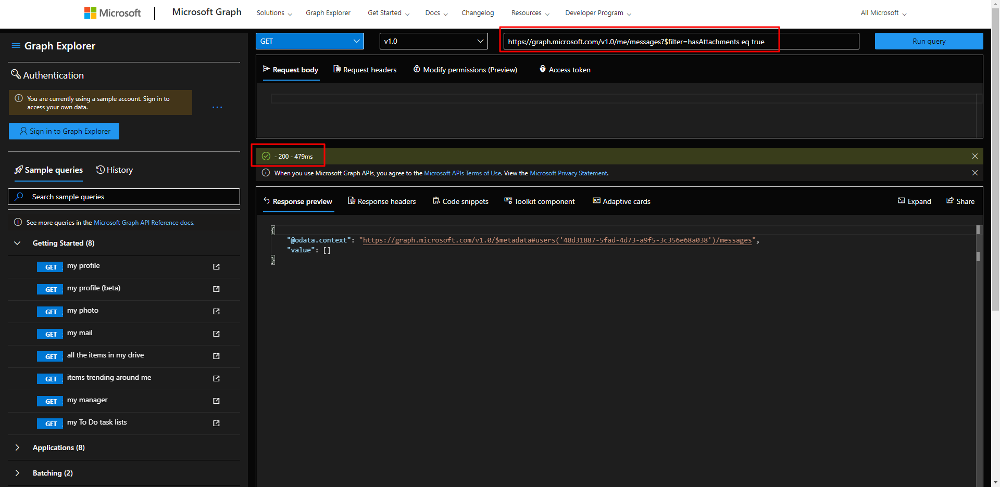

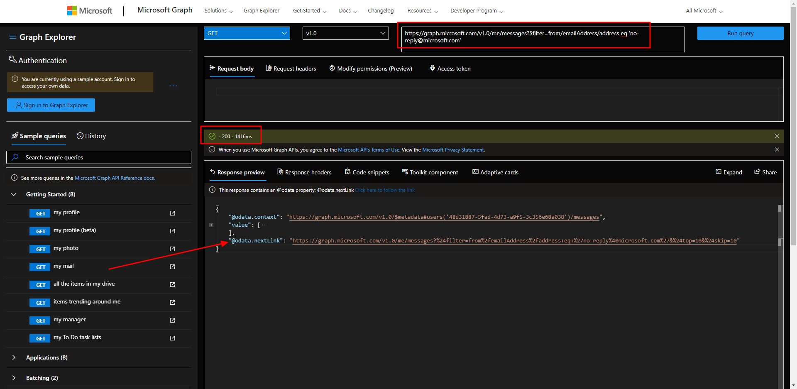

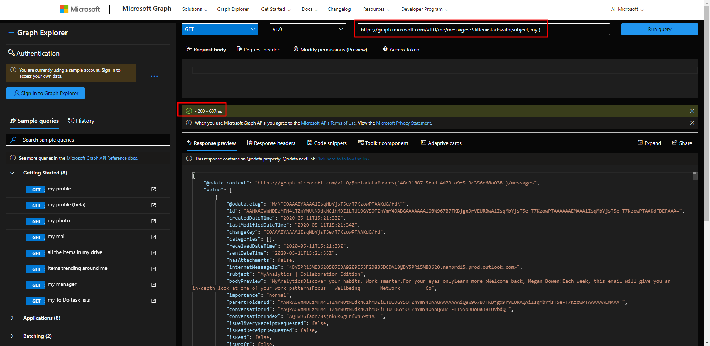

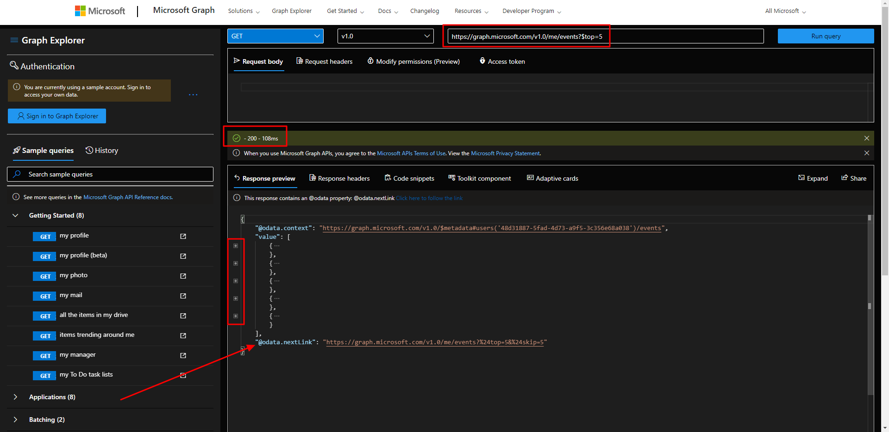

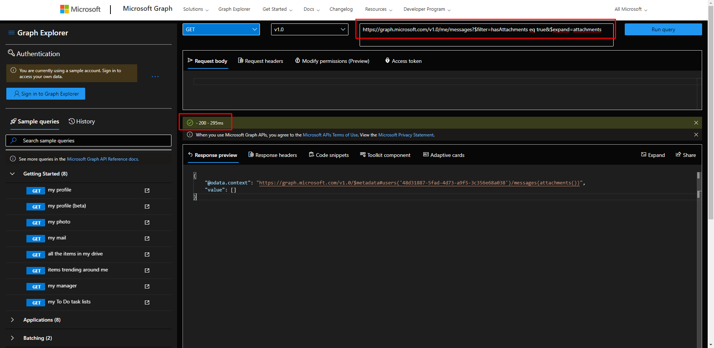

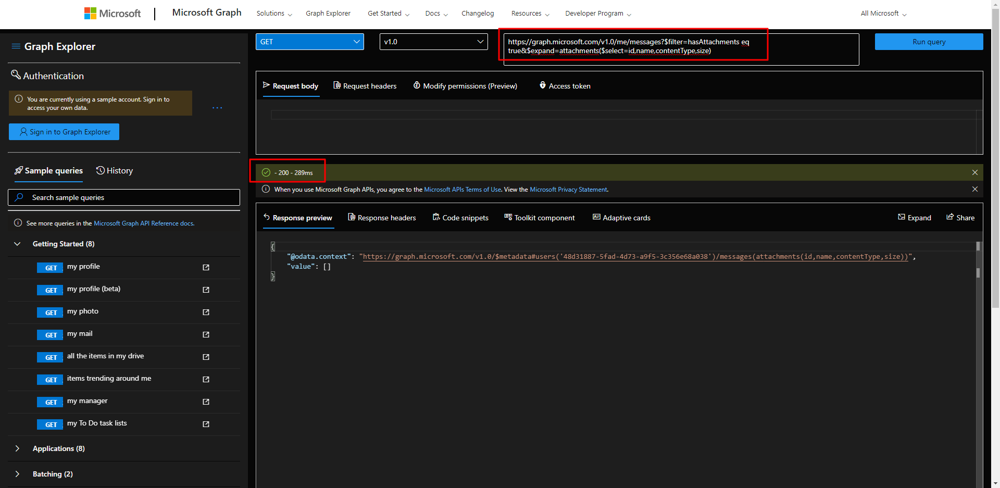

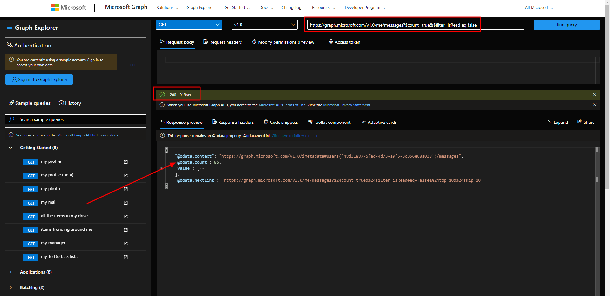

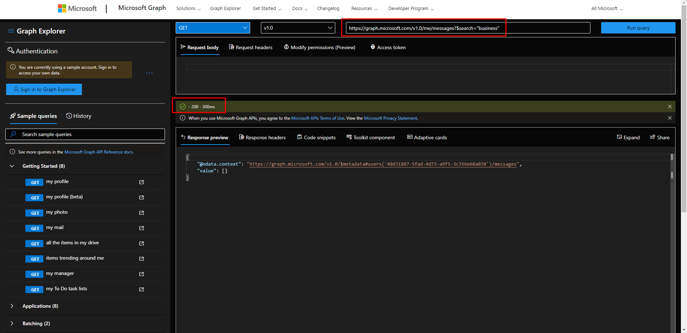

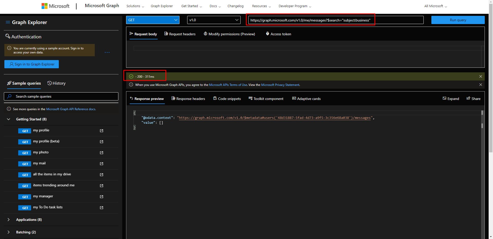
