# Exercise 2: Retrieve and control information returned from Microsoft Graph

In this exercise, you will create a new Azure AD web application registration using the Azure Active Directory (Azure AD) admin center, a .NET Core console application, and query Microsoft Graph.

By the end of this exercise you will be able to use the following queries:

- $select

- $top

- $orderby

- $filter

## Task 1: Create an Azure AD application

1. Open a browser and navigate to the [Azure Active Directory admin center (https://aad.portal.azure.com)](https://aad.portal.azure.com/). Sign in using a **Work or School Account** that has global administrator rights to the tenancy.

1. Select **Azure Active Directory** in the leftmost navigation panel.

    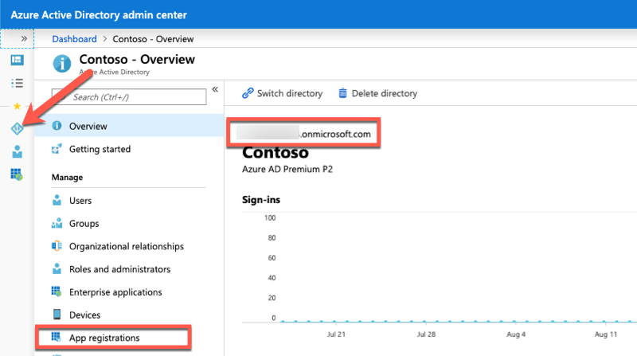

1. Select **Manage > App registrations** in the left navigation panel.

1. On the **App registrations** page, select **New registration**.

    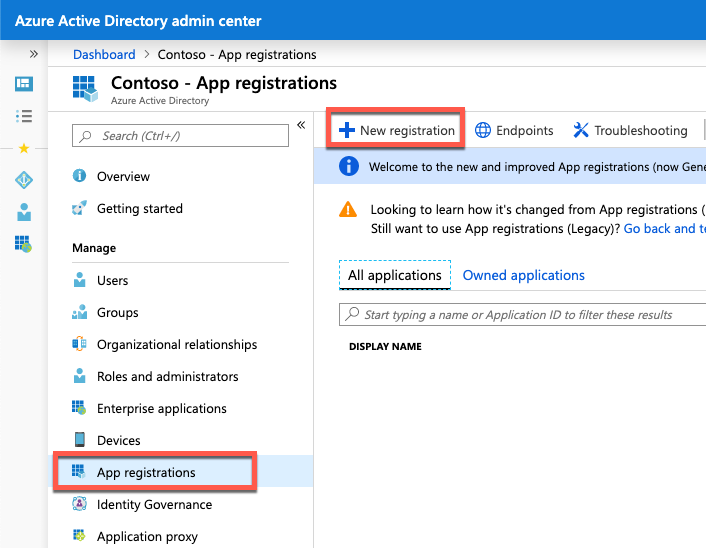

1. On the **Register an application** page, set the values as follows:

    - **Name**: Graph Console App

    - **Supported account types**: Accounts in this organizational directory only (Contoso only - Single tenant)

    - **Redirect URI**: Web = [https://localhost](https://localhost/)

    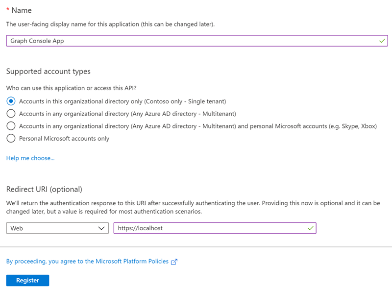

1. Select **Register**.

1. On the **Graph Console App** overview page, copy the value of the **Application (client) ID** and **Directory (tenant) ID**; you will need them later in this exercise.

    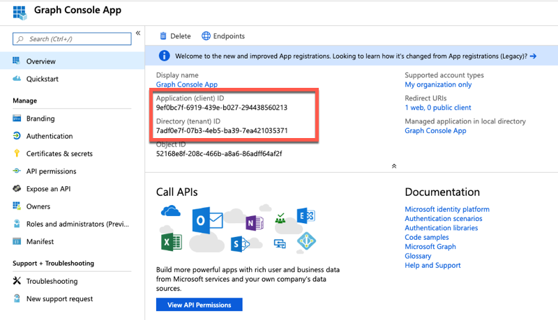

1. Select **Manage > Certificates & secrets**.

1. Select **New client secret**.

    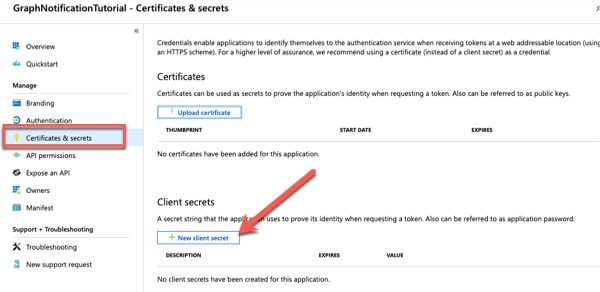

1. In the **Add a client secret** page, enter a value in **Description**, select one of the options for **Expires,** and select **Add**.

    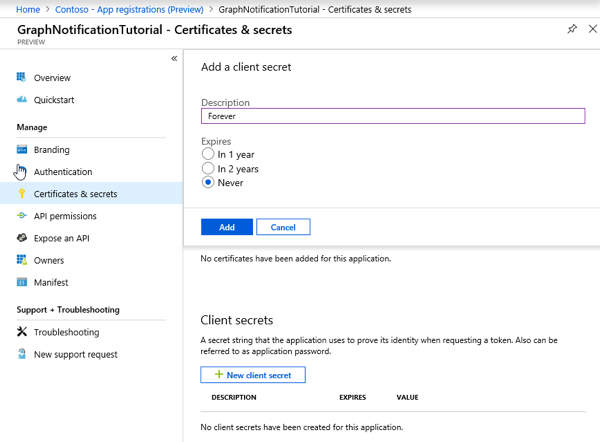

1. Copy the client secret value before you leave this page. You will need it in the next step.

    **Important**:
    This client secret is never shown again, so make sure you copy it now.

    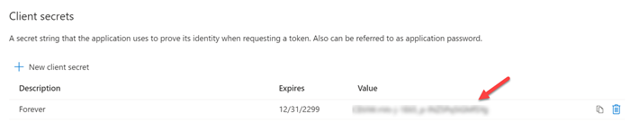

1. Grant Azure AD application permissions to Microsoft Graph. After creating the application, you need to grant it the necessary permissions to Microsoft Graph. Select **API Permissions** in the leftmost navigation panel.

    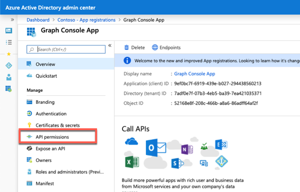

1. Select the **Add a permission** button.

    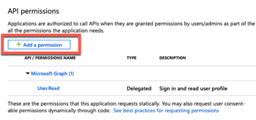

1. In the **Request API permissions** panel that appears, select **Microsoft Graph** from the **Microsoft APIs** tab.

    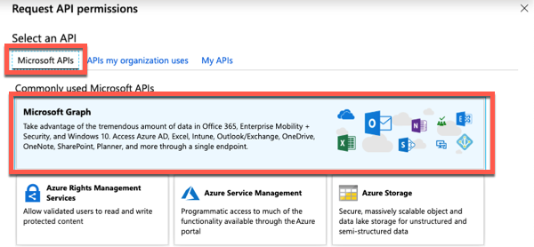

1. When prompted for the type of permission, select **Application permissions**.

    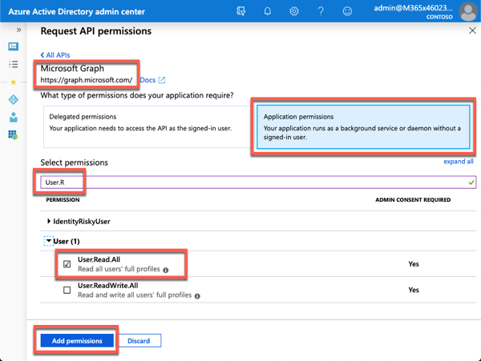

1. Enter **User.R** in the **Select permissions** search box and select the **User.Read.All** permission, followed by the **Add permission** button at the bottom of the panel.

1. Under the **Configured permissions** section, select the button **Grant admin consent for [tenant]**, followed by the **Yes** button to grant all users in your organization this permission.

## Task 2: Create .NET Core console application

1. Open your command prompt, navigate to a directory where you have rights to create your project, and run the following command to create a new .NET Core console application: `dotnet new console -o graphconsoleapp`

1. After creating the application, run the following commands to ensure your new project runs correctly.

    ```dontnetcli
    cd graphconsoleapp
    dotnet add package Microsoft.Identity.Client
    dotnet add package Microsoft.Graph
    dotnet add package Microsoft.Extensions.Configuration
    dotnet add package Microsoft.Extensions.Configuration.FileExtensions
    dotnet add package Microsoft.Extensions.Configuration.Json
    ```

1. Open the application in Visual Studio Code using the following command: `code .`

1. If Visual Studio Code displays a dialog box asking if you want to add required assets to the project, select **Yes**.

## Task 3: Update the console app to support Azure AD authentication

1. Create a new file named **appsettings.json** in the root of the project and add the following code to it:

    ```json
    {
        "tenantId": "YOUR_TENANT_ID_HERE",
        "applicationId": "YOUR_APP_ID_HERE",
        "applicationSecret": "YOUR_APP_SECRET_HERE",
        "redirectUri": "YOUR_REDIRECT_URI_HERE"
    }
    ```

1. Update properties with the following values:

    - **YOUR_TENANT_ID_HERE**: Azure AD directory ID

    - **YOUR_APP_ID_HERE**: Azure AD client ID

    - **YOUR_APP_SECRET_HERE**: Azure AD client secret

    - **YOUR_REDIRECT_URI_HERE**: redirect URI you entered when creating the Azure AD app (*for example, https://localhost*)

## Task 4: Create helper classes

1. Create a new folder **Helpers** in the project.

1. Create a new file **AuthHandler.cs** in the **Helpers** folder and add the following code:

    ```csharp
    using System.Net.Http;
    using System.Threading.Tasks;
    using Microsoft.Graph;
    using System.Threading;
    namespace Helpers
    {
        public class AuthHandler : DelegatingHandler
        {
        private IAuthenticationProvider _authenticationProvider;
            public AuthHandler(IAuthenticationProvider authenticationProvider, HttpMessageHandler innerHandler)
            {
                InnerHandler = innerHandler;
                _authenticationProvider = authenticationProvider;
            }
            protected override async Task<HttpResponseMessage> SendAsync(HttpRequestMessage request, CancellationToken cancellationToken)
            {
                await _authenticationProvider.AuthenticateRequestAsync(request);
                return await base.SendAsync(request, cancellationToken);
            }
        }
    }
    ```

1. Create a new file **MsalAuthenticationProvider.cs** in the **Helpers** folder and add the following code:

    ```csharp
    using System.Net.Http;
    using System.Net.Http.Headers;
    using System.Threading.Tasks;
    using Microsoft.Identity.Client;
    using Microsoft.Graph;
    namespace Helpers
    {
        public class MsalAuthenticationProvider : IAuthenticationProvider
        {
            private IConfidentialClientApplication _clientApplication;
            private string[] _scopes;
            public MsalAuthenticationProvider(IConfidentialClientApplication clientApplication, string[] scopes)
            {
                _clientApplication = clientApplication;
                _scopes = scopes;
            }
            public async Task AuthenticateRequestAsync(HttpRequestMessage request)
            {
                var token = await GetTokenAsync();
                request.Headers.Authorization = new AuthenticationHeaderValue("bearer", token);
            }
            public async Task<string> GetTokenAsync()
            {
                AuthenticationResult authResult = null;
                authResult = await _clientApplication.AcquireTokenForClient(_scopes).ExecuteAsync();
                return authResult.AccessToken;
            }
        }
    }
    ```

## Task 5: Incorporate Microsoft Graph into the console app

1. Open the **Program.cs** file and add the following using statements to the top of the file below  using System:

    ```csharp
    using System.Collections.Generic;
    using Microsoft.Identity.Client;
    using Microsoft.Graph;
    using Microsoft.Extensions.Configuration;
    using Helpers;
    ```

1. Add the following static member to the Program class in the **Program.cs** file. This member will be used to instantiate the client used to call Microsoft Graph:

    ```csharp
    private static GraphServiceClient _graphClient;
    ```

1. Add the following method **LoadAppSettings** to the **Program** class. This method retrieves the configuration details from the **appsettings.json** file previously created:

    ```csharp
    private static IConfigurationRoot LoadAppSettings()
    {
        try
        {
        var config = new ConfigurationBuilder()
                          .SetBasePath(System.IO.Directory.GetCurrentDirectory())
                          .AddJsonFile("appsettings.json", false, true)
                          .Build();
        if (string.IsNullOrEmpty(config["applicationId"]) ||
                    string.IsNullOrEmpty(config["applicationSecret"]) ||
                    string.IsNullOrEmpty(config["redirectUri"]) ||
                    string.IsNullOrEmpty(config["tenantId"]))
            {
                return null;
            }
            return config;
        }
        catch (System.IO.FileNotFoundException)
        {
            return null;
        }
    }
    ```

1. Add the following method **CreateAuthorizationProvider** to the **Program** class. This method will create an instance of the clients used to call Microsoft Graph:

    ```csharp
    private static IAuthenticationProvider CreateAuthorizationProvider(IConfigurationRoot config)
    {
        var clientId = config["applicationId"];
        var clientSecret = config["applicationSecret"];
        var redirectUri = config["redirectUri"];
        var authority = $"https://login.microsoftonline.com/{config["tenantId"]}/v2.0";
        List<string> scopes = new List<string>();
        scopes.Add("https://graph.microsoft.com/.default");
        var cca = ConfidentialClientApplicationBuilder.Create(clientId)
                                              .WithAuthority(authority)
                                              .WithRedirectUri(redirectUri)
                                              .WithClientSecret(clientSecret)
                                              .Build();
        return new MsalAuthenticationProvider(cca, scopes.ToArray());
    }
    ```

1. Add the following method **GetAuthenticatedGraphClient** to the **Program** class. This method creates an instance of the **GraphServiceClient** object:

    ```csharp
    private static GraphServiceClient GetAuthenticatedGraphClient(IConfigurationRoot config)
    {
        var authenticationProvider = CreateAuthorizationProvider(config);
        _graphClient = new GraphServiceClient(authenticationProvider);
        return _graphClient;
    }
    ```

1. Locate the **Main** method in the **Program** class. Add the following code to the end of the **Main** method to load the configuration settings from the **appsettings.json** file:

    ```csharp
    var config = LoadAppSettings();
    if (config == null)
    {
      Console.WriteLine("Invalid appsettings.json file.");
      return;
    }
    ```

1. Add the following code to the end of the **Main** method, just after the code added in the last step. This code will obtain an authenticated instance of the **GraphServicesClient** and submit a request for the first user.

    ```csharp
    var client = GetAuthenticatedGraphClient(config);
    var graphRequest = client.Users.Request();
    var results = graphRequest.GetAsync().Result;
    foreach(var user in results)
    {
        Console.WriteLine(user.Id + ": " + user.DisplayName + " <" + user.Mail + ">");
    }
    Console.WriteLine("\nGraph Request:");
    Console.WriteLine(graphRequest.GetHttpRequestMessage().RequestUri);
    ```

## Task 6: Build and test the application

1. Run the following command in a command prompt to compile the console application: `dotnet build`

1. Run the following command to run the console application: `dotnet run`

1. When the application runs, you'll see a list of users displayed. The query retrieved all information about the users.

    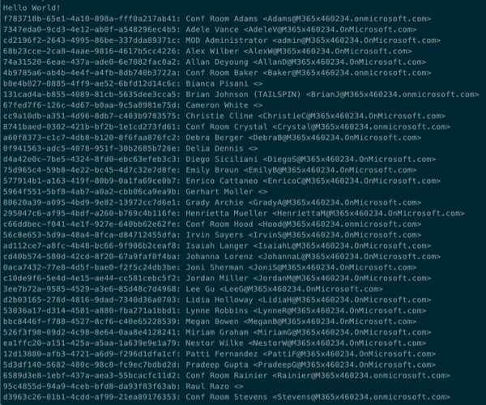

    **Note**:
    Notice the URL written to the console. This is the entire request, including query parameters, that the Microsoft Graph SDK is generating. Take note for each query you run in this exercise.

## Task 7: Edit the application to optimize the query

The current console application isn't efficient because it retrieves all information about all users in your organization but only displays three properties. The **$select** query parameter can limit the amount of data that is returned by Microsoft Graph, optimizing the query.

1. Update the line that starts with `var results = graphRequest` in the **Main** method with the following to limit the query to just two properties:

    ```csharp
    var results = graphRequest
                        .Select(u => new { u.DisplayName, u.Mail })
                        .GetAsync()
                        .Result;
    ```

1. Rebuild and rerun the console application by executing the following commands in the command line:

    ```csharp
    dotnet build
    dotnet run
    ```

1. Notice that the **ID** property isn't populated with data, as it wasn't included in the **$select** query parameter.

    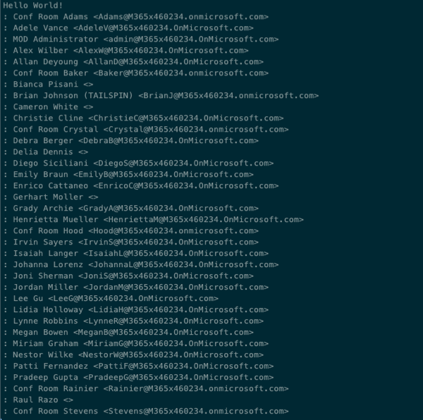

1. Let us further limit the results to just the first 15 results. Update the line that starts with `var results = graphRequest` in the **Main** method with the following:

    ```csharp
    var results = graphRequest
                        .Select(u => new { u.DisplayName, u.Mail })
                        .Top(15)
                        .GetAsync()
                        .Result;
    ```

1. Rebuild and rerun the console application by executing the following commands in the command line:

    ```csharp
    dotnet build
    dotnet run
    ```

1. Notice only 15 items are now returned by the query.

    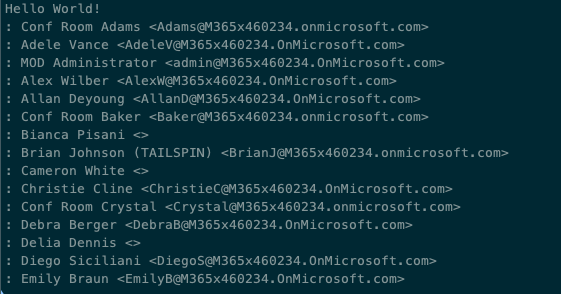

1. Sort the results in reverse alphabetic order. Update the line that starts with `var results = graphRequest` in the **Main** method with the following:

    ```csharp
    var results = graphRequest
                        .Select(u => new { u.DisplayName, u.Mail })
                        .Top(15)
                        .OrderBy("DisplayName desc")
                        .GetAsync()
                        .Result;
    ```

1. Rebuild and rerun the console application by executing the following commands in the command line:

    ```csharp
    dotnet build
    dotnet run
    ```

    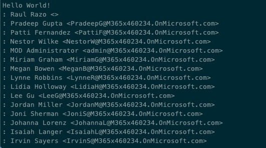

1. Further refine the results by selecting users whose surname starts with A, B, or C. You'll need to remove the **\$orderby** query parameter added previously as the Users endpoint doesn't support combining the **\$filter** and **\$orderby** parameters. Update the line that starts with `var results = graphRequest` in the **Main** method with the following:

    ```csharp
    var results = graphRequest
                        .Select(u => new { u.DisplayName, u.Mail })
                        .Top(15)
                        // .OrderBy("DisplayName desc)
                        .Filter("startsWith(surname,'A') or startsWith(surname,'B') or startsWith(surname,'C')")
                        .GetAsync()
                        .Result;
    ```

1. Rebuild and rerun the console application by executing the following commands in the command line:

    ```powershell
    dotnet build
    dotnet run
    ```

    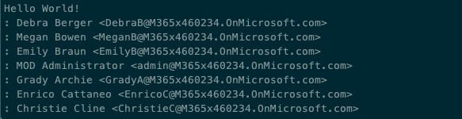

## Review

In this exercise, you created an Azure AD application and .NET console application that retrieved user data from Microsoft Graph. You then used query parameters to limit and manipulate the data returned by Microsoft Graph to optimize the query.


### [Go to exercise 03 instructions -->](../Exercise_03/04-Exercise-3-Using-change-notifications-and-track-changes-with-Microsoft-Graph.md)

### [<-- Back to readme](../../../)
