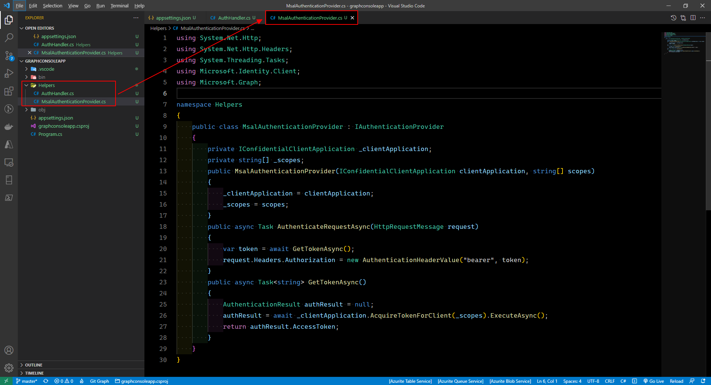

# Microsoft Ms-600 (Adrián Arenilla Seco) - LAB 02

## Exercise 2: Retrieve and control information returned from Microsoft Graph
### [Go to exercise 02 instructions -->](03-Exercise-2-Retrieve-and-control-information-returned-from-Microsoft-Graph.md)

Register a single-tenant Azure AD application.

Add a client secret.

Update the App API permissions.

Select Grant admin consent for the app Graph Console App.

Update the console app to support Azure AD authentication.

Create helper classes.

Create helper classes.

Incorporate Microsoft Graph into the console app.

Build and test the application.

Edit the application to optimize the query and build and test the application.

Update the application to optimize the query and build and test the application.

Update the application to optimize the query and build and test the application.

Update the application to optimize the query and build and test the application.

### [<-- Back to readme](../../../../)