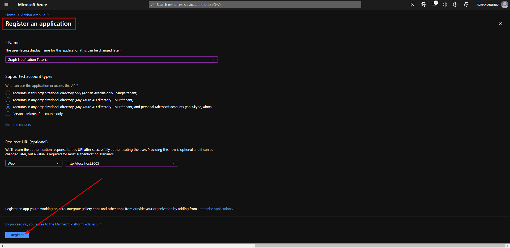
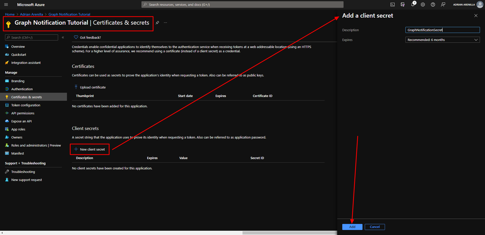
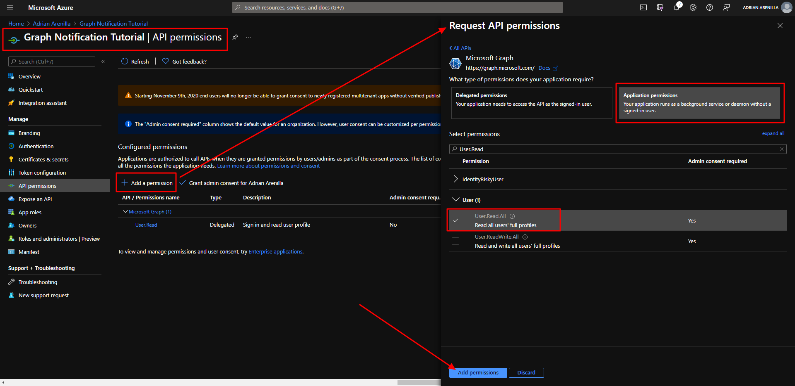
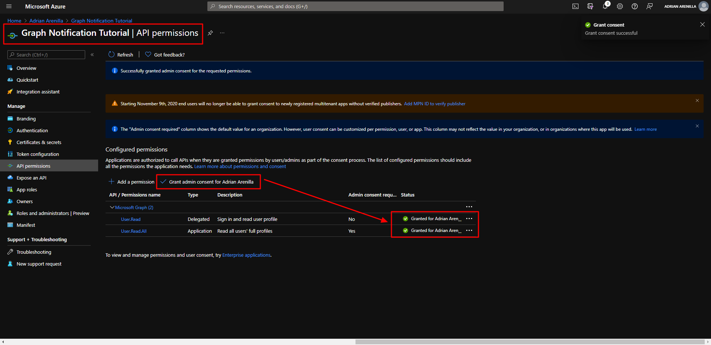
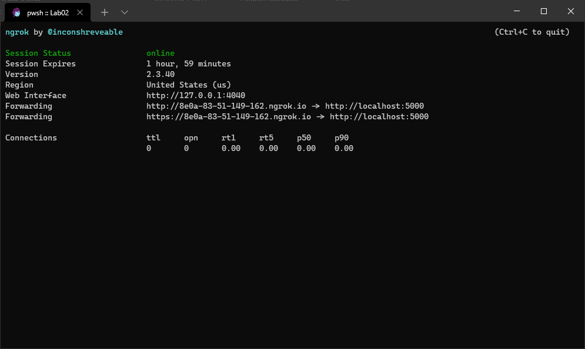
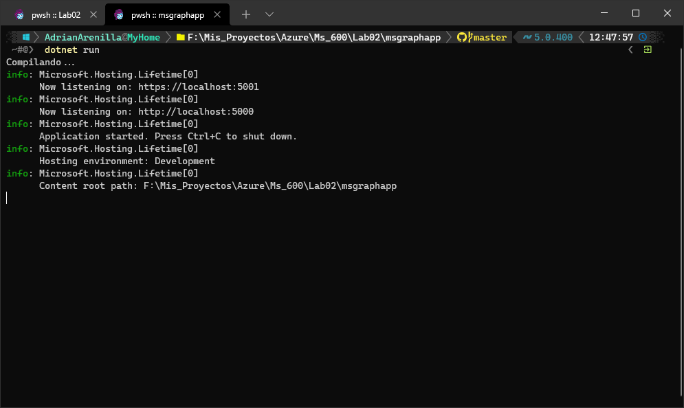
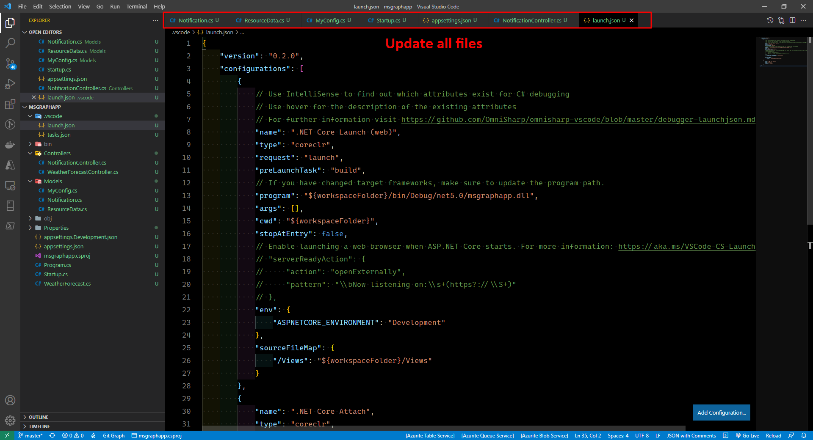
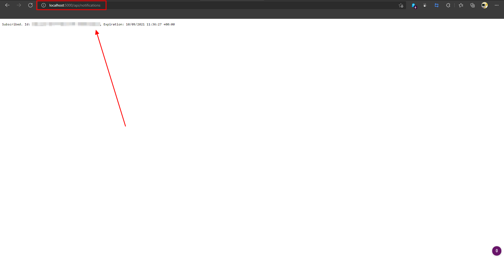

# Microsoft Ms-600 (Adrián Arenilla Seco) - LAB 02

## Exercise 3: Using change notifications and track changes with Microsoft Graph
### [Go to exercise 03 instructions -->](04-Exercise-3-Using-change-notifications-and-track-changes-with-Microsoft-Graph.md)

Register an application.

Add a client secret.

Update the App API permissions.

Select Grant admin consent for the app Graph Notification Tutorial.

Run ngrok.

Create .NET Core WebApi App.

Code the HTTP API.

Run the application.

Query for changes and test the changes.

### [<-- Back to readme](../../../../)
