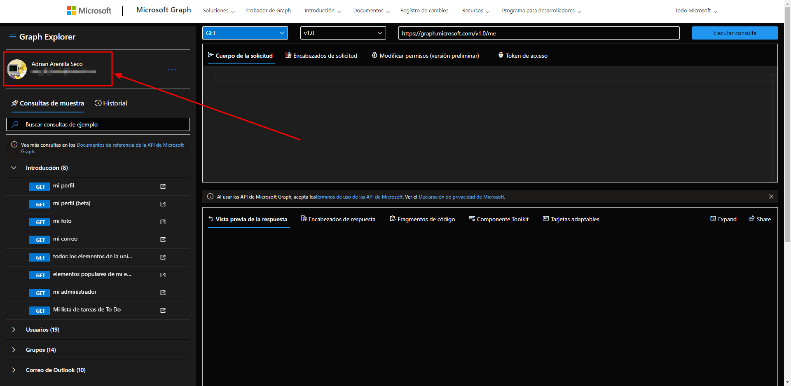
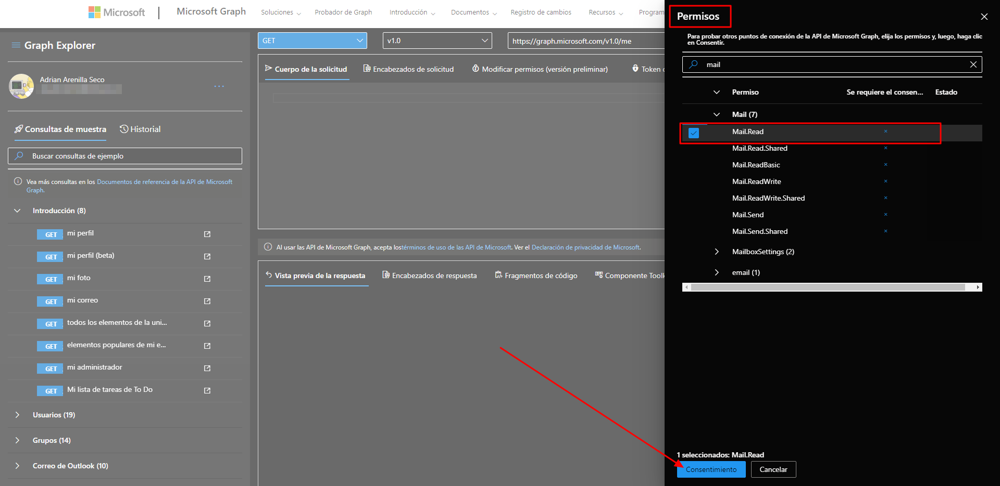
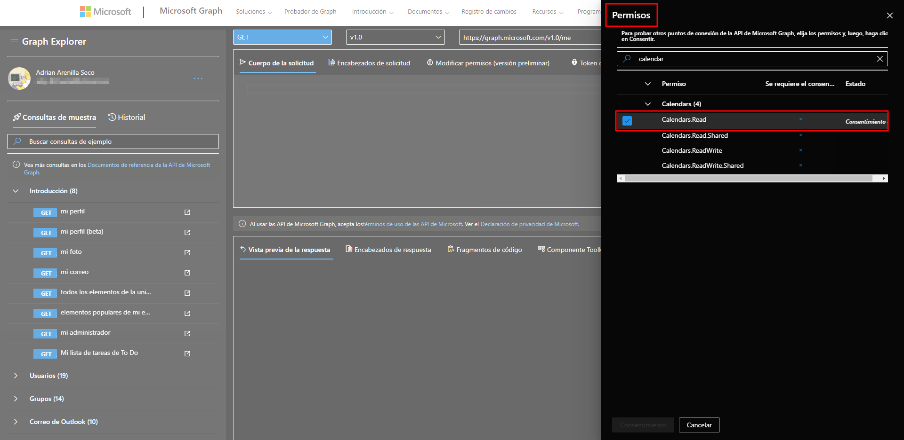
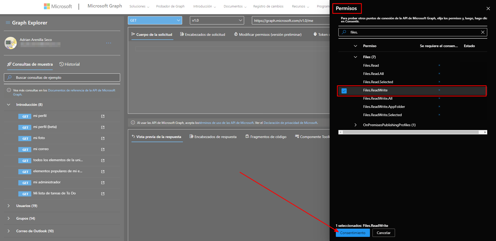
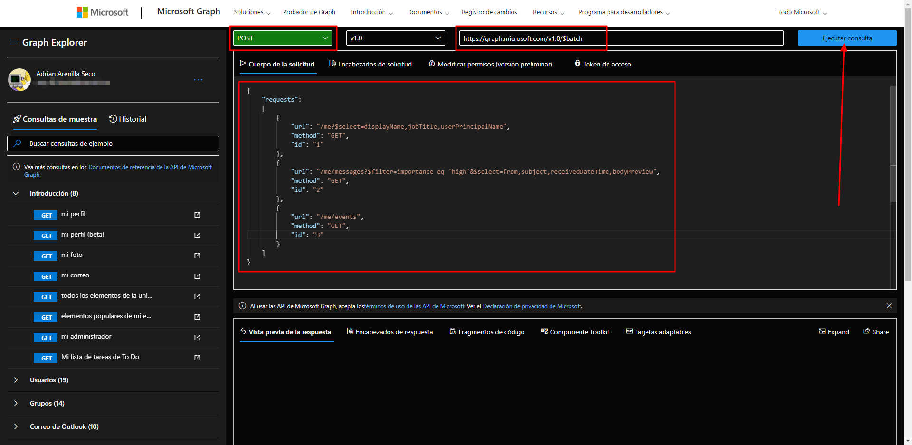
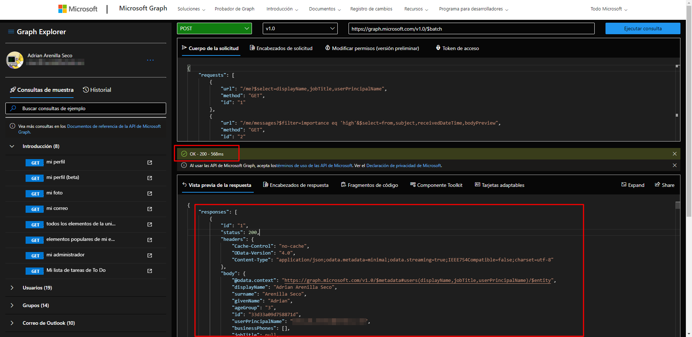
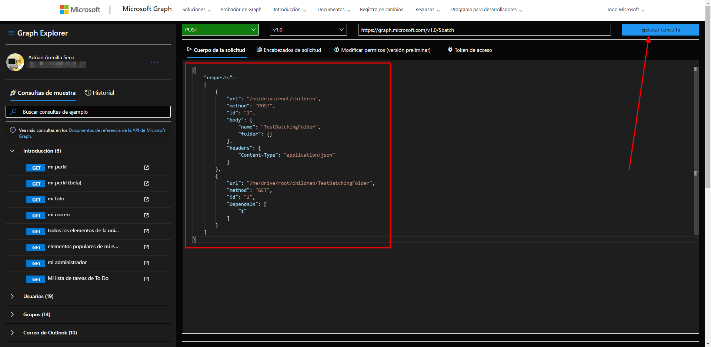
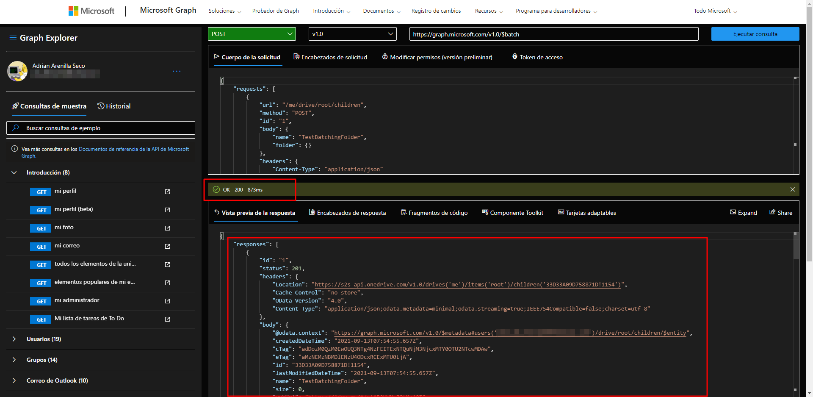

# Microsoft Ms-600 (Adrián Arenilla Seco) - LAB 02

## # Exercise 4: Reduce traffic with batched requests
### [Go to exercise 04 instructions -->](05-Exercise-4-Reduce-traffic-with-batched-requests.md)

Sign in to Microsoft Graph Explorer.

After signing in, click select permissions and verify that the user has the permissions to submit the requests in this exercise.

After signing in, click select permissions and verify that the user has the permissions to submit the requests in this exercise.

After signing in, click select permissions and verify that the user has the permissions to submit the requests in this exercise.

`https://graph.microsoft.com/v1.0/\$batch`

Observe the results in the Response Preview box at the bottom of the page.

Update the JSON code to the Request Body input box.

Observe the results in the Response Preview box at the bottom of the page.

### [<-- Back to readme](../../../../)