# Exercise 5: Understand throttling in Microsoft Graph

In this exercise, you will create a new Azure AD web application registration using the Azure AD admin center, a .NET Core console application, and query Microsoft Graph. You will issue many requests in parallel to trigger your requests to be throttled. This application will allow you to see the response you will receive.

## Task 1: Create an Azure AD application

1. Open a browser and navigate to the [Azure Active Directory admin center (https://aad.portal.azure.com)](https://aad.portal.azure.com/). Sign in using a **Work or School Account** that has global administrator rights to the tenancy.

1. Select **Azure Active Directory** in the leftmost navigation panel.

    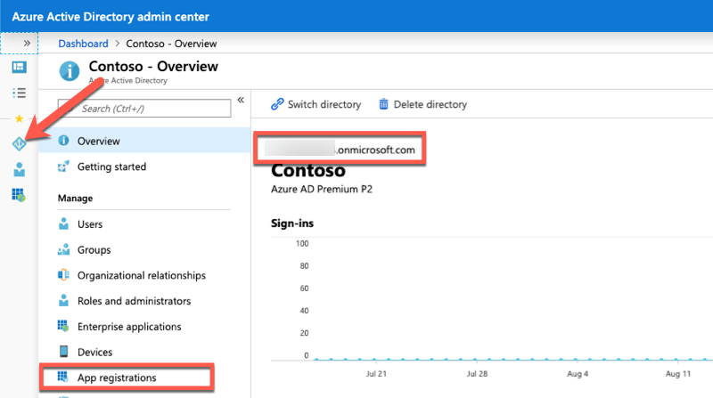

1. Select **Manage > App registrations** in the left navigation panel.

1. On the **App registrations** page, select **New registration**.

    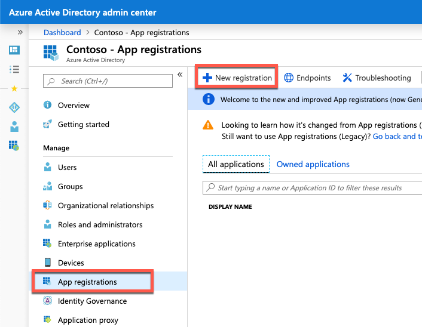

1. On the **Register an application** page, set the values as follows:

    - **Name**: Graph Console Throttle App.

    - **Supported account types**: Accounts in this organizational directory only (Contoso only - Single tenant).

    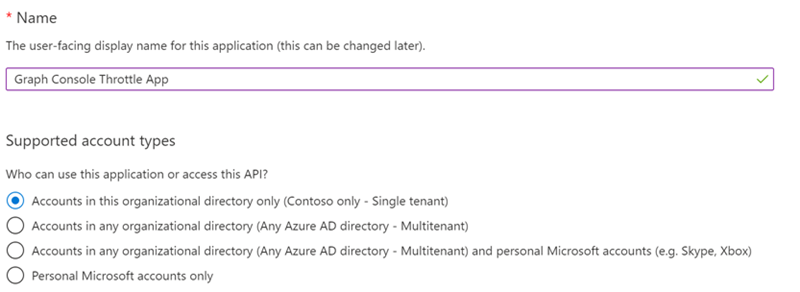

1. Select **Register**.

1. On the **Graph Console App** page, copy the value of the **Application (client) ID** and **Directory (tenant) ID**; you will need these in the application.

    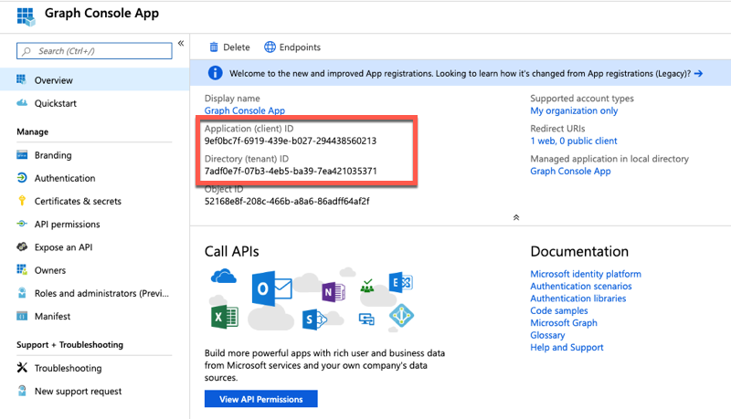

1. Select **Manage > Authentication**.

1. Under **Platform configurations**, select **Add a platform**.

1. In Configure platforms, select **Mobile and desktop applications**.

    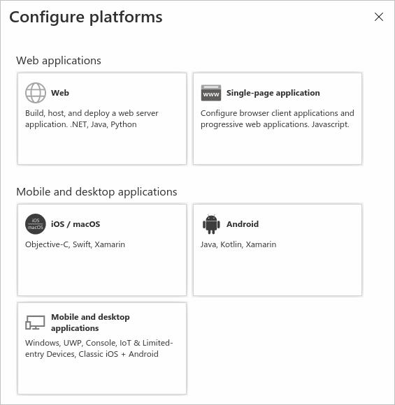

1. In the section **Redirect URIs**, select the entry that begins with **msal** and enter **https://contoso** in **Custom redirect URIs** section, and then click **Configure** button.

    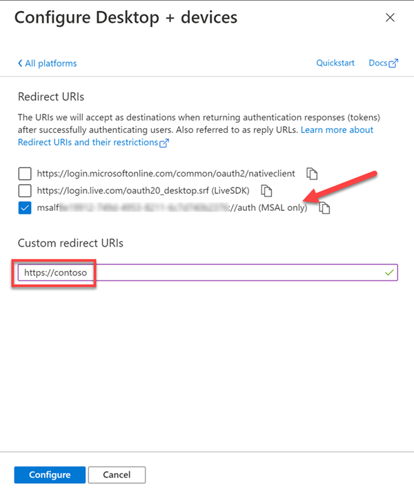

1. Scroll down to the **Advanced settings** section and set the toggle to **Yes**.

    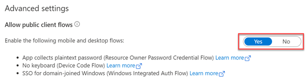

1. Select **Save** in the top menu to save your changes.

## Task 2: Grant Azure AD application permissions to Microsoft Graph

After creating the application, you need to grant it the necessary permissions to Microsoft Graph.

1. Select **API Permissions** in the left navigation panel.

    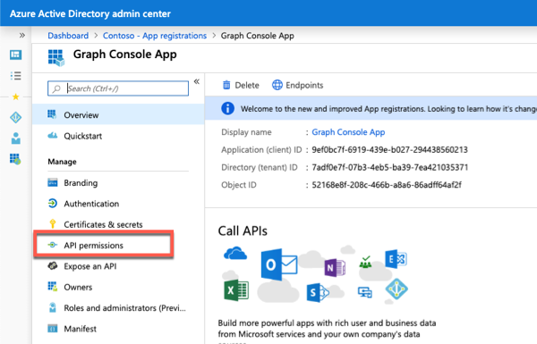

1. Select the **Add a permission** button.

    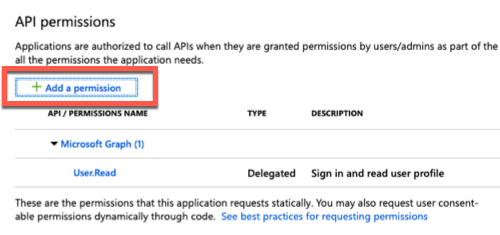

1. In the **Request API permissions** panel that appears, select **Microsoft Graph** from the **Microsoft APIs** tab.

    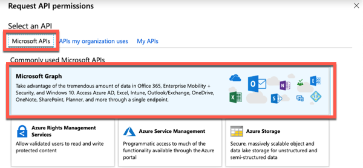

1. When prompted for the type of permission, select **Delegated permissions**.

    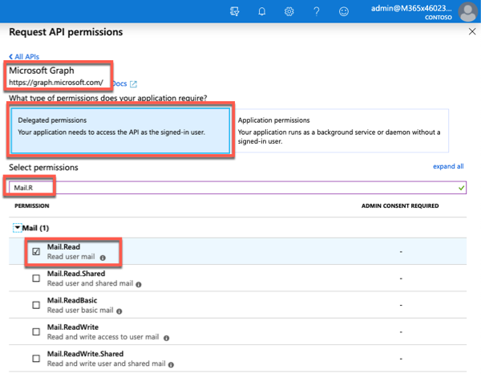

1. Enter **Mail.R** in the **Select permissions** search box and select the **Mail.Read** permission, followed by the **Add permission** button at the bottom of the panel.

1. At the bottom of the **API Permissions** panel, select the button **Grant admin consent for [tenant]**, followed by the **Yes** button, to grant all users in your organization this permission.

The option to **Grant admin consent** here in the Azure AD admin center is pre-consenting the permissions to the users in the tenant to simplify the exercise. This approach allows the console application to use the [resource owner password credential grant](https://docs.microsoft.com/azure/active-directory/develop/v2-oauth-ropc), so the user isn't prompted to grant consent to the application that simplifies the process of obtaining an OAuth access token. You could elect to implement alternative options such as the [device code flow](https://docs.microsoft.com/azure/active-directory/develop/v2-oauth2-device-code) to utilize dynamic consent as another option.

## Task 3: Create .NET Core console application

1. Open your command prompt, navigate to a directory where you have rights to create your project, and run the following command to create a new .NET Core console application: `dotnet new console -o graphconsolethrottlepp`

1. After creating the application, run the following commands to ensure your new project runs correctly:

    ```dontnetcli
    cd graphconsolethrottlepp
    dotnet add package Microsoft.Identity.Client
    dotnet add package Microsoft.Graph
    dotnet add package Microsoft.Extensions.Configuration
    dotnet add package Microsoft.Extensions.Configuration.FileExtensions
    dotnet add package Microsoft.Extensions.Configuration.Json
    ```

1. Open the application in Visual Studio Code using the following command: `code .`

1. If Visual Studio Code displays a dialog box asking if you want to add required assets to the project, select **Yes**.

## Task 4: Update the console app to support Azure AD authentication

1. Create a new file named **appsettings.json** in the root of the project and add the following code to it:

    ```json
     {
       "tenantId": "YOUR_TENANT_ID_HERE",
        "applicationId": "YOUR_APP_ID_HERE"
    }
    ```

1. Update properties with the following values:

    - **YOUR_TENANT_ID_HERE**: Azure AD directory ID

    - **YOUR_APP_ID_HERE**: Azure AD client ID

## Task 5: Create authentication helper classes

1. Create a new folder **Helpers** in the project.

1. Create a new file **AuthHandler.cs** in the **Helpers** folder and add the following code:

    ```csharp
    using System.Net.Http;
    using System.Threading;
    using System.Threading.Tasks;
    using Microsoft.Graph;
    namespace Helpers
    {
        public class AuthHandler : DelegatingHandler
        {
            private IAuthenticationProvider _authenticationProvider;
            public AuthHandler(IAuthenticationProvider authenticationProvider, HttpMessageHandler innerHandler)
            {
                InnerHandler = innerHandler;
                _authenticationProvider = authenticationProvider;
            }
            protected override async Task<HttpResponseMessage> SendAsync(HttpRequestMessage request, CancellationToken cancellationToken)
            {
                await _authenticationProvider.AuthenticateRequestAsync(request);
                return await base.SendAsync(request, cancellationToken);
            }
        }
    }
    ```

1. Create a new file **MsalAuthenticationProvider.cs** in the **Helpers** folder and add the following code:

    ```csharp
    using System.Net.Http;
    using System.Net.Http.Headers;
    using System.Security;
    using System.Threading.Tasks;
    using Microsoft.Identity.Client;
    using Microsoft.Graph;
    namespace Helpers
    {
        public class MsalAuthenticationProvider : IAuthenticationProvider
        {
            private static MsalAuthenticationProvider _singleton;
            private IPublicClientApplication _clientApplication;
            private string[] _scopes;
            private string _username;
            private SecureString _password;
            private string _userId;
            private MsalAuthenticationProvider(IPublicClientApplication clientApplication, string[] scopes, string username, SecureString password)
            {
                _clientApplication = clientApplication;
                _scopes = scopes;
                _username = username;
                _password = password;
                _userId = null;
            }
            public static MsalAuthenticationProvider GetInstance(IPublicClientApplication clientApplication, string[] scopes, string username, SecureString password)
            {
                if (_singleton == null)
                {
                    _singleton = new MsalAuthenticationProvider(clientApplication, scopes, username, password);
                }
                return _singleton;
            }
            public async Task AuthenticateRequestAsync(HttpRequestMessage request)
            {
                var accessToken = await GetTokenAsync();
                request.Headers.Authorization = new AuthenticationHeaderValue("bearer", accessToken);
            }
            public async Task<string> GetTokenAsync()
            {
                if (!string.IsNullOrEmpty(_userId))
                {
                    try
                    {
                        var account = await _clientApplication.GetAccountAsync(_userId);
                        if (account != null)
                        {
                            var silentResult = await _clientApplication.AcquireTokenSilent(_scopes, account).ExecuteAsync();
                            return silentResult.AccessToken;
                        }
                    }
                    catch (MsalUiRequiredException){ }
                }
                var result = await _clientApplication.AcquireTokenByUsernamePassword(_scopes, _username, _password).ExecuteAsync();
                _userId = result.Account.HomeAccountId.Identifier;
                return result.AccessToken;
            }
        }
    }
    ```

## Task 6: Incorporate Microsoft Graph into the console app

1. Open the **Program.cs** file and add the following `using` statements to the top of the file below **using System;** line:

    ```csharp
    using System.Collections.Generic;
    using System.Net;
    using System.Net.Http;
    using System.Net.Http.Headers;
    using System.Security;
    using System.Threading.Tasks;
    using Microsoft.Identity.Client;
    using Microsoft.Graph;
    using Microsoft.Extensions.Configuration;
    using Helpers;
    ```

1. Add the following method **LoadAppSettings** to the **Program** class. The method retrieves the configuration details from the **appsettings.json** file previously created:

    ```csharp
    private static IConfigurationRoot LoadAppSettings()
        {
          try
          {
            var config = new ConfigurationBuilder()
                              .SetBasePath(System.IO.Directory.GetCurrentDirectory())
                              .AddJsonFile("appsettings.json", false, true)
                              .Build();
            if (string.IsNullOrEmpty(config["applicationId"]) ||
                string.IsNullOrEmpty(config["tenantId"]))
            {
              return null;
            }
            return config;
          }
          catch (System.IO.FileNotFoundException)
          {
            return null;
          }
        }
    ```

1. Add the following method **CreateAuthorizationProvider** to the **Program** class. The method will create an instance of the clients used to call Microsoft Graph.

    ```csharp
    private static IAuthenticationProvider CreateAuthorizationProvider(IConfigurationRoot config, string userName, SecureString userPassword)
        {
          var clientId = config["applicationId"];
          var authority = $"https://login.microsoftonline.com/{config["tenantId"]}/v2.0";
          List<string> scopes = new List<string>();
          scopes.Add("User.Read");
          scopes.Add("Mail.Read");
          var cca = PublicClientApplicationBuilder.Create(clientId)
                                                  .WithAuthority(authority)
                                                  .Build();
          return MsalAuthenticationProvider.GetInstance(cca, scopes.ToArray(), userName, userPassword);
        }
    ```

1. Add the following method **GetAuthenticatedHTTPClient** to the **Program** class. The method creates an instance of the **HttpClient** object.

    ```csharp
        private static HttpClient GetAuthenticatedHTTPClient(IConfigurationRoot config, string userName, SecureString userPassword)
        {
          var authenticationProvider = CreateAuthorizationProvider(config, userName, userPassword);
          var httpClient = new HttpClient(new AuthHandler(authenticationProvider, new HttpClientHandler()));
          return httpClient;
        }
    ```

1. Add the following method **ReadPassword** to the **Program** class. The method prompts the user for their password:

    ```csharp
    private static SecureString ReadPassword()
        {
          Console.WriteLine("Enter your password");
          SecureString password = new SecureString();
          while (true)
          {
            ConsoleKeyInfo c = Console.ReadKey(true);
            if (c.Key == ConsoleKey.Enter)
            {
              break;
            }
            password.AppendChar(c.KeyChar);
            Console.Write("*");
          }
          Console.WriteLine();
          return password;
        }
    ```

1. Add the following method **ReadUsername** to the **Program** class. The method prompts the user for their username:

    ```csharp
      private static string ReadUsername()
        {
          string username;
          Console.WriteLine("Enter your username");
          username = Console.ReadLine();
          return username;
        }
    ```

1. Locate the **Main** method in the **Program** class. Add the following code below **Console.WriteLine("Hello World!");** to load the configuration settings from the **appsettings.json** file:

    ```csharp
          var config = LoadAppSettings();
          if (config == null)
          {
            Console.WriteLine("Invalid appsettings.json file.");
            return;
          }
    ```

1. Add the following code to the end of the **Main** method, just after the code added in the last step. This code will obtain an authenticated instance of the **HttpClient** and submit a request for the current user's email:

    ```csharp
          var userName = ReadUsername();
          var userPassword = ReadPassword();
          var client = GetAuthenticatedHTTPClient(config, userName, userPassword);
    ```

1. Add the following code below **var client = GetAuthenticatedHTTPClient(config, userName, userPassword);**  to issue many requests to Microsoft Graph. This code will create a collection of tasks to request a specific Microsoft Graph endpoint. When a task succeeds, it will write a dot to the console, while a failed request will write an X to the console. The most recent failed request's status code and headers are saved. All tasks are then executed in parallel. At the conclusion of all requests, the results are written to the console:

    ```csharp
    var totalRequests = 100;
          var successRequests = 0;
          var tasks = new List<Task>();
          var failResponseCode = HttpStatusCode.OK;
          HttpResponseHeaders failedHeaders = null;
          for (int i = 0; i < totalRequests; i++)
          {
            tasks.Add(Task.Run(() =>
            {
              var response = client.GetAsync("https://graph.microsoft.com/v1.0/me/messages").Result;
              Console.Write(".");
              if (response.StatusCode == HttpStatusCode.OK)
              {
                successRequests++;
              }
              else
              {
                Console.Write('X');
                failResponseCode = response.StatusCode;
                failedHeaders = response.Headers;
              }
            }));
          }
          var allWork = Task.WhenAll(tasks);
          try
          {
            allWork.Wait();
          }
          catch { }
          Console.WriteLine();
          Console.WriteLine("{0}/{1} requests succeeded.", successRequests, totalRequests);
          if (successRequests != totalRequests)
          {
            Console.WriteLine("Failed response code: {0}", failResponseCode.ToString());
            Console.WriteLine("Failed response headers: {0}", failedHeaders);
          }
    ```

## Task 7: Build and test the application

1. Run the following command in a command prompt to compile the console application: `dotnet build`

1. Run the following command to run the console application: `dotnet run`

    **Note**:
    The console app may take one or two minutes to complete the process of authenticating and obtaining an access token from Azure AD and issuing the requests to Microsoft Graph.

1. After entering the username and password of a user, you will see the results written to the console.

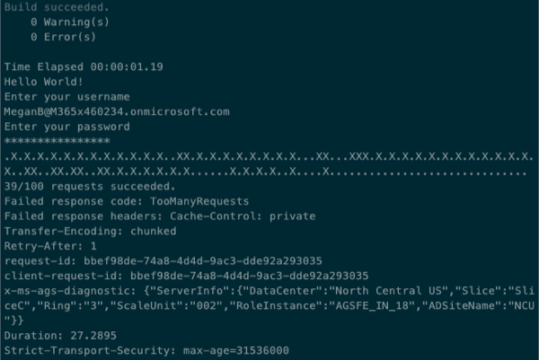

There is a mix of success and failure indicators in the console. The summary states only 39% of the requests were successful.

After the results, the console has two lines that begin with **Failed response**. Notice the code states **TooManyRequests** that is the representation of the HTTP status code 429. This status code is the indication that your requests are being throttled.

Also notice within the collection of response headers, the presence of **Retry-After**. This header is the value in seconds that Microsoft Graph tells you to wait before sending your next request to avoid being further throttled.

### Add helper class to deserialize the message object returned in a REST request

It is easier to work with strongly typed objects instead of untyped JSON responses from a **REST** request. Create a helper class to simplify working with the messages objects returned from the REST request.

1. Create a new file, **Messages.cs** in the root of the project, and add the following code to it:

    ```csharp
    using Newtonsoft.Json;
    using System;
    namespace graphconsolethrottlepp
    {
        public class Messages
        {
            [JsonProperty(PropertyName = "@odata.context")]
            public string ODataContext { get; set; }
            [JsonProperty(PropertyName = "@odata.nextLink")]
            public string ODataNextLink { get; set; }
            [JsonProperty(PropertyName = "value")]
            public Message[] Items { get; set; }
        }
        public class Message
        {
            [JsonProperty(PropertyName = "@odata.etag")]
            public string ETag { get; set; }
            [JsonProperty(PropertyName = "id")]
            public string Id { get; set; }
            [JsonProperty(PropertyName = "subject")]
            public string Subject { get; set; }
        }
    }
    ```

    **Note**:
    This class is used by the JSON deserializer to translate a JSON response into a Messages object.

### Add method to implement delayed retry strategy when requests are throttled

The application is going to be modified to first get a list of messages in the current user's mailbox, then issue a separate request for the details of each message. In most scenarios, a separate request will trigger Microsoft Graph to throttle the requests.

To address this, your code should inspect each response for situations when the request has been throttled. In those situations, the code should check for the presence of a Retry-After header in the response that specifies the number of seconds your application should wait before issuing another request. If a Retry-After header isn't present, you should have a default value to fall back on.

1. Within the **Program.cs** file, add a new method **GetMessageDetail()** and the following code to it:

    ```csharp
    private static Message GetMessageDetail(HttpClient client, string messageId, int defaultDelay = 2)
    {
        Message messageDetail = null;
        string endpoint = "https://graph.microsoft.com/v1.0/me/messages/" + messageId;
        // add code here
        return messageDetail;
    }
    ```

1. Add the following code before the `// add code here` comment to create a request and wait for the response from Microsoft Graph:

    ```csharp
    // submit request to Microsoft Graph & wait to process response
    var clientResponse = client.GetAsync(endpoint).Result;
    var httpResponseTask = clientResponse.Content.ReadAsStringAsync();
    httpResponseTask.Wait();
    ```

1. In the case of a successful response, return the deserialized response back to the caller to display the messages. Add the following lines to the top of the **Program.cs** file to update the **using** statements:

    ```csharp
    using Newtonsoft.Json;
    ```

1. Go back to the method **GetMessageDetail()** and the following code before the `// add code here` comment:

    ```csharp
    Console.WriteLine("...Response status code: {0}  ", clientResponse.StatusCode);
    // IF request successful (not throttled), set message to retrieved message
    if (clientResponse.StatusCode == HttpStatusCode.OK)
    {
      messageDetail = JsonConvert.DeserializeObject<Message>(httpResponseTask.Result);
    }
    ```

1. In the case of a throttled response, add the following **else** statement to the if statement you just added:

    ```csharp
    // ELSE IF request was throttled (429, aka: TooManyRequests)...
    else if (clientResponse.StatusCode == HttpStatusCode.TooManyRequests)
    {
        // get retry-after if provided; if not provided default to 2s
        int retryAfterDelay = defaultDelay;
        if (clientResponse.Headers.RetryAfter.Delta.HasValue && (clientResponse.Headers.RetryAfter.Delta.Value.Seconds > 0))
        {
            retryAfterDelay = clientResponse.Headers.RetryAfter.Delta.Value.Seconds;
        }
        // wait for specified time as instructed by Microsoft Graph's Retry-After header,
        //    or fall back to default
        Console.WriteLine(">>>>>>>>>>>>> sleeping for {0} seconds...", retryAfterDelay);
        System.Threading.Thread.Sleep(retryAfterDelay * 1000);
        // call method again after waiting
        messageDetail = GetMessageDetail(client, messageId);
    }
    ```

This code will do the following:

- Set a default delay of two seconds before the next request is made.

- If the Retry-After header value is present and greater than zero seconds, use that value to overwrite the default delay.

- Set the thread to sleep for the specified, or default, number of seconds.

- Recursively call the same method to retry the request.

    **Tip**:
    In cases where the response does not include a **Retry-After** header, it is recommended to consider implementing an exponential back-off default delay. In this code, the application will initially pause for two seconds before retrying the request. Future requests will double the delay if Microsoft Graph continues to throttle the request.

Real-world applications should have an upper limit on how long they will delay so to avoid an unreasonable delay so users are not left with an unresponsive experience.

The resulting method should look like the following:

```csharp
private static Message GetMessageDetail(HttpClient client, string messageId, int defaultDelay = 2)
        {
            Message messageDetail = null;
            string endpoint = "https://graph.microsoft.com/v1.0/me/messages/" + messageId;
            // submit request to Microsoft Graph & wait to process response
            var clientResponse = client.GetAsync(endpoint).Result;
            var httpResponseTask = clientResponse.Content.ReadAsStringAsync();
            httpResponseTask.Wait();
            Console.WriteLine("...Response status code: {0}  ", clientResponse.StatusCode);
            // IF request successful (not throttled), set message to retrieved message
            if (clientResponse.StatusCode == HttpStatusCode.OK)
            {
                messageDetail = JsonConvert.DeserializeObject<Message>(httpResponseTask.Result);
            }
            // ELSE IF request was throttled (429, aka: TooManyRequests)...
            else if (clientResponse.StatusCode == HttpStatusCode.TooManyRequests)
            {
                // get retry-after if provided; if not provided default to 2s
                int retryAfterDelay = defaultDelay;
                if (clientResponse.Headers.RetryAfter.Delta.HasValue && (clientResponse.Headers.RetryAfter.Delta.Value.Seconds > 0))
                {
                    retryAfterDelay = clientResponse.Headers.RetryAfter.Delta.Value.Seconds;
                }
                // wait for specified time as instructed by Microsoft Graph's Retry-After header,
                //    or fall back to default
                Console.WriteLine(">>>>>>>>>>>>> sleeping for {0} seconds...", retryAfterDelay);
                System.Threading.Thread.Sleep(retryAfterDelay * 1000);
                // call method again after waiting
                messageDetail = GetMessageDetail(client, messageId);
            }
            // add code here
            return messageDetail;
        }
```

### Update application to use retry strategy

The next step is to update the Main method to use the new method so the application will use an intelligent throttling strategy.

1. Locate the following line that obtains an instance of an authenticated **HttpClient** object in the **Main** method. Delete all code in the **Main** method after this line:

    ```csharp
    var client = GetAuthenticatedHTTPClient(config, userName, userPassword);
    ```

1. Add the following code after obtaining the HttpClient object. This code will request the top 100 messages from the current user's mailbox and deserialize the response into a typed object you previously created:

    ```csharp
         var stopwatch = new System.Diagnostics.Stopwatch();
          stopwatch.Start();
          var clientResponse = client.GetAsync("https://graph.microsoft.com/v1.0/me/messages?$select=id&$top=100").Result;
          // enumerate through the list of messages
          var httpResponseTask = clientResponse.Content.ReadAsStringAsync();
          httpResponseTask.Wait();
          var graphMessages = JsonConvert.DeserializeObject<Messages>(httpResponseTask.Result);
    ```

1. Add the following code to create individual requests for each message. These tasks are created as asynchronous tasks that will be executed in parallel:

    ```csharp
         var tasks = new List<Task>();
          foreach (var graphMessage in graphMessages.Items)
          {
            tasks.Add(Task.Run(() =>
            {
              Console.WriteLine("...retrieving message: {0}", graphMessage.Id);
              var messageDetail = GetMessageDetail(client, graphMessage.Id);
              Console.WriteLine("SUBJECT: {0}", messageDetail.Subject);
            }));
          }
    ```

1. Next, add the following code to execute all tasks in parallel and wait for them to complete:

    ```csharp
          // do all work in parallel & wait for it to complete
          var allWork = Task.WhenAll(tasks);
          try
          {
            allWork.Wait();
          }
          catch { }
    ```

1. With all work complete, write the results to the console:

    ```csharp
          stopwatch.Stop();
          Console.WriteLine();
          Console.WriteLine("Elapsed time: {0} seconds", stopwatch.Elapsed.Seconds);
    ```

### Build and test the updated application

1. Run the following command in a command prompt to compile the console application: `dotnet build`

1. Run the following command to run the console application: `dotnet run`

After entering the username and password for the current user, the application will write multiple log entries to the console, as in the following figure.

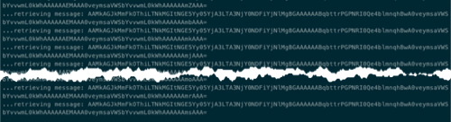

Within one or two minutes, the application will display the results of the application. Depending on the speed of your workstation and internet connection, your requests may or may not have triggered Microsoft Graph to throttle you. If not, try running the application a few more times.

If your application ran fast enough, you should see some instances where Microsoft Graph returned the HTTP status code 429, indicated by the **TooManyRequests** entries.

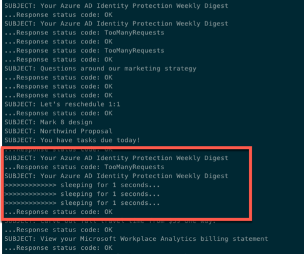

In this case, the **messages** endpoint returned a Retry-After value of one (1) because the application displays messages on the console that it slept for one second.

The important point is that the application completed successfully, retrieving all 100 messages, even when some requests were rejected due to being throttled by Microsoft Graph.

## Task 8: Implement Microsoft Graph SDK for throttling retry strategy

In the last section exercise, you modified the application to implement a strategy to determine if a request is throttled. In the case where the request was throttled, as indicated by the response to the REST endpoint request, you implemented a retry strategy using the HttpClient.

Let's change the application to use the Microsoft Graph SDK client, which has all the logic built in for implementing the retry strategy when a request is throttled.

### Update the GetAuthenticatedHttpClient method

The application will use the Microsoft Graph SDK to submit requests, not the **HttpClient**, so you need to update it.

1. Locate the method **GetAuthenticatedHttpClient** and make the following changes to it:

    1. Set the **return** type from **HttpClient** to **GraphServiceClient**.

    1. Rename the **method** from **GetAuthenticatedHttpClient** to **GetAuthenticatedGraphClient**.

    1. Replace the last two lines in the method with the following lines to obtain and return an instance of the **GraphServiceClient**:

        ```csharp
        var graphClient = new GraphServiceClient(authenticationProvider);
        return graphClient;
        ```

1. Your updated method **GetAuthenticatedGraphClient** should look similar to this:

    ```csharp
        private static GraphServiceClient GetAuthenticatedGraphClient(IConfigurationRoot config, string userName, SecureString userPassword)
        {
          var authenticationProvider = CreateAuthorizationProvider(config, userName, userPassword);
          var graphClient = new GraphServiceClient(authenticationProvider);
          return graphClient;
        }
    ```

### Update the application to use the GraphServiceClient.

1. The next step is to update the application to use the Graph SDK that includes an intelligent throttling strategy. Locate the **Messages.cs** file in the project. Delete this file or comment all code within the file out. Otherwise, the application will get the **Message** object this file contains confused with the **Message** object in the Microsoft Graph SDK.

1. Next, within the **Main** method, locate the following line:

    ```csharp
    var client = GetAuthenticatedHTTPClient(config, userName, userPassword);
    ```

1. Update the method called in that line to use the method you updated, **GetAuthenticatedGraphClient**:

    ```csharp
    var client = GetAuthenticatedGraphClient(config, userName, userPassword);
    ```

1. The next few lines used the **HttpClient** to call the Microsoft Graph REST endpoint to get a list of all messages. Find these lines, as shown, and remove them:

    ```csharp
    var clientResponse = client.GetAsync("https://graph.microsoft.com/v1.0/me/messages?$select=id&$top=100").Result;
    // enumerate through the list of messages
    var httpResponseTask = clientResponse.Content.ReadAsStringAsync();
    httpResponseTask.Wait();
    var graphMessages = JsonConvert.DeserializeObject<Messages>(httpResponseTask.Result);
    ```

1. Replace those lines with the following code to request the same information using the Microsoft Graph SDK. The collection returned by the SDK is in a different format than what the REST API returned:

    ```csharp
    var clientResponse = client.Me.Messages
                                  .Request()
                                  .Select(m => new { m.Id })
                                  .Top(100)
                                  .GetAsync()
                                  .Result;
    ```

1. Locate the **foreach** loop that enumerates through all returned messages to request each message's details. Change the collection to the following code:

    ```csharp
    foreach (var graphMessage in clientResponse.CurrentPage)
    ```

### Update the GetMessageDetail method to return

The last step is to modify the **GetMessageDetail** method that retrieved the message details for each message. Recall from the previous section in this unit that you had to write the code to detect when requests were throttled. In the where case they were throttled, you added code to retry the request after a specified delay. Fortunately, the Microsoft Graph SDK has this logic included in it.

1. Locate the **GetMessageDetail()** method.

1. Update the signature of the method so the first parameter expects an instance of the **GraphServiceClient**, not the **HttpClient**, and remove the last parameter of a default delay. The method signature should now look like the following:

    ```csharp
    private static Microsoft.Graph.Message GetMessageDetail(GraphServiceClient client, string messageId)
    ```

1. Next, remove all code within this method and replace it with this single line:

    ```csharp
    // submit request to Microsoft Graph & wait to process response
    return client.Me.Messages[messageId].Request().GetAsync().Result;
    ```

## Task 9: Build and test the updated application

1. Run the following command in a command prompt to compile the console application: `dotnet build`

1. Run the following command to run the console application: `dotnet run`

1. After entering the username and password for the current user, the application will write multiple log entries to the console, as in the following image.

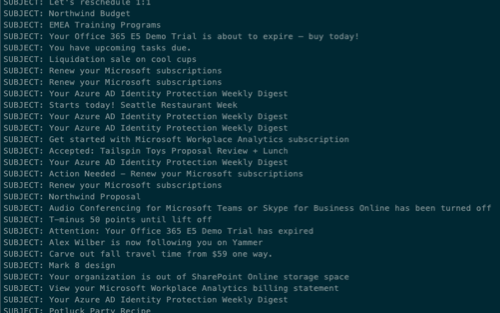

The application will do the same thing as the **HttpClient** version of the application. However, one difference is that the application will not display the status code returned in the response to the requests or any of the *sleeping* log messages, because the Microsoft Graph SDK handles all the retry logic internally.

## Review

In this exercise, you used the Azure AD application and .NET console application you previously created and modified them to demonstrate two strategies to account for throttling in your application. One strategy used the **HttpClient** object but required you to implement the detect, delay, and retry logic yourself when requests were throttled. The other strategy used the Microsoft Graph SDK's included support for handling this same scenario.


### [Go to exercise 06 instructions -->](../Exercise_06/07-Exercise-6-Querying-user-data-from-Microsoft-Graph.md)

### [<-- Back to readme](../../../)