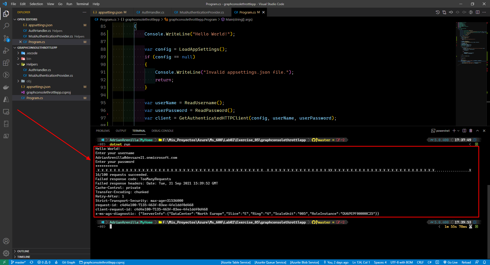
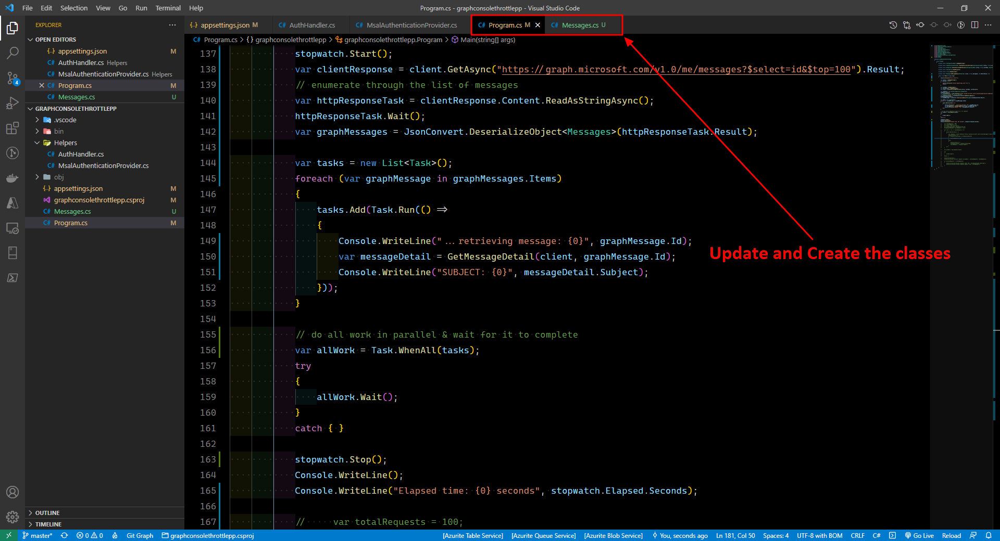
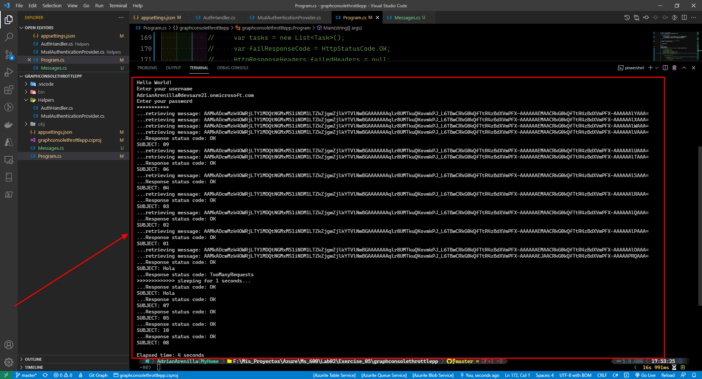
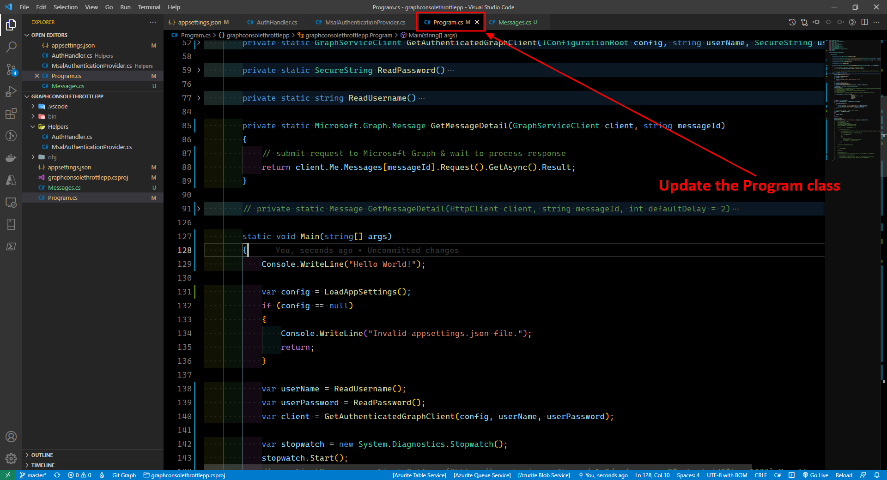
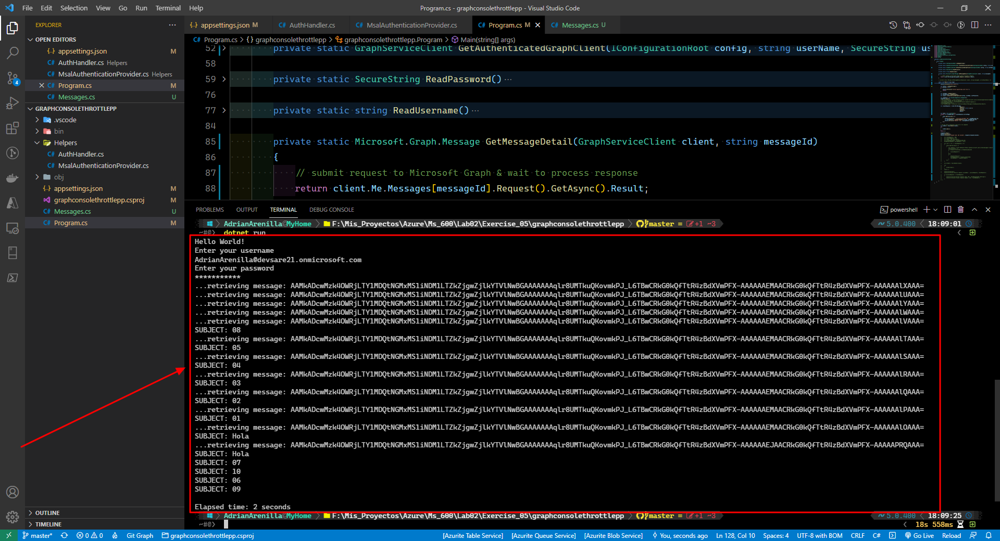

# Microsoft Ms-600 (Adrián Arenilla Seco) - LAB 02

## Exercise 5: Understand throttling in Microsoft Graph
### [Go to exercise 05 instructions -->](06-Exercise-5-Understand-throttling-in-Microsoft-Graph.md)

Register a single-tenant Azure AD application.

Add a Redirect URI of mobile and desktop applications.

Select the entry that begins with msal and enter https://contoso in Custom redirect URIs section.

To the Advanced settings section and set the toggle to Yes.

Update the App API permissions.

Select Grant admin consent for the app Graph Console Throttle App.

Update the helpers classes, the JSON file and the Program class.

Build and test the application.

Create a new class (Messages) and update the Program class.

Build and test the application.

Update the Program class.

Build and test the application.

### [<-- Back to readme](../../../../)