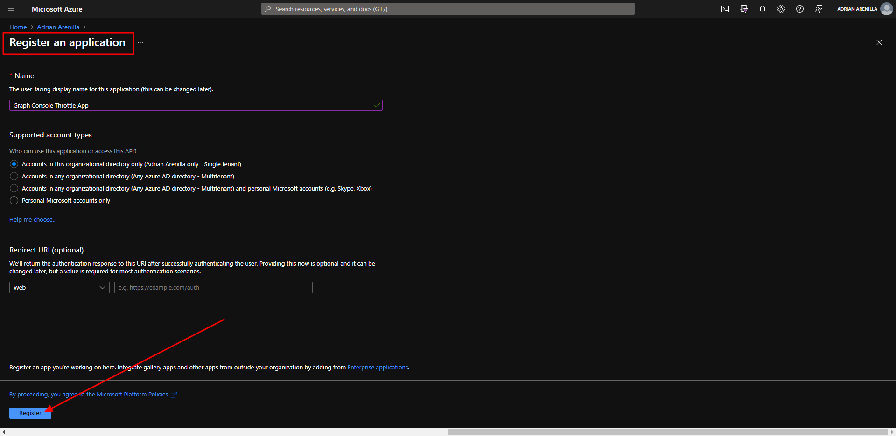
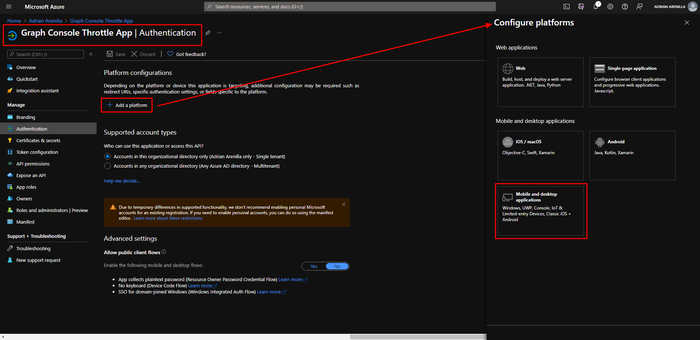
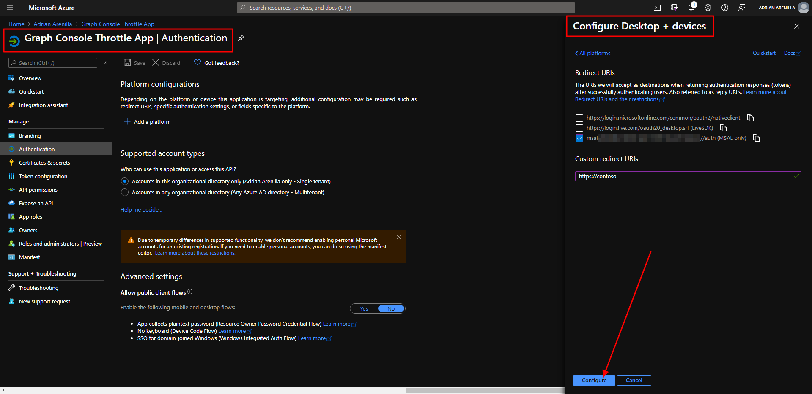
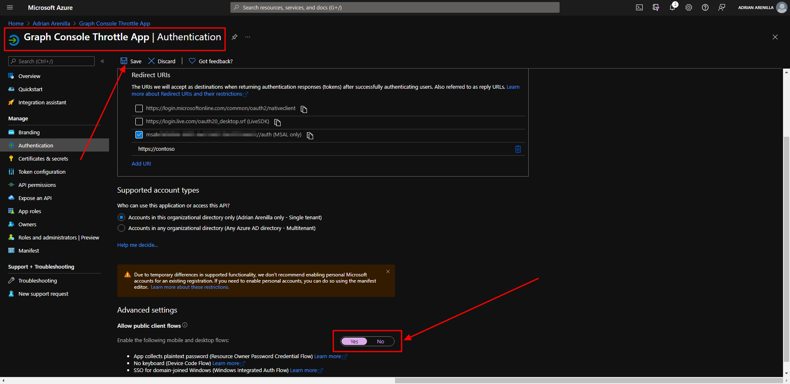
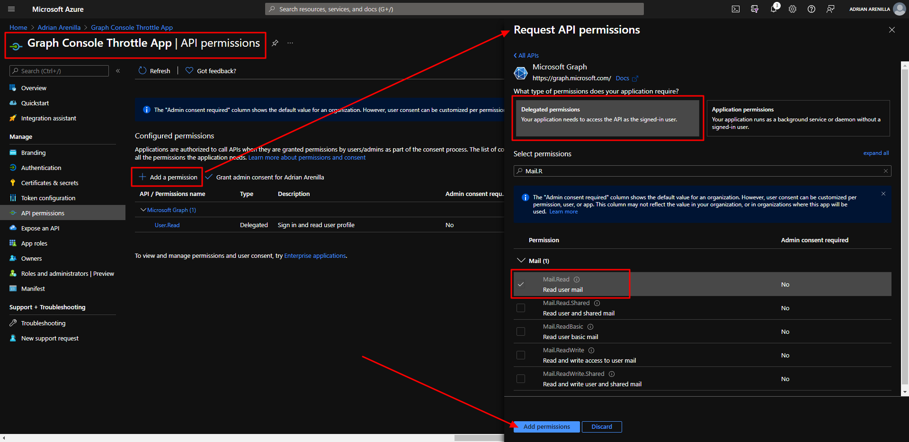
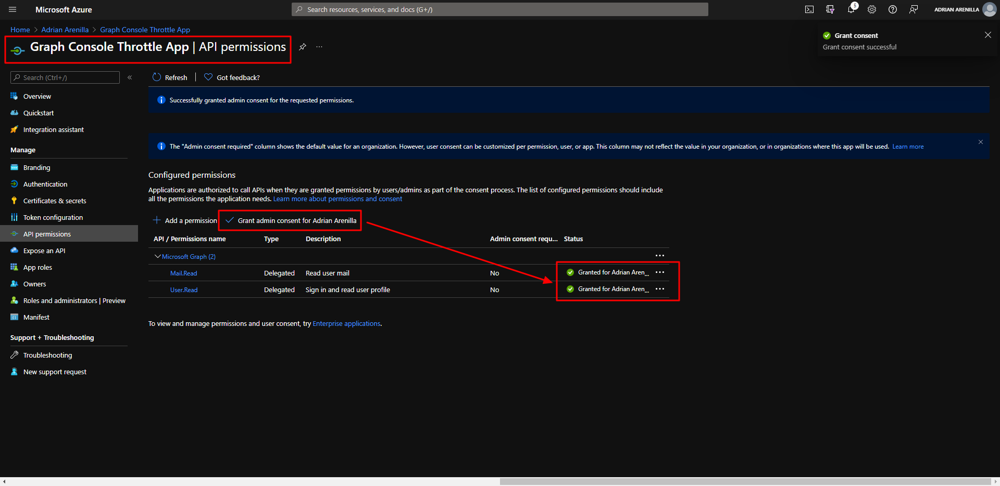
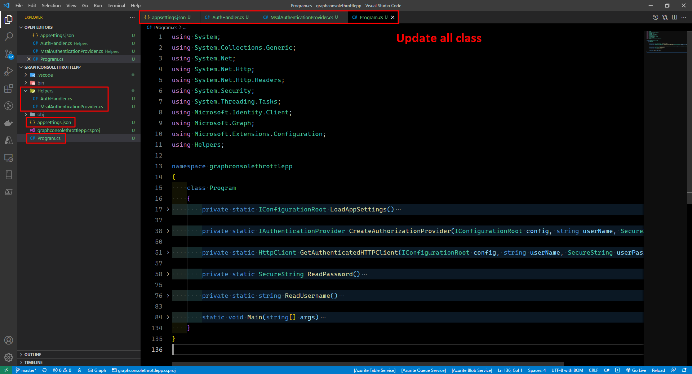

# Microsoft Ms-600 (Adrián Arenilla Seco) - LAB 02

## Exercise 5: Understand throttling in Microsoft Graph
### [Go to exercise 05 instructions -->](06-Exercise-5-Understand-throttling-in-Microsoft-Graph.md)

