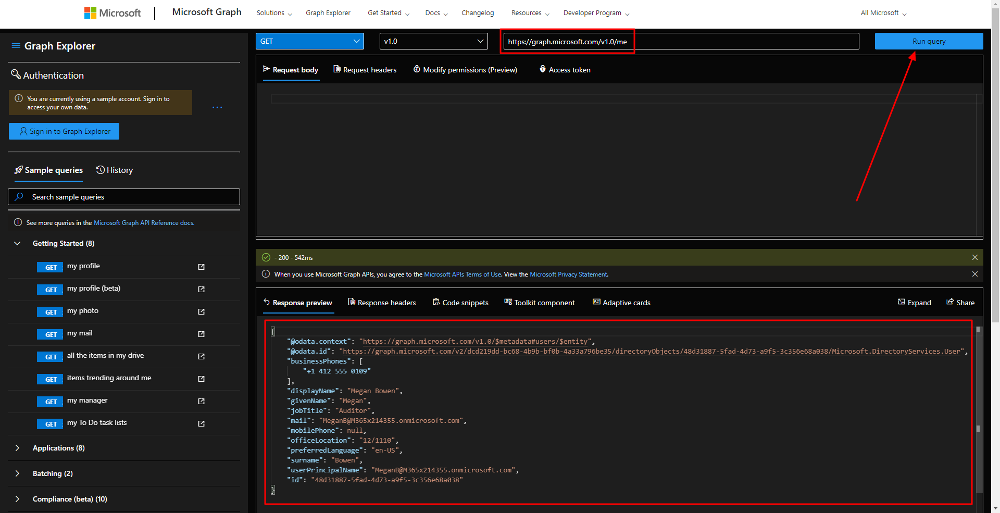
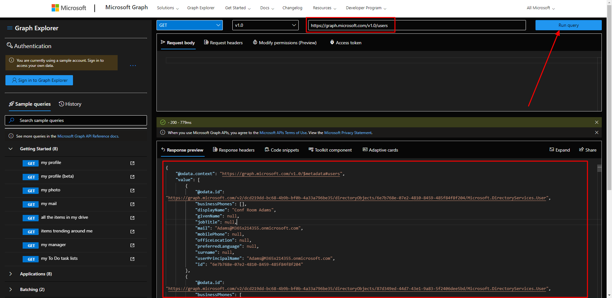
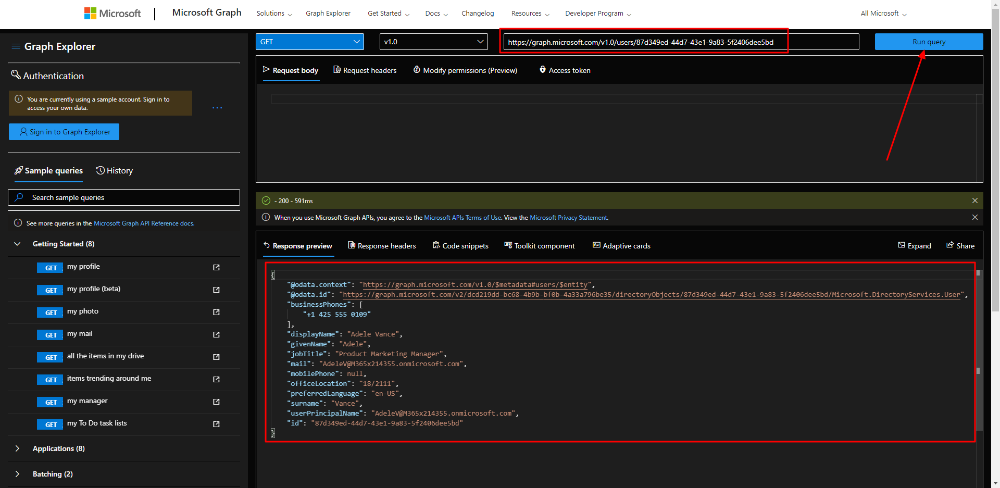
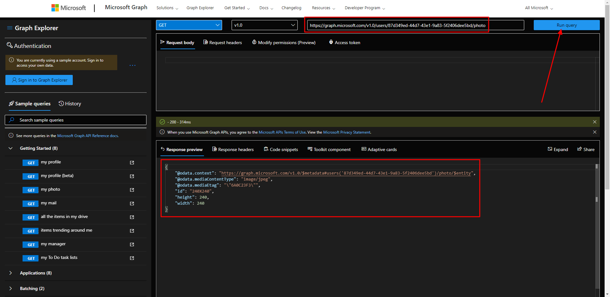
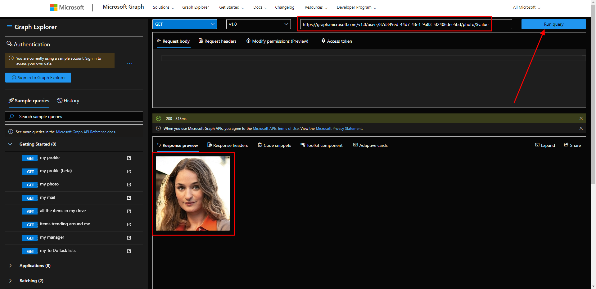
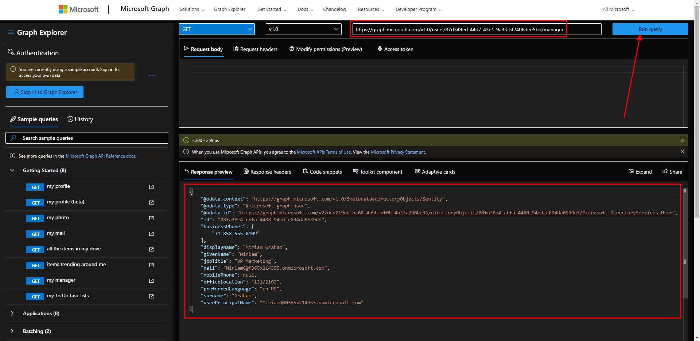
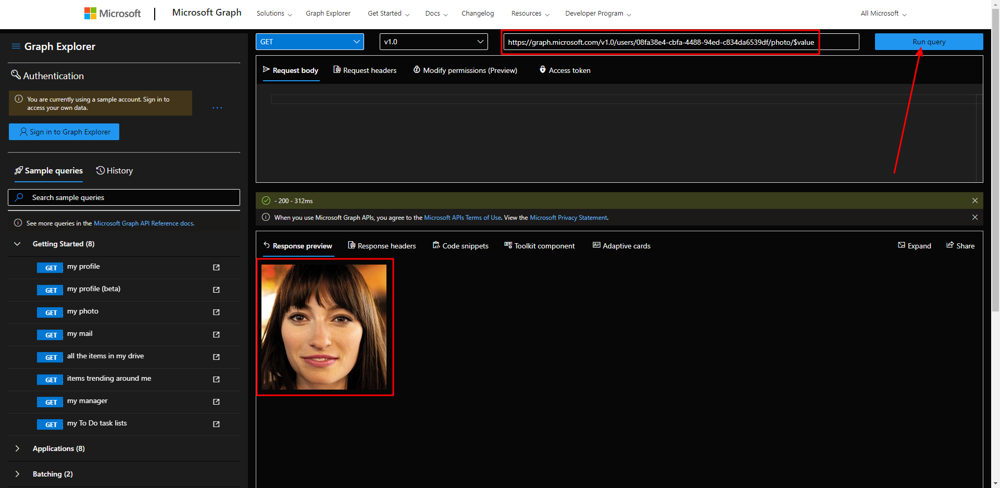

# Microsoft Ms-600 (Adrián Arenilla Seco) - LAB 02

## Exercise 6: Querying user data from Microsoft Graph
### [Go to exercise 06 instructions -->](07-Exercise-6-Querying-user-data-from-Microsoft-Graph.md)

`https://graph.microsoft.com/v1.0/me`

`https://graph.microsoft.com/v1.0/users`

`https://graph.microsoft.com/v1.0/users/{id}`

`https://graph.microsoft.com/v1.0/users/{id}/photo`

`https://graph.microsoft.com/v1.0/users/{id}/photo/$value`

`https://graph.microsoft.com/v1.0/users/{id}/manager`

`https://graph.microsoft.com/v1.0/users/{id-manager}/photo/$value`

### [<-- Back to readme](../../../../)