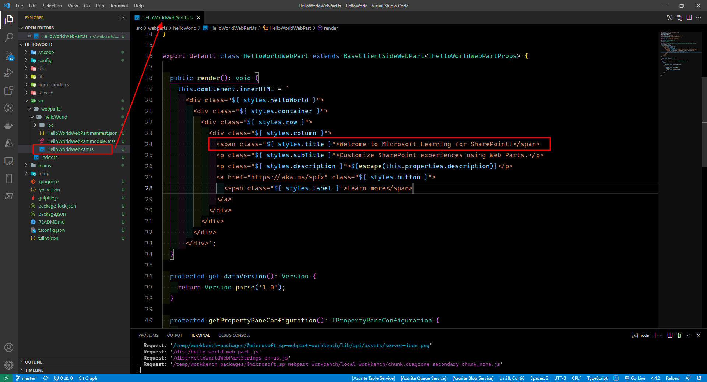

# Microsoft Ms-600 (Adrián Arenilla Seco) - LAB 03

## Exercise 1: Introduction to SharePoint Framework (SPFx)
### [Go to exercise 01 instructions -->](02-Exercise-1-Introduction-to-SharePoint-Framework-(SPFx).md)

Run the SharePoint Yeoman generator by executing the following command: `yo @microsoft/sharepoint`

The SharePoint Framework's gulp serve task will build the project, start a local web server, and launch a browser open to the SharePoint Workbench.

Locate the style with the class styles.title and update change the title.

View SharePoint Online and SharePoint on-premises.

### [<-- Back to readme](../../../../)