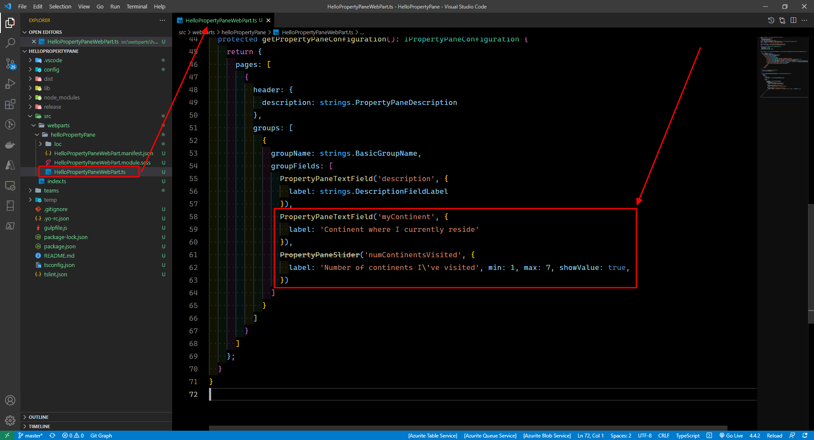

# Microsoft Ms-600 (Adrián Arenilla Seco) - LAB 03

## Exercise 2: Working with the web part property pane
### [Go to exercise 02 instructions -->](03-Exercise-2-Working-with-the-web-part-property-pane.md)

Create a new SPFx solution and web part.

Select the HelloPropertyPane web part to add the web part to the page.

Add new properties to the web part.

Add new properties to the web part.

Verify that the new properties have been added.

Extend the property pane.

Verify that the new properties have been added.

### [<-- Back to readme](../../../../)