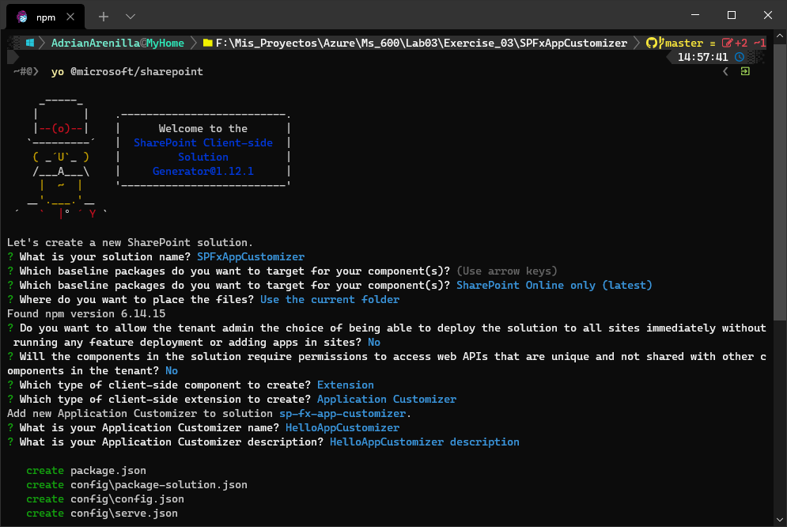
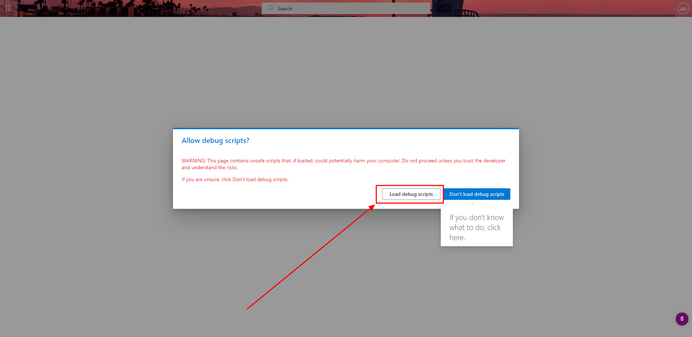
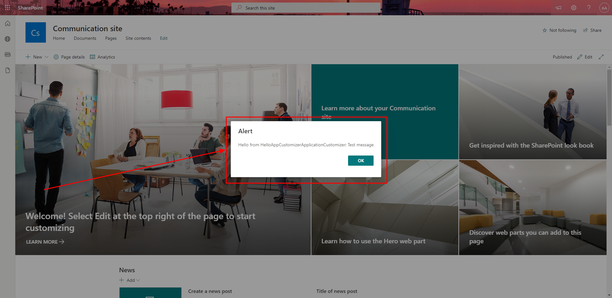
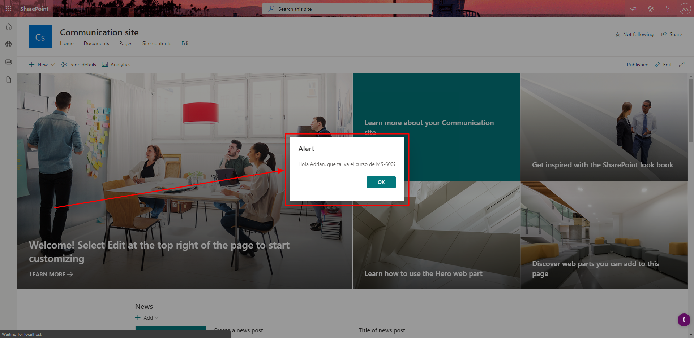
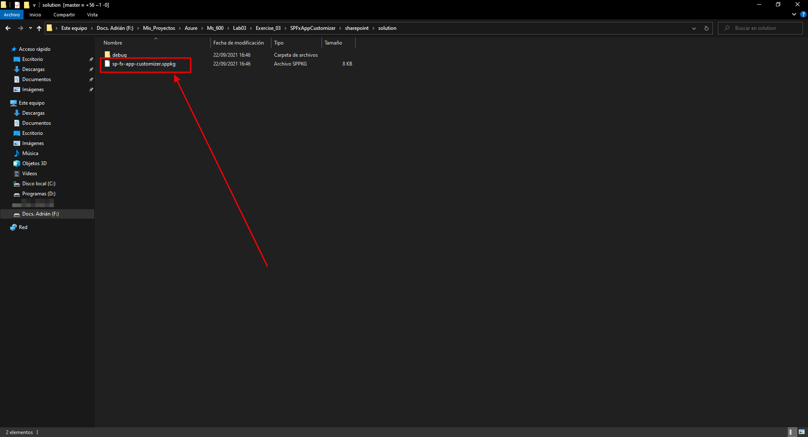
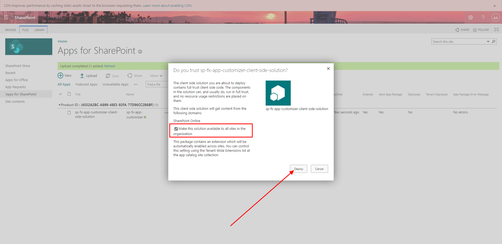
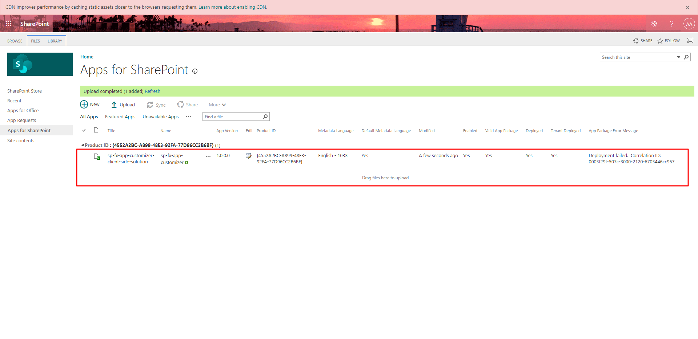
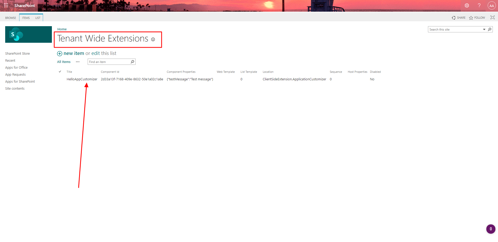
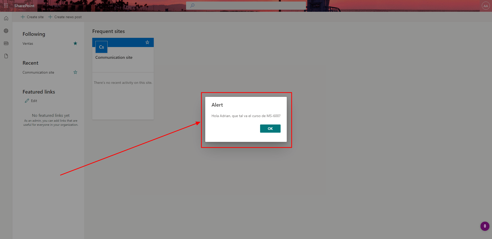

# Microsoft Ms-600 (Adrián Arenilla Seco) - LAB 03

## Exercise 3: Creating SharePoint Framework Extensions
### [Go to exercise 03 instructions -->](04-Exercise-3-Creating-SharePoint-Framework-Extensions.md)

Create a new SPFx solution and extension.

Select the button Load debug scripts.

Once the scripts load, a SharePoint dialog alert box will be shown: This alert box is shown by the application customize.

Change of alert message.

Build and package the solution.

Deploy the extension in SharePoint.

Verify the result.

Verify that the extension has been added to the tenant's extensions.

If this extension has been deployed successfully you should see a Hello (your name) dialog prompt on the load of the page.

### [<-- Back to readme](../../../../)