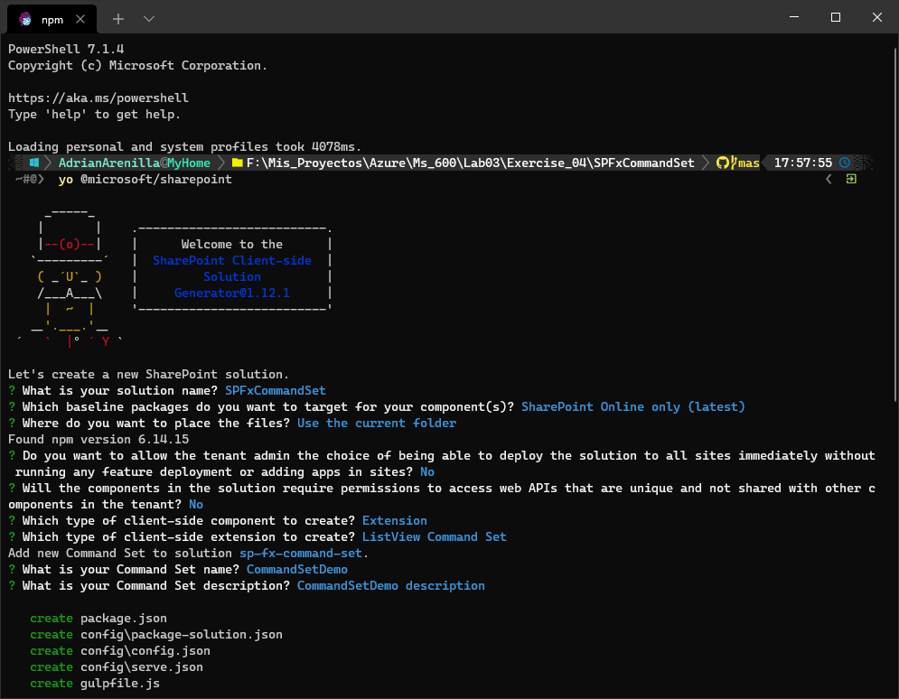
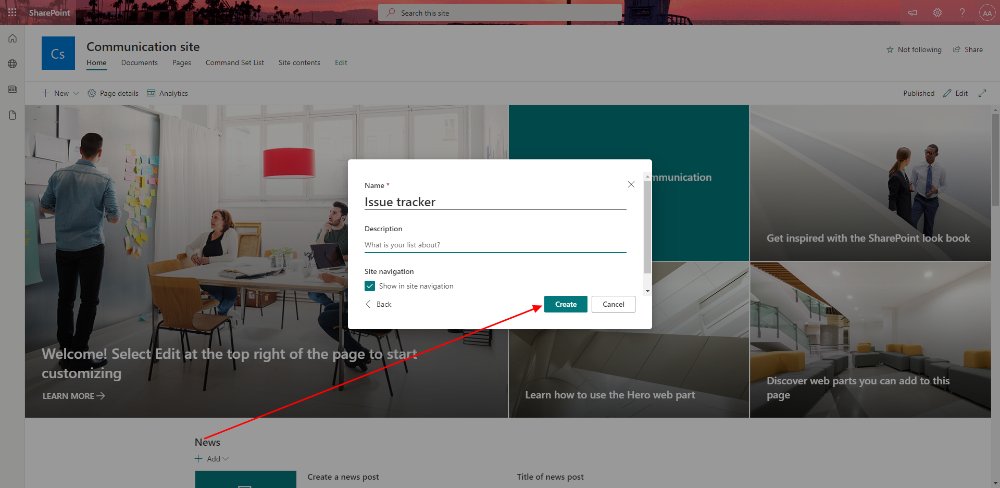
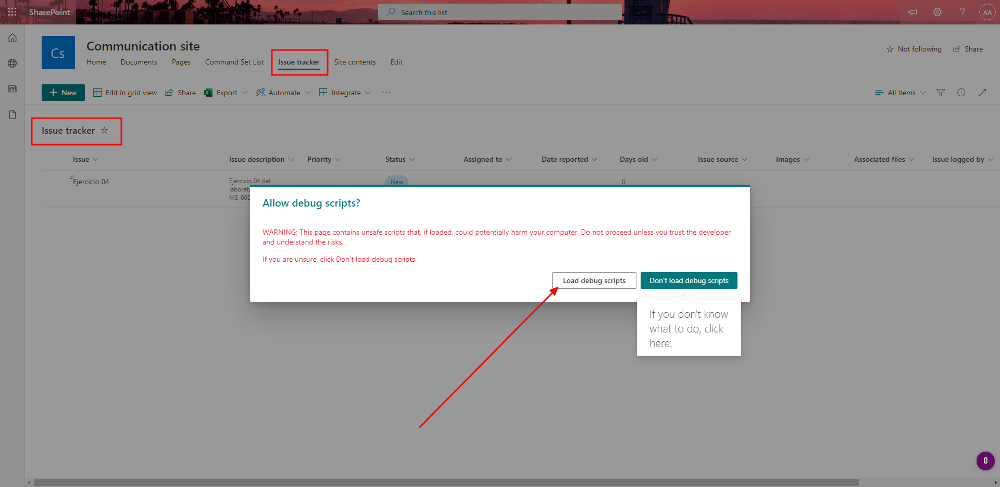

# Microsoft Ms-600 (Adrián Arenilla Seco) - LAB 03

## Exercise 4: Creating a command set extension
### [Go to exercise 04 instructions -->](05-Exercise-4-Creating-a-command-set-extension.md)

Create a new SPFx solution and extension.

Create a new list.

Name the list and create.

Verify that the message and the page of the created list are displayed.

### [<-- Back to readme](../../../../)
