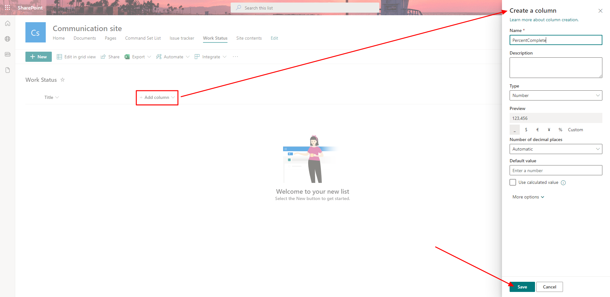

# Microsoft Ms-600 (Adrián Arenilla Seco) - LAB 03

## Exercise 5: Creating a field customize extension
### [Go to exercise 05 instructions -->](06-Exercise-5-Creating-a-field-customizer-extension.md)

Create a new SPFx solution and extension.

Update the files of the lab.

Create a new list.

Create a new column within the created list.

Add values to the list.

Final result showing the percentage bar.

### [<-- Back to readme](../../../../)