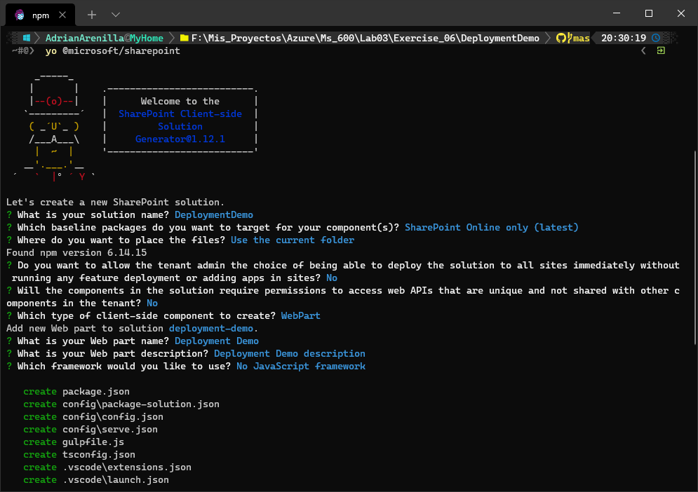

# Microsoft Ms-600 (Adrián Arenilla Seco) - LAB 03

## Exercise 6: Deploying a SharePoint Framework solution
### [Go to exercise 06 instructions -->](07-Exercise-6-Deploying-a-SharePoint-Framework-solution.md)

Create a new SPFx solution and web part.

Deploying the package to a SharePoint site.

Installing the SharePoint package in a site collection.

Adding the web part to a page.

### [<-- Back to readme](../../../../)