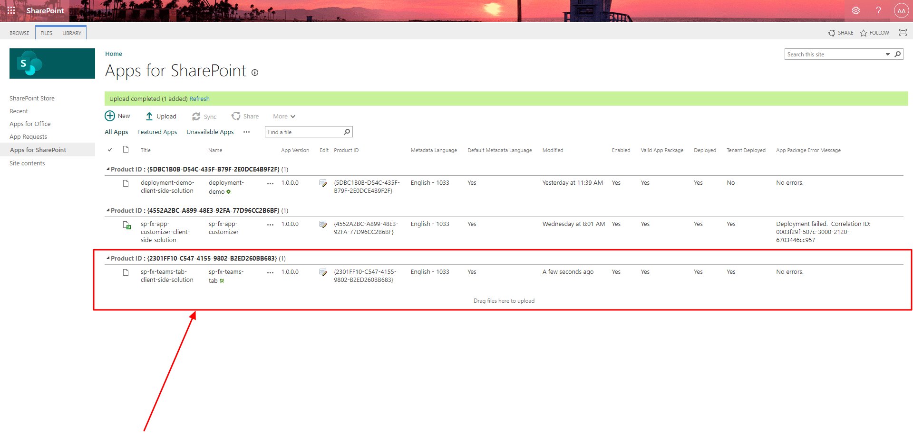

# Microsoft Ms-600 (Adrián Arenilla Seco) - LAB 03

## Exercise 7: Deploying SPFx solutions to Microsoft Teams
### [Go to exercise 07 instructions -->](08-Exercise-7-Deploying-SPFx-solutions-to-Microsoft-Teams.md)

Create a new SPFx solution and web part.

After create a new manifest.json, create a Microsoft Teams app package by zipping the contents of the ./teams folder.

Deploy the app created into Apps for SharePoint.

App deployed.

Test the web part in SharePoint.

Create a new team called My First Team.

Add the SPFx web part in Microsoft Teams.

Choose My First Team > General to install the app.

Confirm the installation of the app.

The application should now load in Microsoft Teams within the General channel under the tab SPFx Teams Together.

### [<-- Back to readme](../../../../)