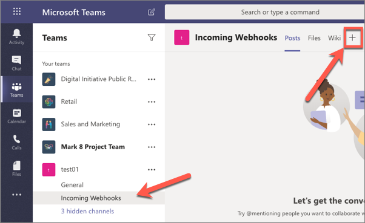
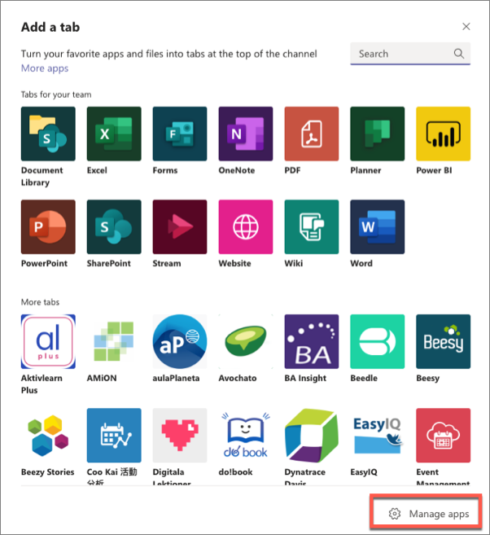
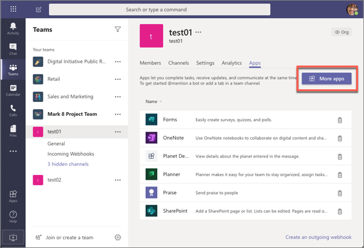
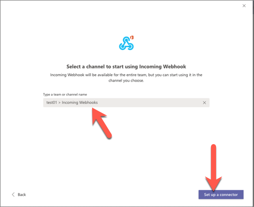
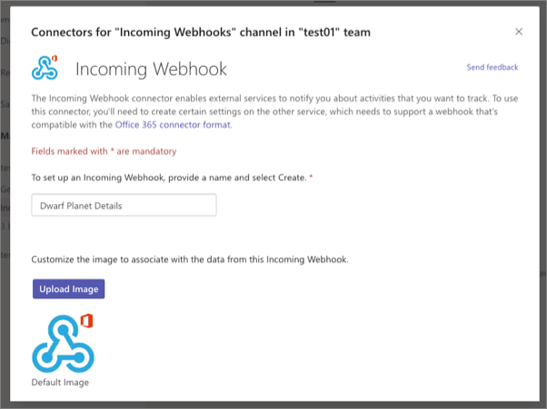
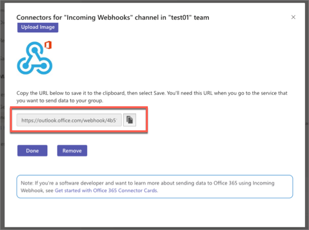

# Exercise 5: Creating incoming webhooks

In this exercise, you’ll learn how to register an incoming webhook in a Microsoft Teams channel and post a message to it.

## Task 1: Register a new incoming webhook

Now let's add an incoming webhook to a team in Microsoft Teams. 

1. In the browser, navigate to **https://teams.microsoft.com** and sign in with the credentials of a Work and School account.

1. Once you're signed in, select a channel in a team you want to add the webhook to. From the channel's page, select the **+** in the top navigation:

    

1. On the **Add a tab** dialog, select **Manage apps** in the lower right corner:

    

1. This will take you to the **Manage Channel** page. Select the **More apps** button:

    

1. On the **Apps** page, search for the **incoming webhook** app and select it.

    

1. Select the **Add to a team** button. On the next page, enter the name of a channel to add the webhook to, and select the **Set up a connector**:

    

1. On the **Incoming Webhook** configuration screen, enter the name **Dwarf Planet Details** and select the **Create** button (*you may need to scroll down in the dialog as the **Create** button isn't visible by default, as in the following screenshot*):

    

1. After creating the incoming webhook, the dialog will add a new input box that contains the endpoint for you should post to. Copy this value:

    

## Task 2: Test the incoming webhook

1. After configuring the incoming webhook, the next step is to submit a post to it to display a message in the channel. Do this by submitting an HTTPS request to the webhook endpoint provided.

1. Using the free tool [Postman](https://www.postman.com/), create a new request to the point endpoint:

    - set the request to a **POST**
    - set the endpoint to the webhook endpoint you copied at the end of the previous section
    - set the `Content-Type` header to `application/json` on the **Headers** tab:

        `

    - add the following JSON to the **Body** tab and select the **raw** option:

        ```json
        {
          "@type": "MessageCard",
          "@context": "http://schema.org/extensions",
          "summary": "Dwarf planet Pluto details",
          "sections": [{
            "activityTitle": "Dwarf planet Pluto details",
            "activityImage": "https://upload.wikimedia.org/wikipedia/commons/e/ef/Pluto_in_True_Color_-_High-Res.jpg",
            "facts": [
              {
                "name": "Description",
                "value": "Pluto is an icy dwarf planet in the Kuiper belt, a ring of bodies beyond the orbit of Neptune. It was the first Kuiper belt object to be discovered and is the largest known dwarf planet. Pluto was discovered by Clyde Tombaugh in 1930 as the ninth planet from the Sun. After 1992, its status as a planet was questioned following the discovery of several objects of similar size in the Kuiper belt. In 2005, Eris, a dwarf planet in the scattered disc which is 27% more massive than Pluto, was discovered. This led the International Astronomical Union (IAU) to define the term \"planet\" formally in 2006, during their 26th General Assembly. That definition excluded Pluto and reclassified it as a dwarf planet."
              },
              {
                "name": "Order from the sun",
                "value": "9"
              },
              {
                "name": "Known satellites",
                "value": "5"
              },
              {
                "name": "Solar orbit (*Earth years*)",
                "value": "247.9"
              },
              {
                "name": "Average distance from the sun (*km*)",
                "value": "590637500000"
              },
              {
                "name": "Image attribution",
                "value": "NASA/Johns Hopkins University Applied Physics Laboratory/Southwest Research Institute/Alex Parker [Public domain]"
              }
            ]
          }],
          "potentialAction": [{
            "@context": "http://schema.org",
            "@type": "ViewAction",
            "name": "Learn more on Wikipedia",
            "target": ["https://en.wikipedia.org/wiki/Pluto"]
          }]
        }
        ```

        

        > **IMPORTANT:**
        > If you include a card in a message sent to an incoming webhook, it must be an Office 365 Connector Cards; adaptive cards aren't supported when sending messages to incoming webhooks.

1. Send the card to Microsoft Teams by selecting the **Send** button.

1. In the browser, navigate back to the **Conversations** tab in the channel where you installed the incoming webhook. You should see a message containing your card:

    

## Summary

In this exercise, you learned how to register an incoming webhook in a Microsoft Teams channel and post a message to it.


### [Go to exercise 06 instructions -->](07-Exercise-6-Create-a-custom-personal-tab.md)

### [<-- Back to readme](../../../)
