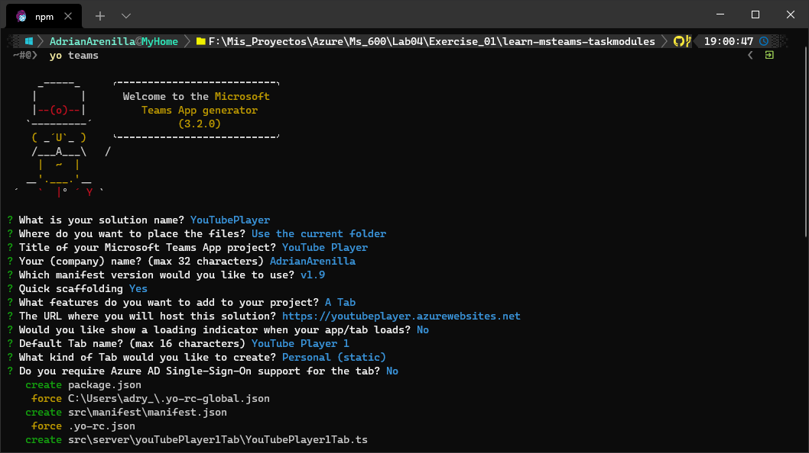
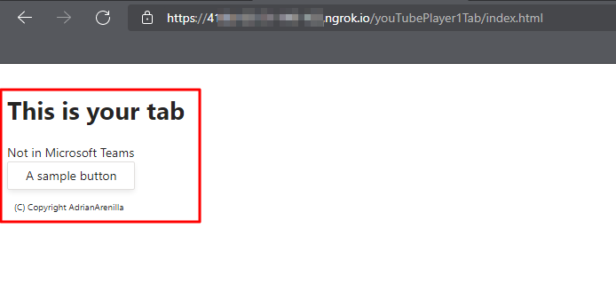
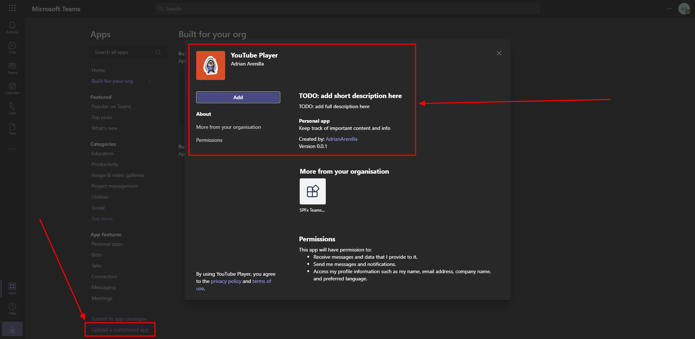
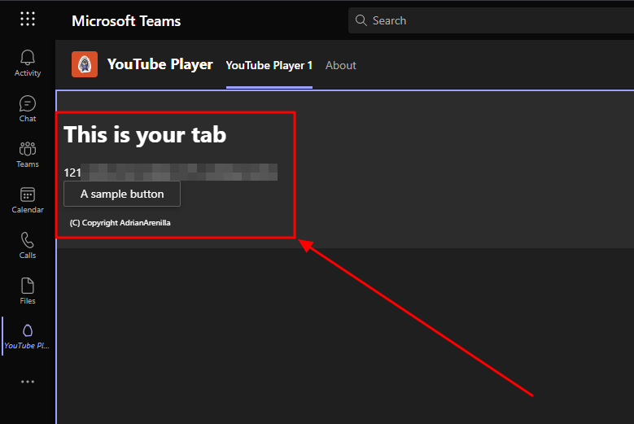
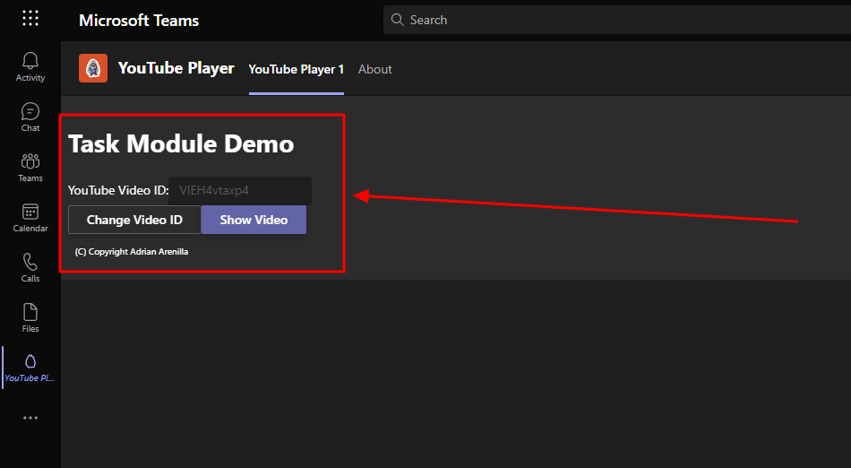
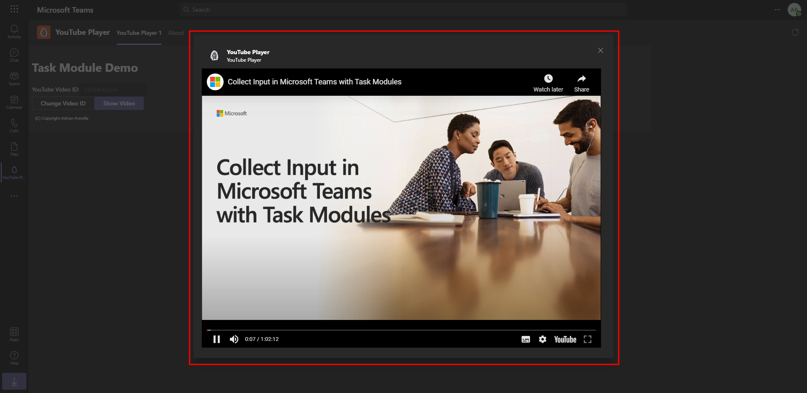
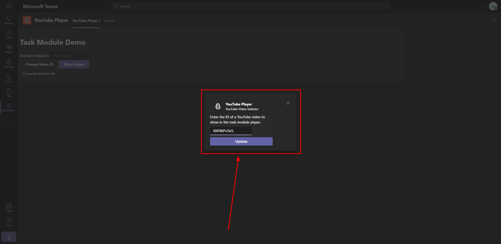
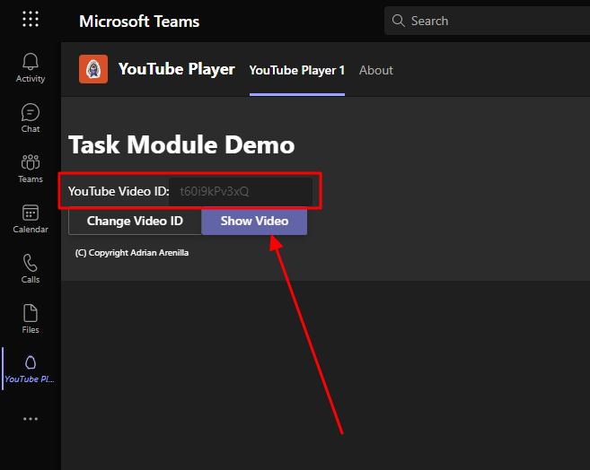
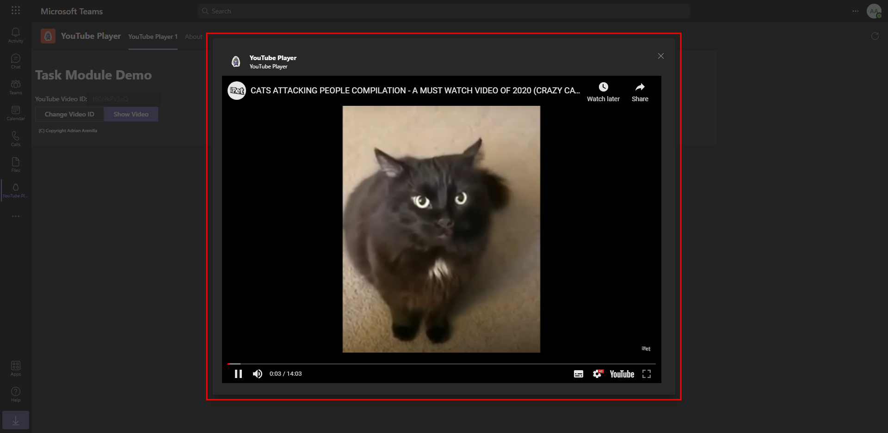

# Microsoft Ms-600 (Adrián Arenilla Seco) - LAB 04

## Exercise 1: Collecting user input with task modules
### [Go to exercise 01 instructions -->](02-Exercise-1-Collecting-user-input-with-task-modules.md)

Create Microsoft Teams app.

Test the personal tab.

Add the tab into Microsoft Teams.

Check that your tab is correctly installed into Microsoft Teams.

Implement the personal tab's user interface and add video player task module.

Test the personal tab verifying that the video is reproduced.

Add video selector task module and update the video ID.

Verify that the new ID is in the box.

Verify that the new ID video is reproduced.

### [<-- Back to readme](../../../../)