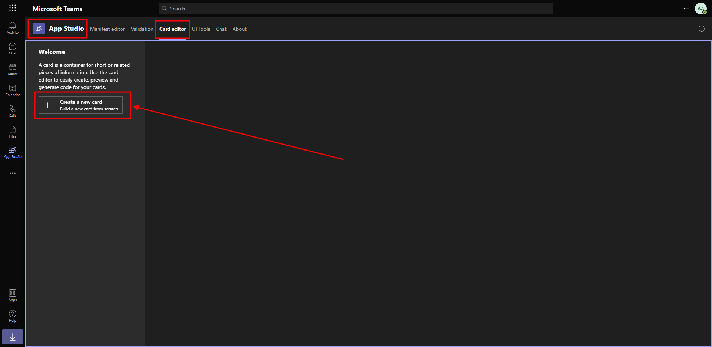
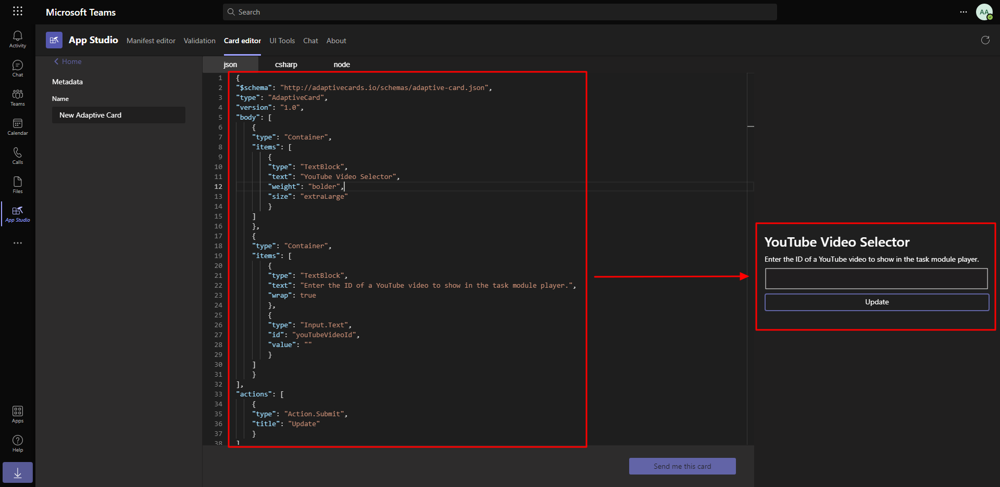
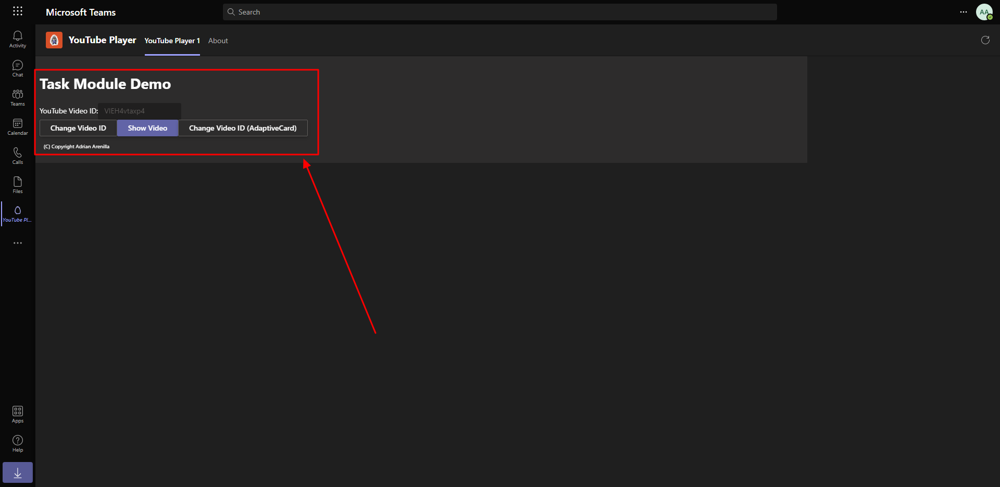
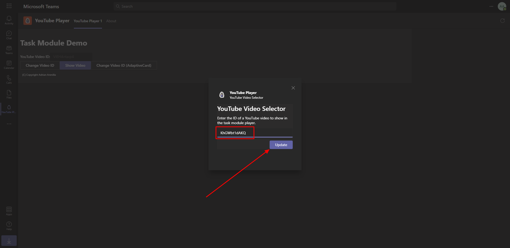
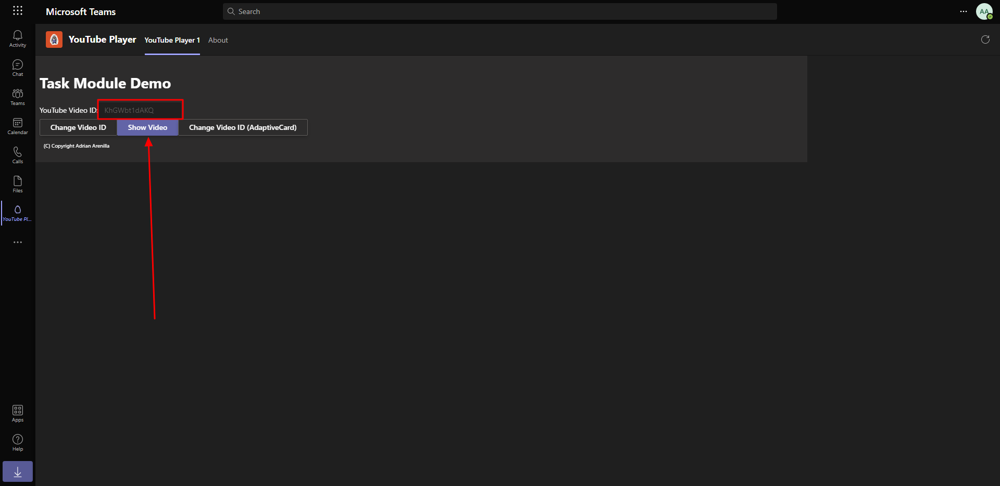
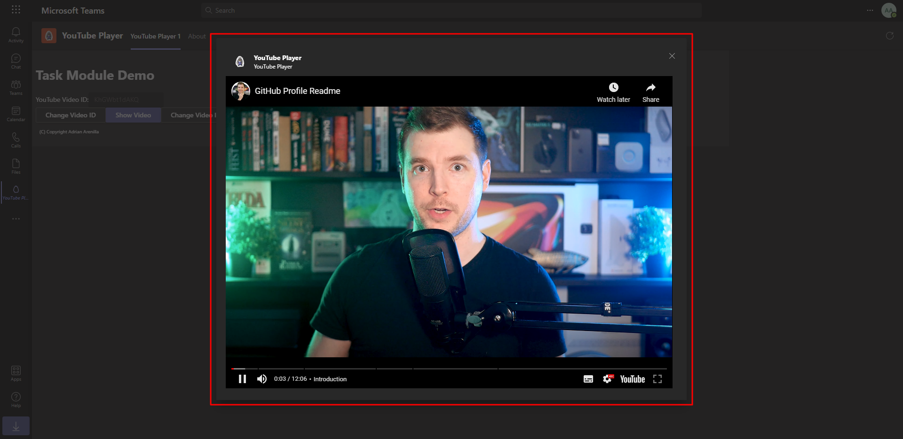
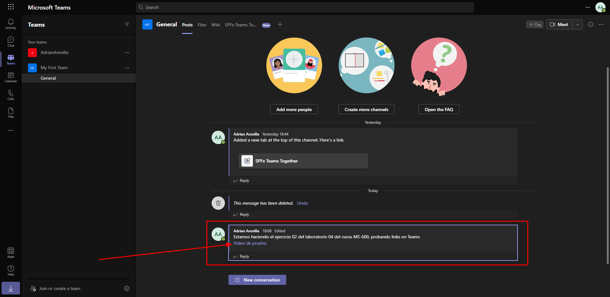
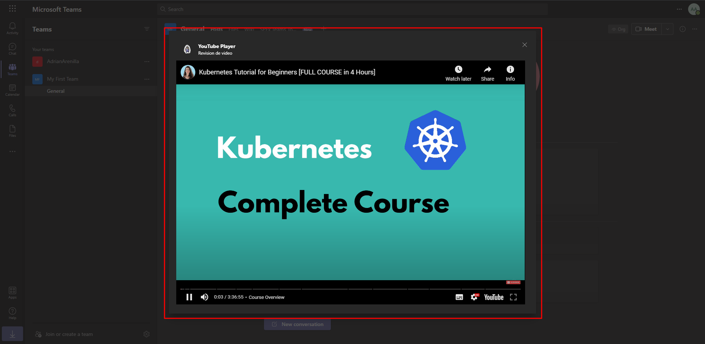

# Microsoft Ms-600 (Adrián Arenilla Seco) - LAB 04

## Exercise 2: Using adaptive cards and deep links in task modules
### [Go to exercise 02 instructions -->](03-Exercise-2-Using-adaptive-cards-and-deep-links-in-task-modules.md)

Create video selector as an adaptive card.

The App Studio Card editor will show a default card and its live preview. You can use this interface to design your card and see how it will be rendered.

Create a new task module that uses the Adaptive Card and test.

Update the YouTube video ID URL.

Show the new video.

Verify that the video is displayed on the screen.

Invoking task modules with deep links.

Show the new video with the deep link.

### [<-- Back to readme](../../../../)