# Microsoft Ms-600 (Adrián Arenilla Seco) - LAB 04

## Exercise 3: Using task modules with bots
### [Go to exercise 03 instructions -->](04-Exercise-3-Using-task-modules-with-bots.md)

Register a new bot in Microsoft Azure.
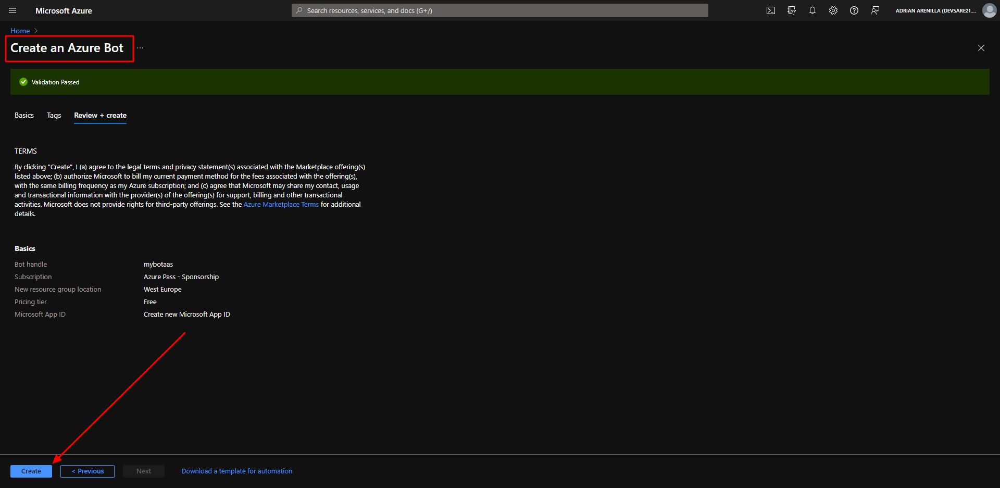

Enable the Microsoft Teams channel for the bot.
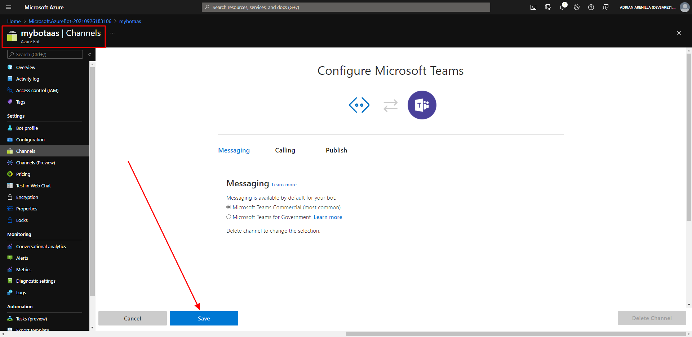

Add a bot to the project.
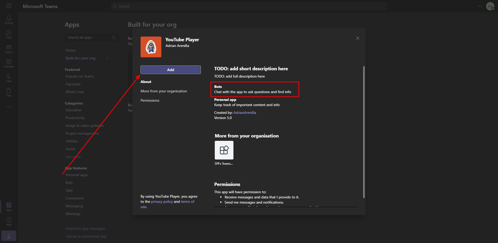

Test the bot in Microsoft Teams.
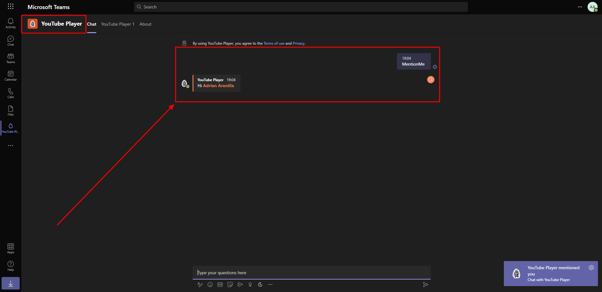

Test the bot in Microsoft Teams.
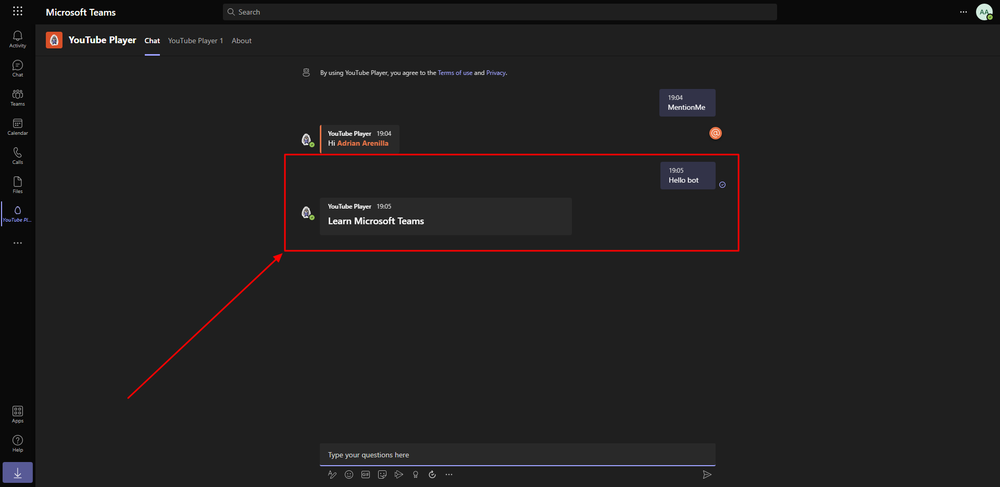

Update the Hero card to add a button the user can select.
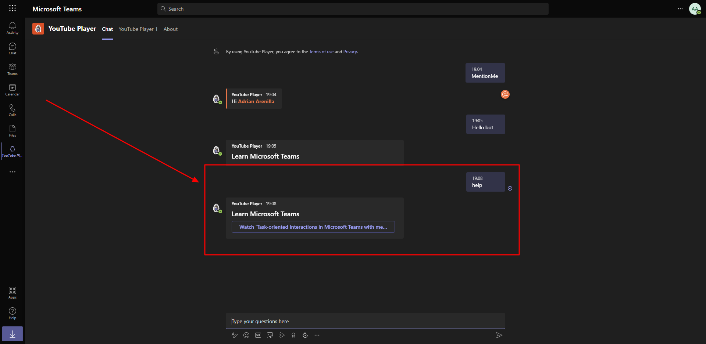

Add the video player task module and test the video player task module.
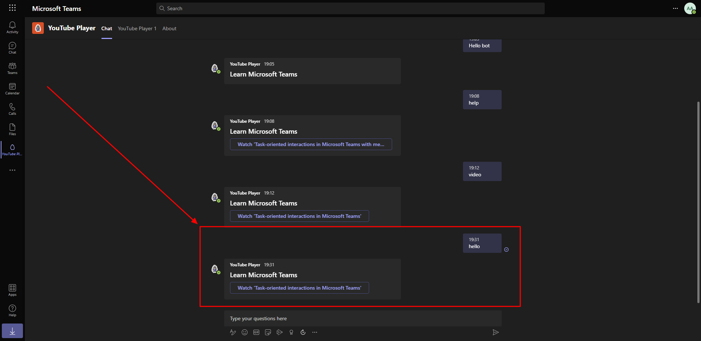

Verify that the video is displayed on the screen.
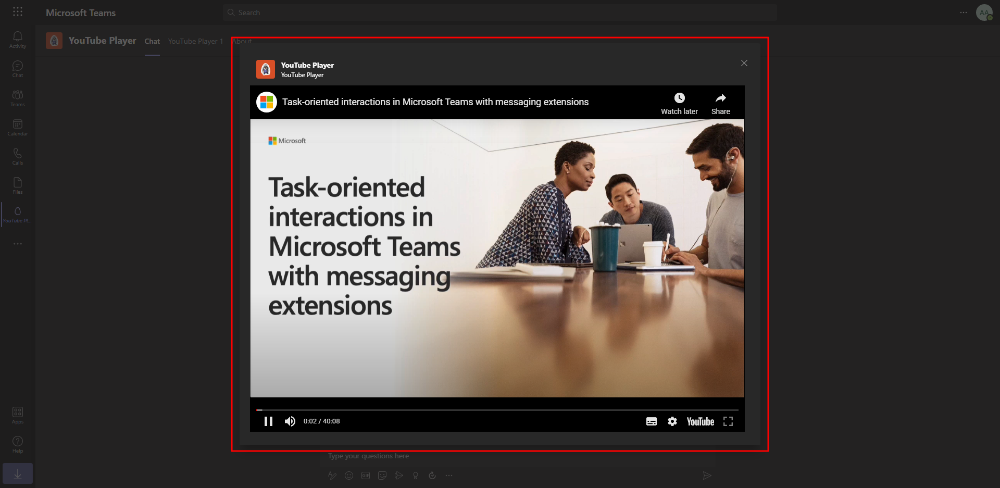

Add the video selector Adaptive Card task module.
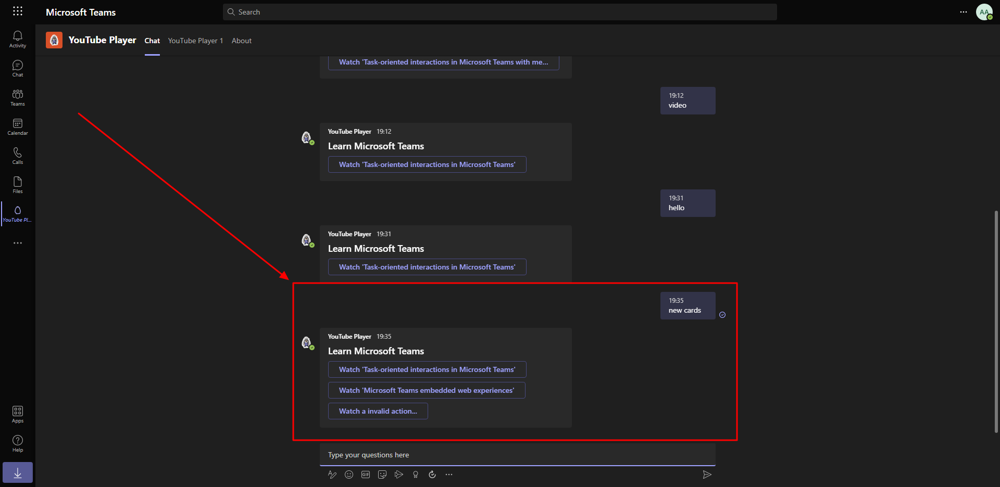

Add the video selector Adaptive Card task module.
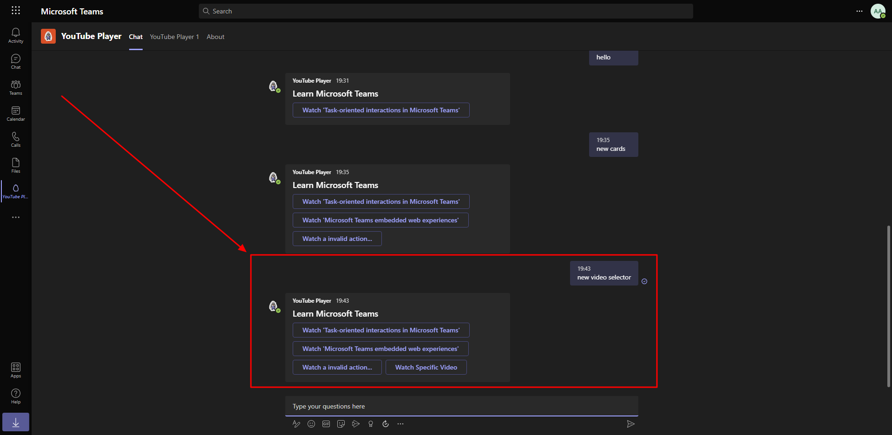

Update the YouTube video ID URL.
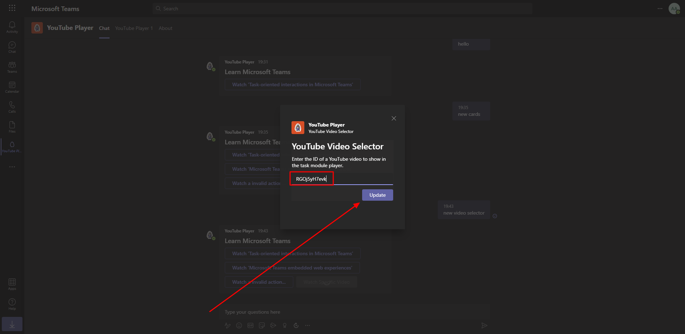

Verify that the video is displayed on the screen.
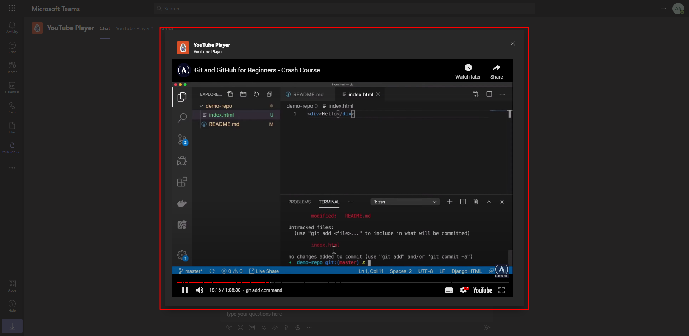

### [<-- Back to readme](../../../../)