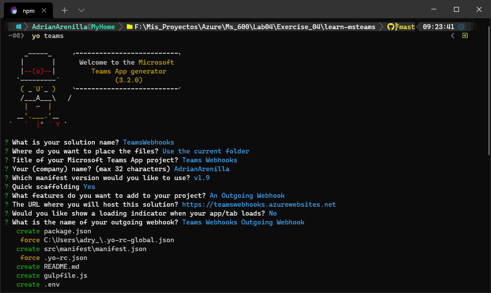
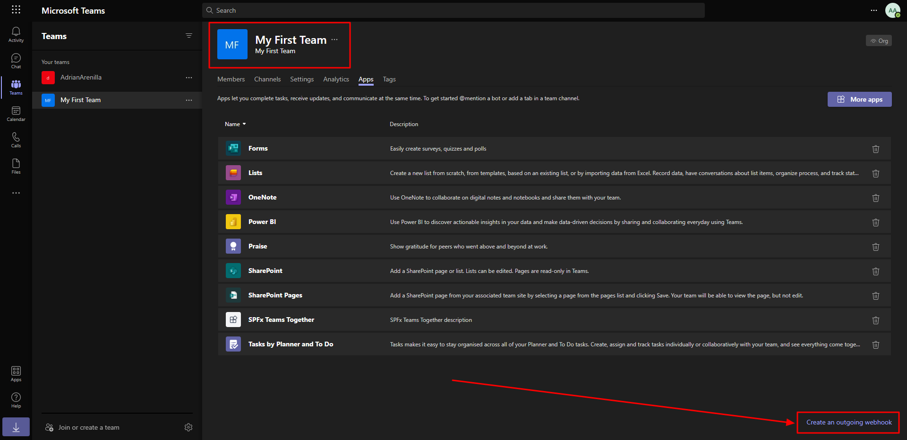
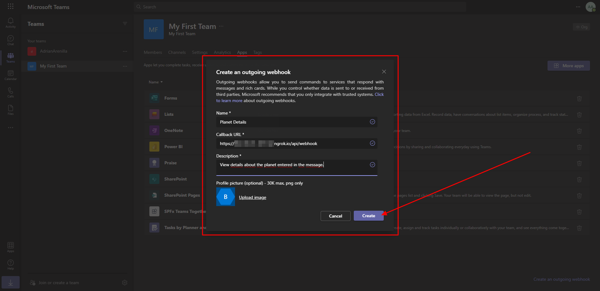
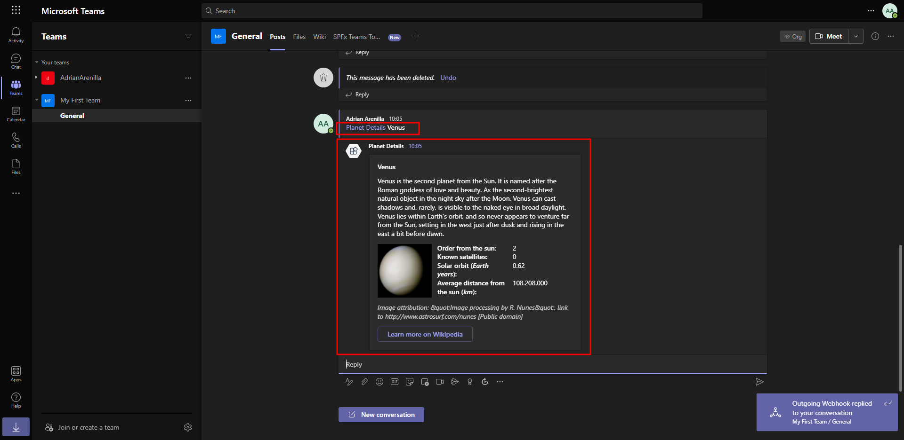
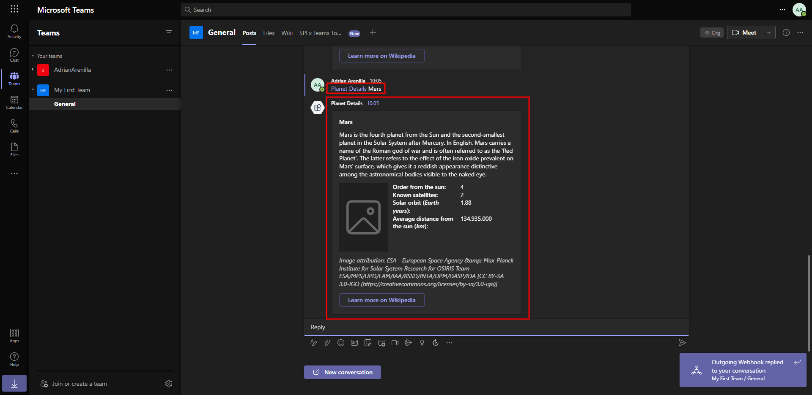

# Microsoft Ms-600 (Adrián Arenilla Seco) - LAB 04

## Exercise 4: Creating outgoing webhooks
### [Go to exercise 04 instructions -->](05-Exercise-4-Creating-outgoing-webhooks.md)

Create Microsoft Teams app.

Create an outgoing webhook within Microsoft Teams.

ESnter the values and select create.

Test the outgoing webhook.

Test the outgoing webhook.

### [<-- Back to readme](../../../../)