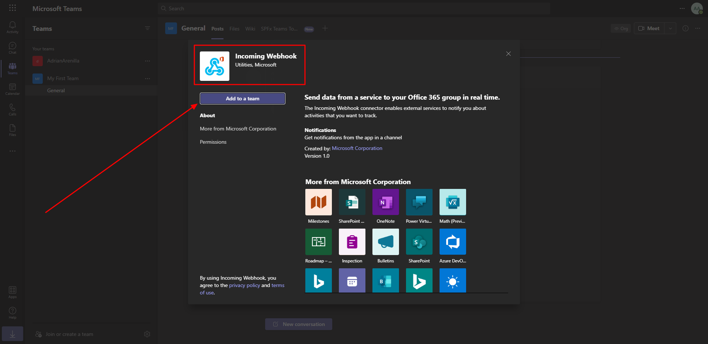
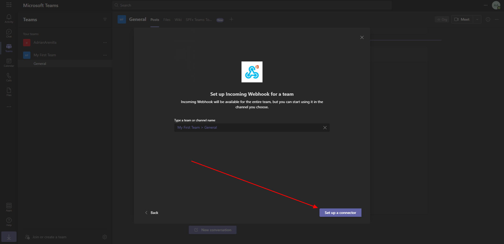
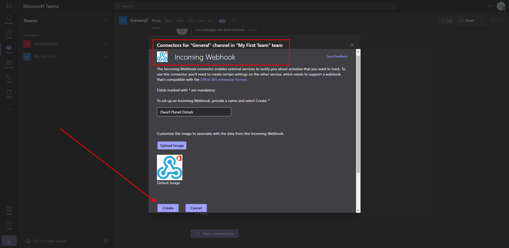
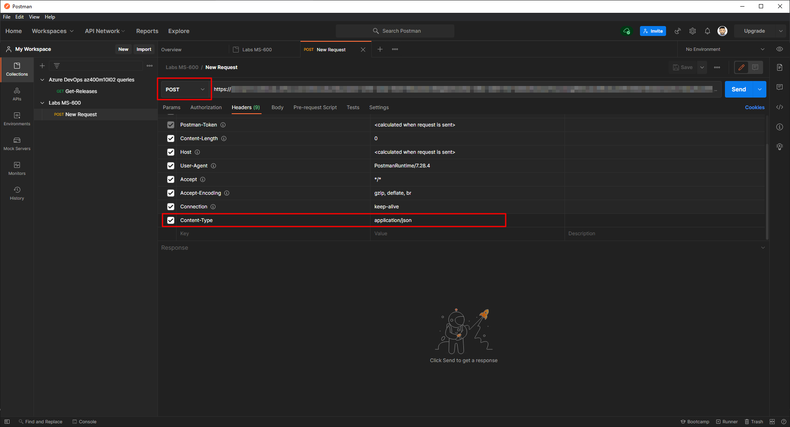
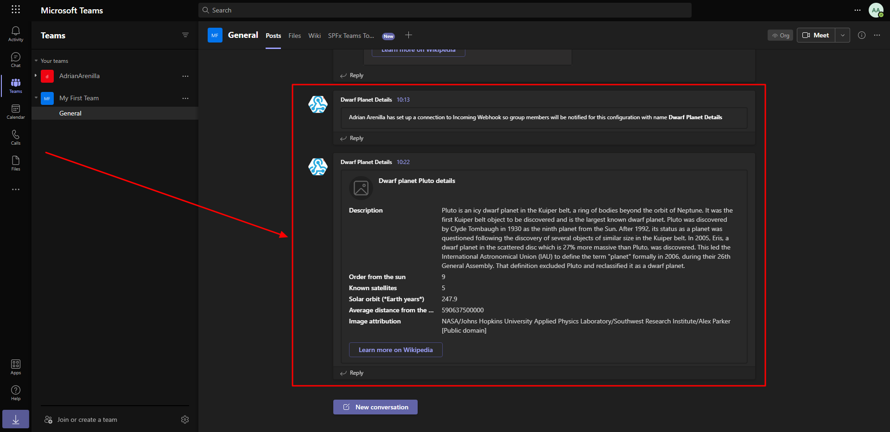

# Microsoft Ms-600 (Adrián Arenilla Seco) - LAB 04

## Exercise 5: Creating incoming webhooks
### [Go to exercise 05 instructions -->](06-Exercise-5-Creating-incoming-webhooks.md)

Register a new incoming webhook.

Enter the name of a channel to add the webhook to, and select the Set up a connector.

Enter the name Dwarf Planet Details and select the Create button.

Test the incoming webhook with Postman.

You should see a message containing your card.

### [<-- Back to readme](../../../../)