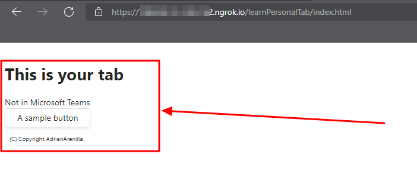
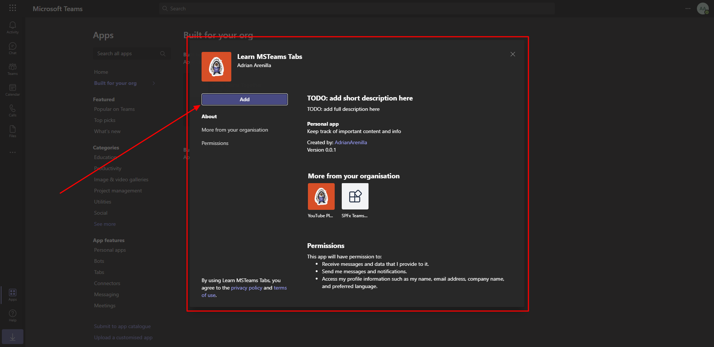
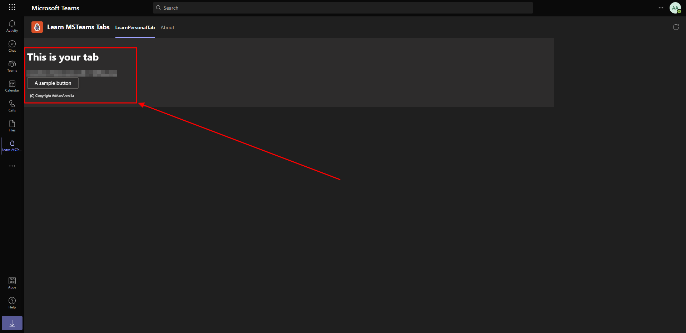
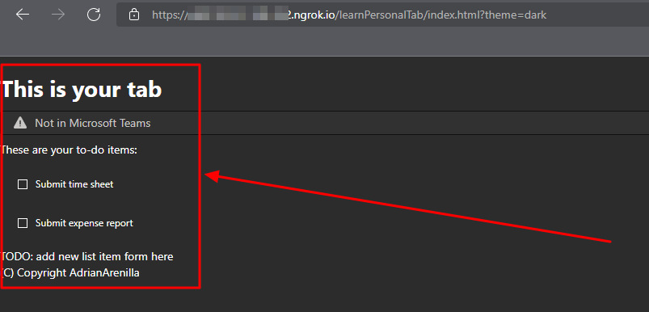
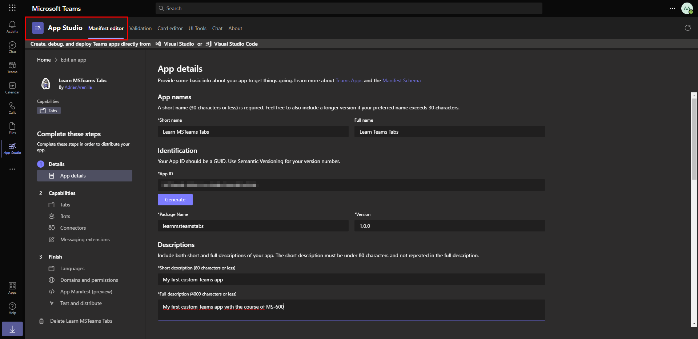
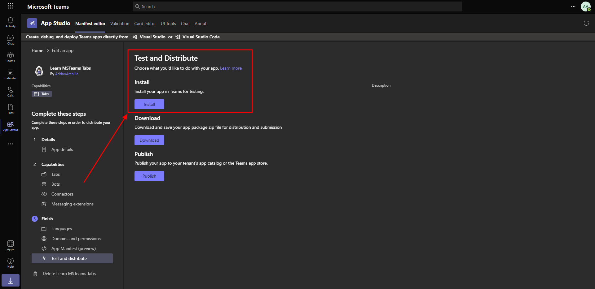
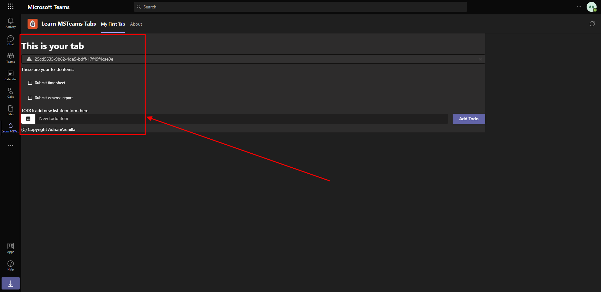

# Microsoft Ms-600 (Adrián Arenilla Seco) - LAB 04

## Exercise 6: Create a custom Microsoft Teams personal tab
### [Go to exercise 06 instructions -->](07-Exercise-6-Create-a-custom-personal-tab.md)

Create Microsoft Teams app.

Open a browser, and go to the ngrok URL displayed in the console and update the URL in the browser to load the tab created by the scaffolding process.

Add the application within Microsoft Teams.

Check that the application is displayed within Teams.

You can test your tab without loading it in Microsoft Teams after update the code to implement the personal tab's user interface.

Use App Studio to update the Microsoft Teams app manifest.

Install the Microsoft Teams app.

Check that the application is displayed within Teams.

### [<-- Back to readme](../../../../)