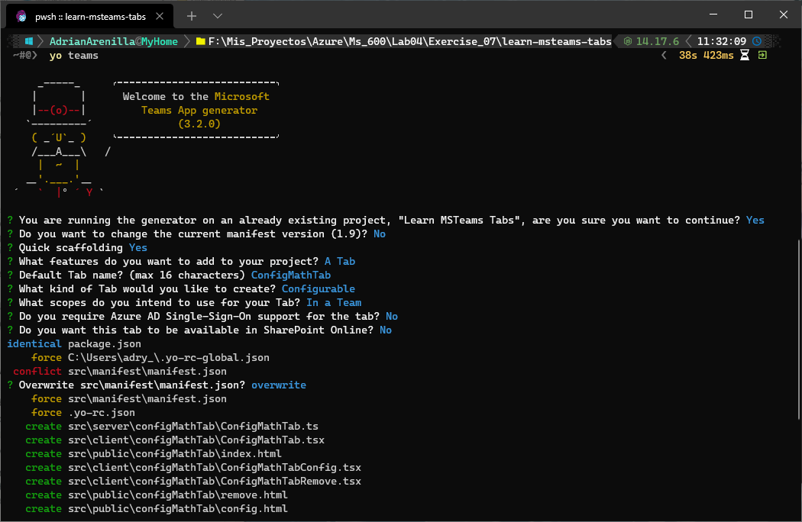
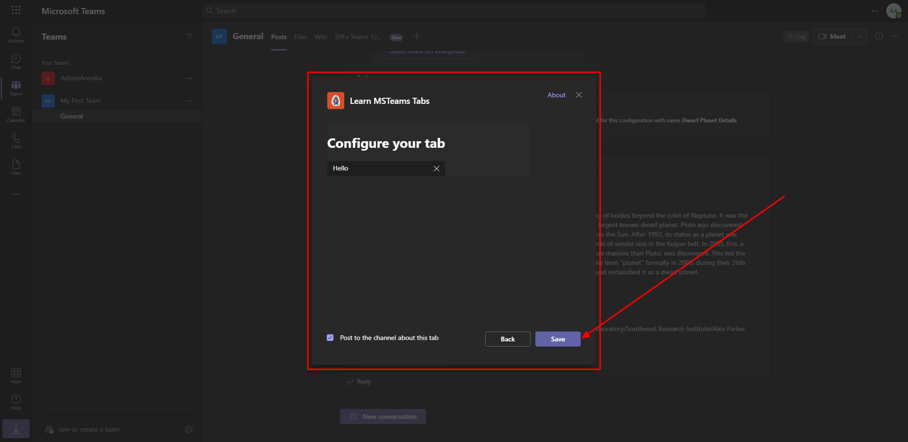
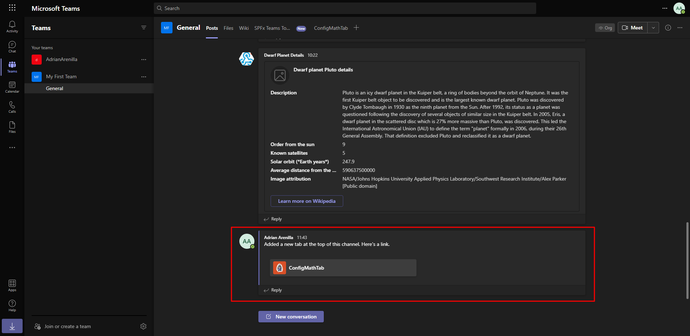
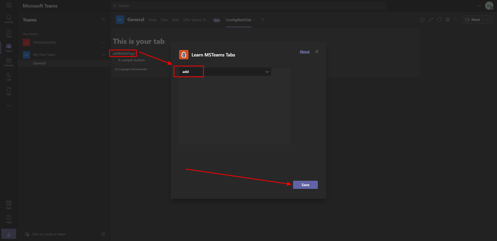
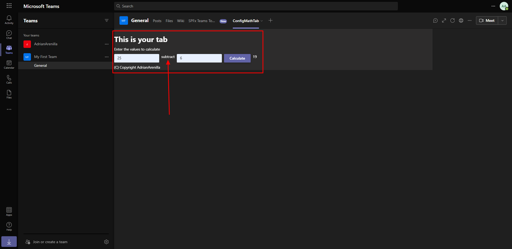
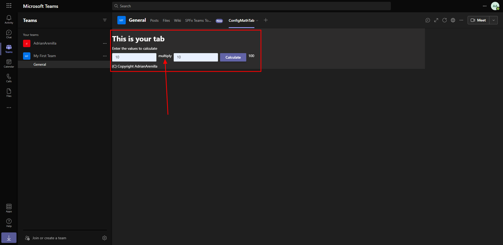
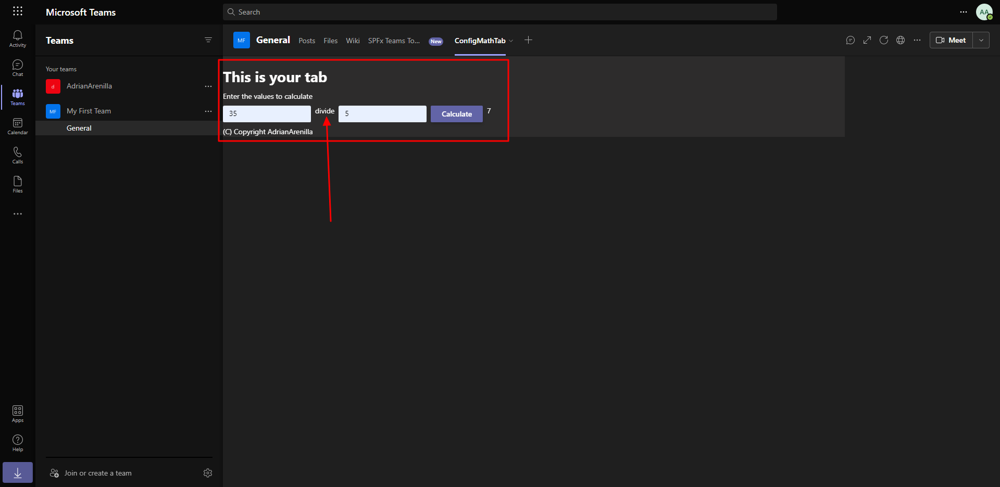

# Microsoft Ms-600 (Adrián Arenilla Seco) - LAB 04

## Exercise 7: Create a custom Microsoft Teams channel tab
### [Go to exercise 07 instructions -->](08-Exercise-7-Create-a-custom-channel-tab.md)

Add a channel app to the Microsoft Teams app project.

Test the channel tab.

Microsoft Teams adds the tab to the channel and displays it for you. You should see the text you entered on the configuration page displayed in the tab.

Update the configuration tab. The tab should display the selected operator with the MathPage suffix.

Implement the channel tab and test with the add (+) operator.

Implement the channel tab and test with the subtract (-) operator.

Implement the channel tab and test with the multiply (*) operator.

Implement the channel tab and test with the divide (/) operator.

### [<-- Back to readme](../../../../)