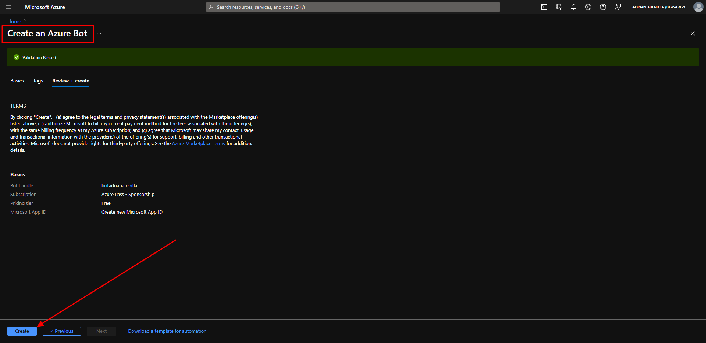
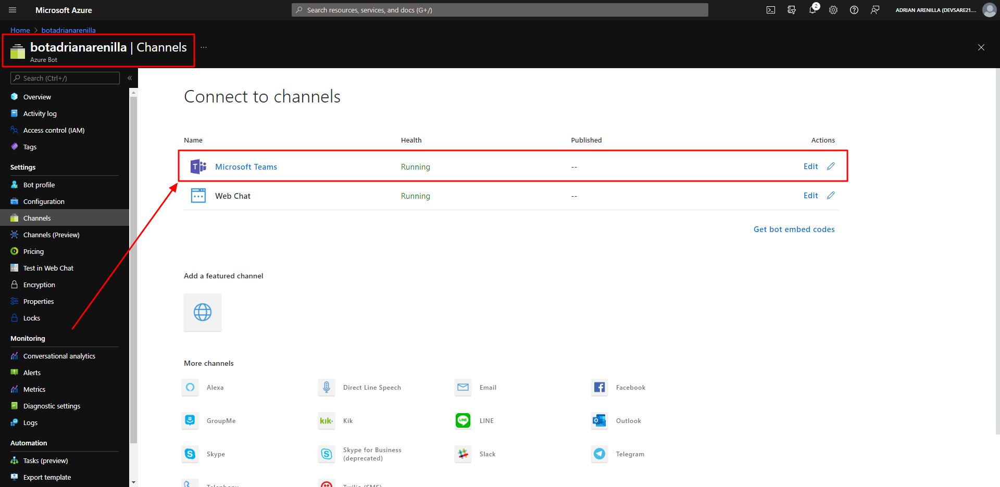
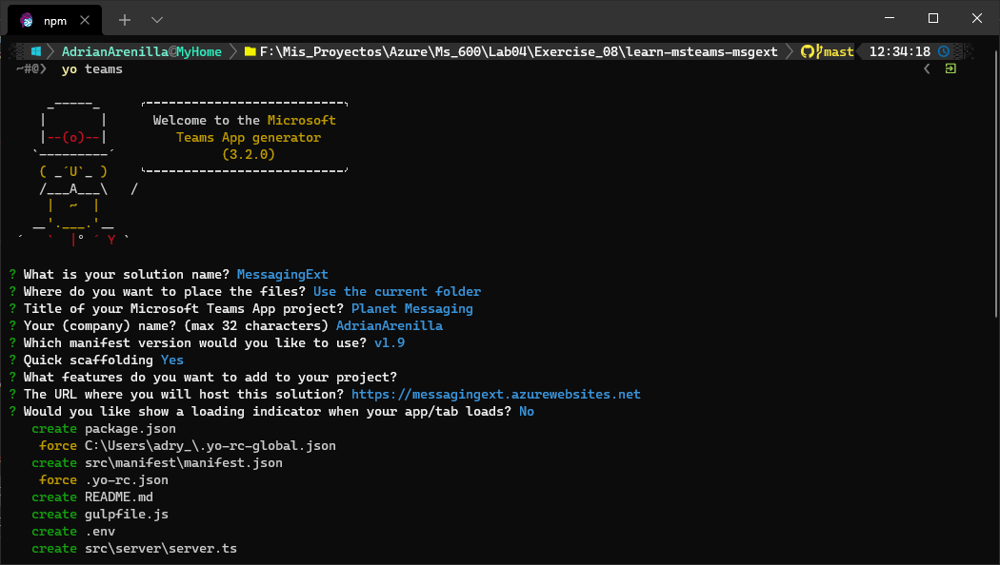
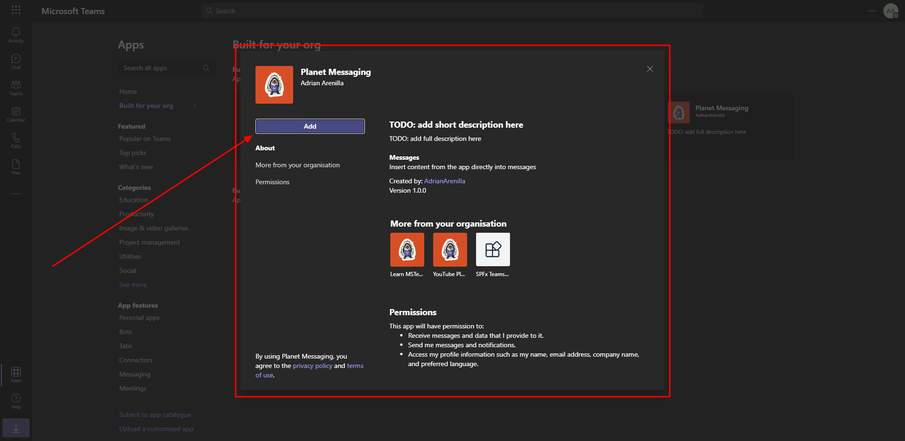
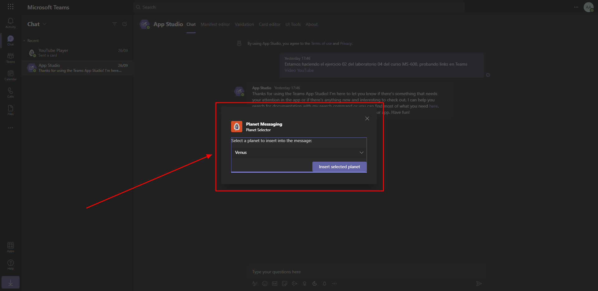
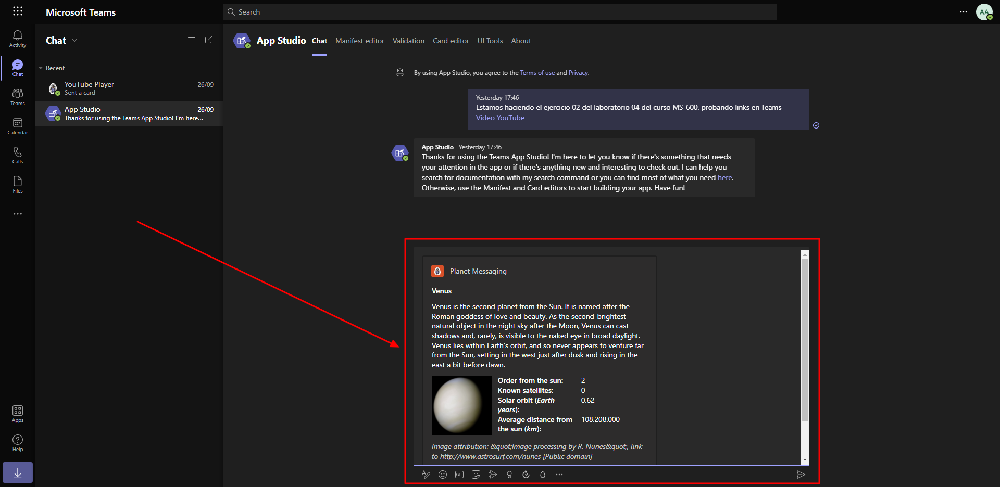
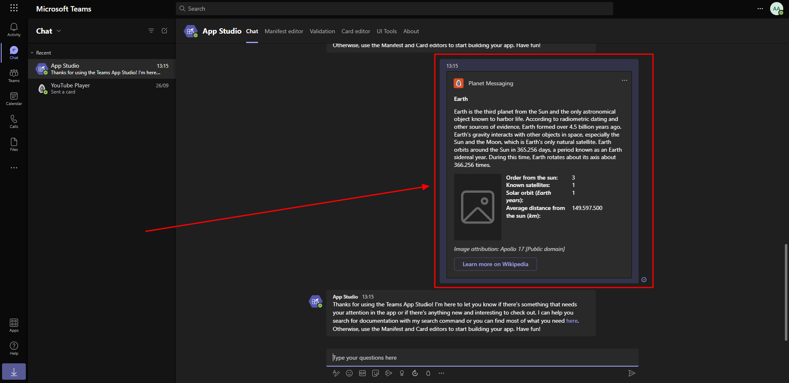

# Microsoft Ms-600 (Adrián Arenilla Seco) - LAB 04

## Exercise 8: Creating action command messaging extensions
### [Go to exercise 08 instructions -->](09-Exercise-8-Creating-action-command-messaging-extensions.md)

Register a new bot in Microsoft Azure.

Enable the Microsoft Teams channel for the bot.

Create Microsoft Teams app.

Install the bot app within Microsoft Teams.

Write the planet to be displayed.

Verify that the result is as expected.

Verify that the result is as expected.

### [<-- Back to readme](../../../../)