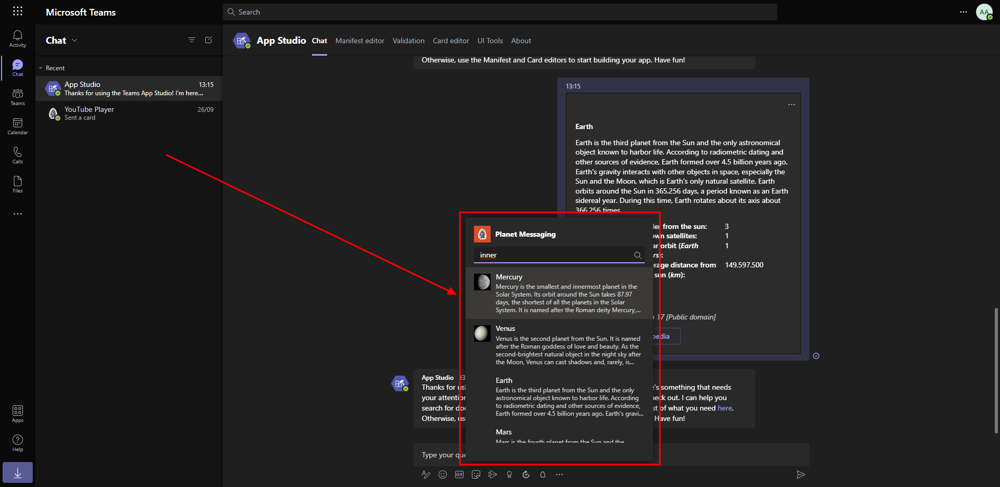
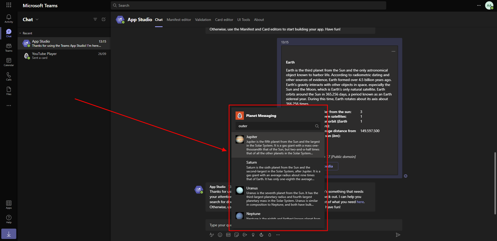

# Microsoft Ms-600 (Adrián Arenilla Seco) - LAB 04

## Exercise 9: Creating search command messaging extensions
### [Go to exercise 09 instructions -->](10-Exercise-9-Creating-search-command-messaging-extensions.md)

Add a new search messaging extension to the Teams application and test that the application displays the planets (inside or outside) of the belt.

Add a new search messaging extension to the Teams application and test that the application displays the planets (inside or outside) of the belt.

### [<-- Back to readme](../../../../)