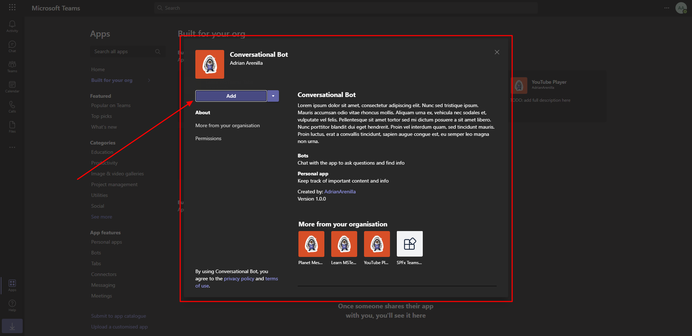

# Microsoft Ms-600 (Adrián Arenilla Seco) - LAB 04

## Exercise 10: Creating conversational bots
### [Go to exercise 10 instructions -->](11-Exercise-10-Creating-conversational-bots.md)

Register a new bot in Microsoft Azure.

Create Microsoft Teams app.

With the bot added to the Teams app, you need to update the manifest in your project. Choose Download button.

Install the custom app in Microsoft Teams.

Type mentionme in the compose box and after a few seconds, you should see the bot respond mentioning the user you are signed in with.

### [<-- Back to readme](../../../../)