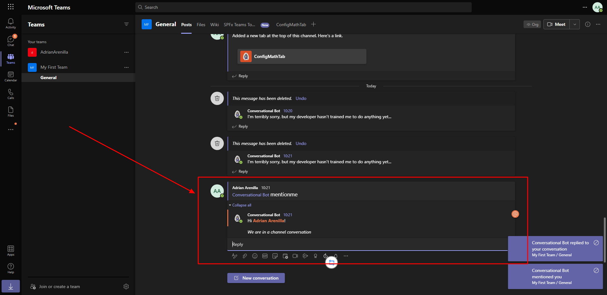
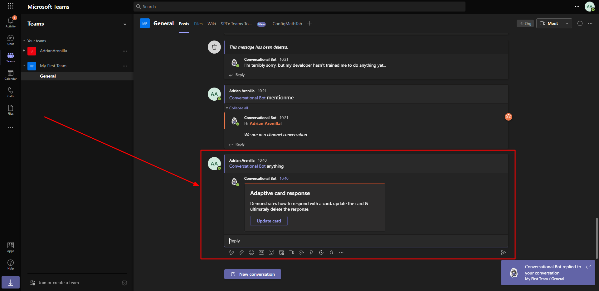
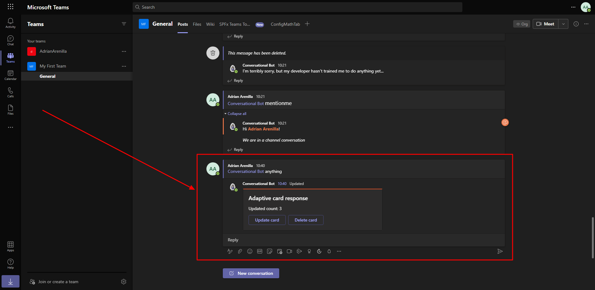
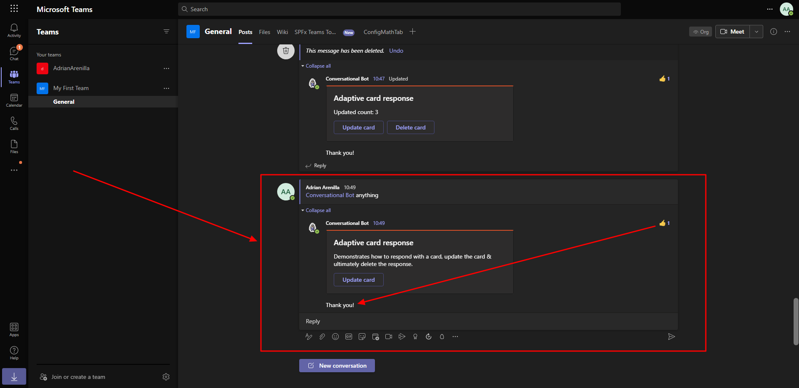

# Microsoft Ms-600 (Adrián Arenilla Seco) - LAB 04

## Exercise 11: Bots in channels and group chats
### [Go to exercise 11 instructions -->](12-Exercise-11-Bots-in-channels-and-group-chats.md)

Add channel support to a conversational bot.

Reply to messages with Adaptive cards.

Test the bot updating existing messages.

Reply to message reactions.

### [<-- Back to readme](../../../../)