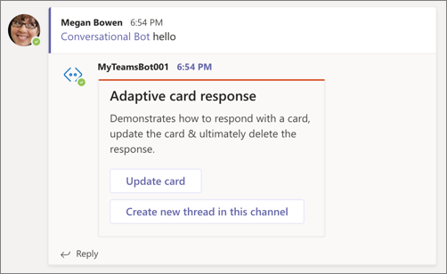

# Exercise 12: Sending proactive messages from bots

In this exercise, you’ll update the existing Teams app from the previous exercise to send a proactive message from your bot.

> [!IMPORTANT]
> This exercise assumes you have created the Microsoft Teams app project with the Yeoman generator

## Task 1: Send a proactive message from the bot

1. Locate and open the bot in the file **./src/server/conversationalBot/ConversationalBot.ts**.

1. Add the following objects to the existing `import {...} from "botbuilder";` statement you'll need:

    ```typescript
    import {
      ConversationReference,
      ConversationParameters,
      teamsGetChannelId,
      Activity,
      BotFrameworkAdapter,
      // existing imports omitted for clarity
    } from "botbuilder";
    ```

1. Locate the card in the `else` statement in the `onMessage()` handler you added in the previous section.

1. Add a second action button to the card that will trigger the creation of a new message:

    ```typescript
    {
      type: "Action.Submit",
      title: "Create new thread in this channel",
      data: { cardAction: "newconversation" }
    }
    ```

    The card should now look like the following:

    ```typescript
    const card = CardFactory.adaptiveCard({
      $schema: "http://adaptivecards.io/schemas/adaptive-card.json",
      type: "AdaptiveCard",
      version: "1.0",
      body: [
        {
          type: "Container",
          items: [
            {
              type: "TextBlock",
              text: "Adaptive card response",
              weight: "bolder",
              size: "large"
            }
          ]
        },
        {
          type: "Container",
          items: [
            {
              type: "TextBlock",
              text: "Demonstrates how to respond with a card, update the card & ultimately delete the response.",
              wrap: true
            }
          ]
        }
      ],
      actions: [
        {
          type: "Action.Submit",
          title: "Update card",
          data: value
        },
        {
          type: "Action.Submit",
          title: "Create new thread in this channel",
          data: { cardAction: "newconversation" }
        }
      ]
    });
    ```

1. Next, add another `case` statement to the `switch (context.activity.value.cardAction)` statement the `onMessage()` handler to detect this new action:

    ```typescript
    case "newconversation":
      const message = MessageFactory.text("This will be the first message in a new thread");
      await this.teamsCreateConversation(context, message);
      break;
    ```

1. The last step is to add the `teamsCreateConversation()` method that will create the new conversation. Add the following method to the `ConversationalBot` class:

    ```typescript
    private async teamsCreateConversation(context: TurnContext, message: Partial<Activity>): Promise<void> {
      // get a reference to the bot adapter & create a connection to the Teams API
      const adapter = <BotFrameworkAdapter>context.adapter;
      const connectorClient = adapter.createConnectorClient(context.activity.serviceUrl);

      // set current teams channel in new conversation parameters
      const teamsChannelId = teamsGetChannelId(context.activity);
      const conversationParameters: ConversationParameters = {
        isGroup: true,
        channelData: {
          channel: {
            id: teamsChannelId
          }
        },
        activity: message as Activity,
        bot: context.activity.recipient
      };
      
      // create conversation and send message
      await connectorClient.conversations.createConversation(conversationParameters);
    }
    ```

### Test the bot sending new messages

1. From the command line, navigate to the root folder for the project and execute the following command:

    ```console
    gulp ngrok-serve
    ```

> [!IMPORTANT]
> Recall from a previous exercise, Ngrok will create a new subdomain. You need to update your bot registration's **Messaging endpoint** in the Azure portal (*shown in a previous exercise*) with this new domain before testing it.

1. In the Microsoft Teams client, go to the channel you installed the bot in the previous section. From the **Conversations** tab, @mention the bot with a random string to trigger the `else` condition.

    The bot will reply to the message with the updated card that contains two buttons:

   

1. Select the second button, **Create new thread in this channel**. Within a few seconds, you should see a new conversation appear in the channel:

    

## Summary

In this exercise, you modified the existing Microsoft Teams app to send a proactive message from your bot.


### [Go to exercise 13 instructions -->](../Exercise_13/14-Exercise-13-Getting-started-with-the-teamwork-endpoint.md)

### [<-- Back to exercise 11 instructions](../Exercise_11/12-Exercise-11-Bots-in-channels-and-group-chats.md)

### [<-- Back to readme](../../../)