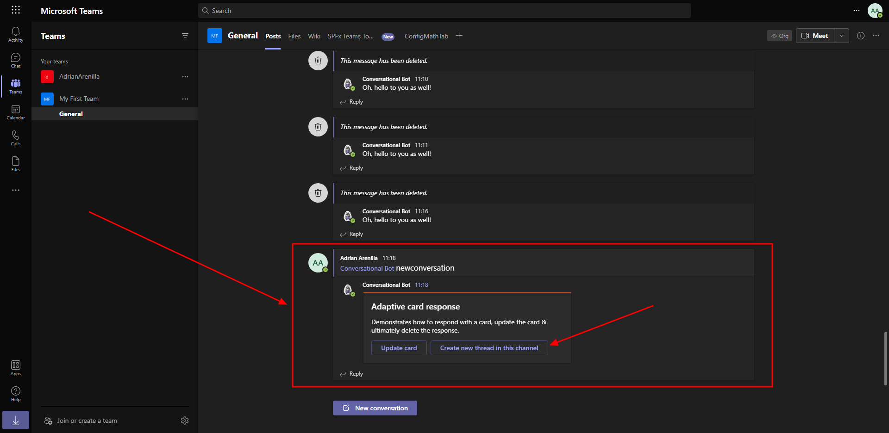
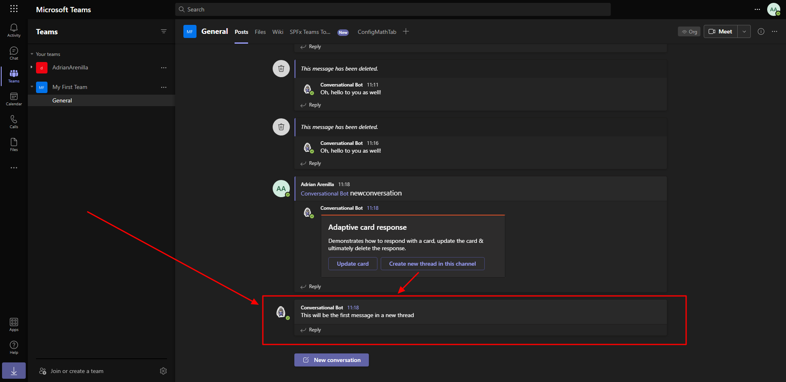

# Microsoft Ms-600 (Adrián Arenilla Seco) - LAB 04

## Exercise 12: Sending proactive messages from bots
### [Go to exercise 12 instructions -->](13-Exercise-12-Sending-proactive-messages-from-bots.md)

Send a proactive message from the bot.

Select the second button, Create new thread in this channel. Within a few seconds, you should see a new conversation appear in the channel.

### [<-- Back to readme](../../../../)