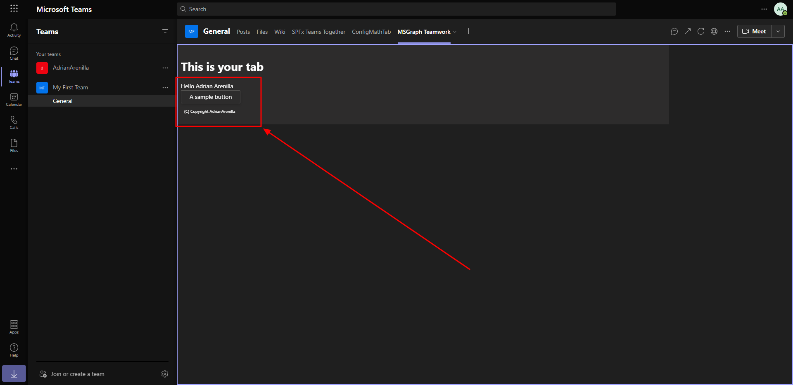

# Microsoft Ms-600 (Adrián Arenilla Seco) - LAB 04

## Exercise 13: Getting started with the teamwork endpoint
### [Go to exercise 13 instructions -->](14-Exercise-13-Getting-started-with-the-teamwork-endpoint.md)

Create your Microsoft Teams app project.

Install the custom app in Microsoft Teams.

When the tab loads, it will initiate the SSO process with Azure AD and obtain an ID token. This token contains the basic identification information about the current user. The current user's display name is included in this token and is displayed in the tab.

Notice it's now displaying the current user's profile photo.

Note that the Teams in which you are a user are now displayed.

### [<-- Back to readme](../../../../)