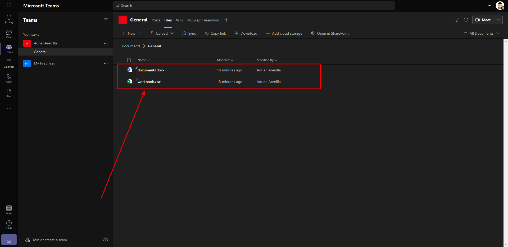
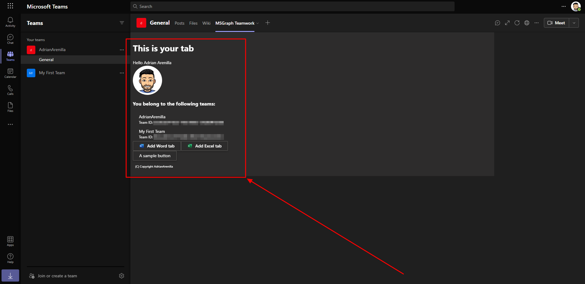
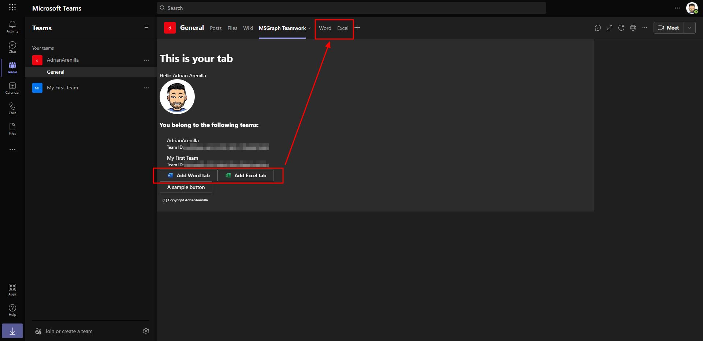

# Microsoft Ms-600 (Adrián Arenilla Seco) - LAB 04

## Exercise 14: Configure a built-in tab with Microsoft Graph
### [Go to exercise 14 instructions -->](15-Exercise-14-Configure-a-built-in-tab-with-Microsoft-Graph.md)

Add documents to the channel (Word and Excel).

Update the user info to add a Word button and Excel button.

The buttons add a Word tab and an Excel tab.

### [<-- Back to readme](../../../../)