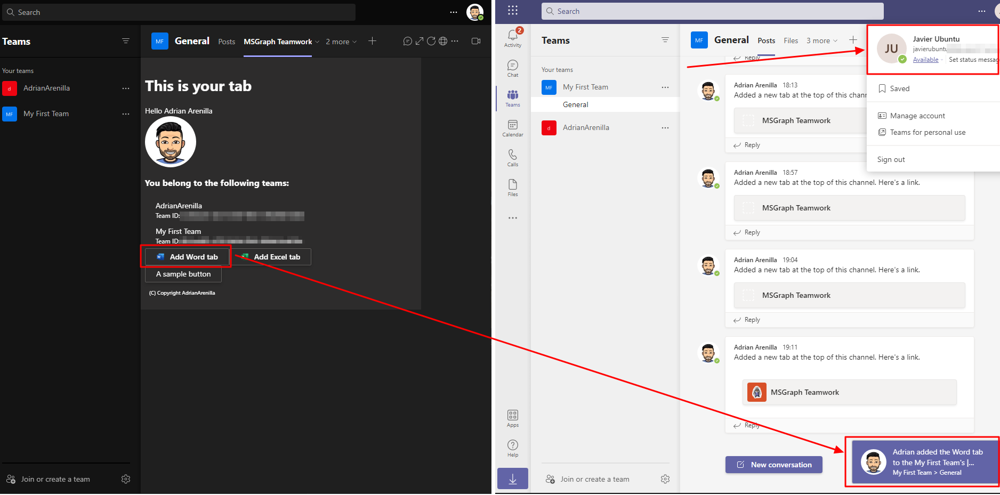
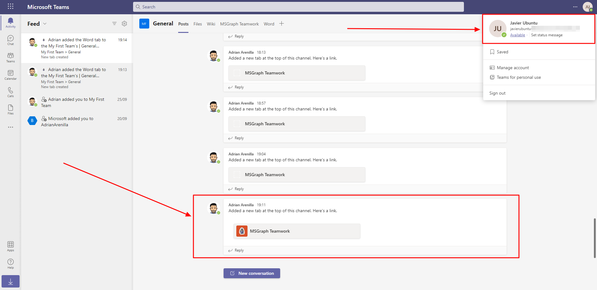

# Microsoft Ms-600 (Adrián Arenilla Seco) - LAB 04

## Exercise 15: Use Microsoft Graph to post to the activity feed
### [Go to exercise 15 instructions -->](16-Exercise-15-Use-Microsoft-Graph-to-post-to-the-activity-feed.md)

 Select the Add Word tab button in the tab and watch the Microsoft Teams instance that the other user (for example: Javier Ubuntu in this case) is signed into.

Select the Activity feed from the activity bar to see the entry listed in Javier's Activity feed.

### [<-- Back to readme](../../../../)