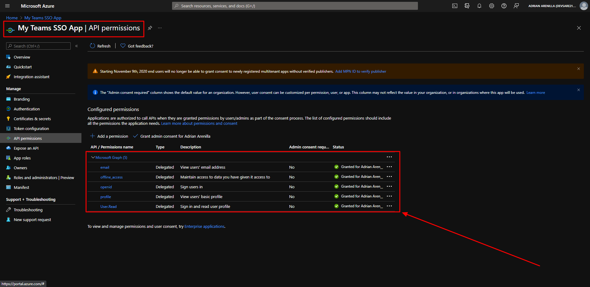

# Microsoft Ms-600 (Adrián Arenilla Seco) - LAB 04

## Exercise 16: Implement single sign-on for Microsoft Teams apps
### [Go to exercise 16 instructions -->](17-Exercise-16-Implement-single-sign-on-for-Microsoft-Teams-apps.md)

Register an Azure AD application to support single sign-on (SSO).

Configure API permissions.

Expose an API for the app.

### [<-- Back to readme](../../../../)