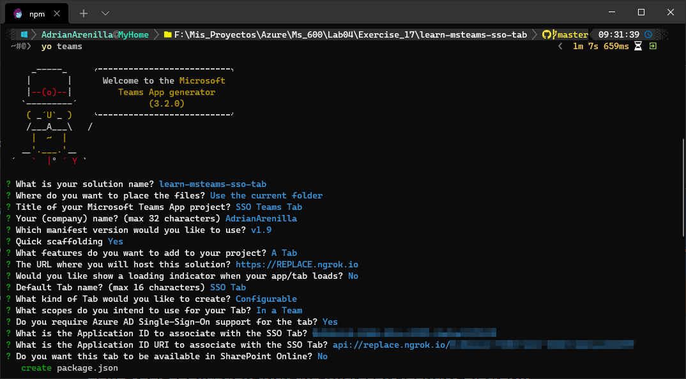
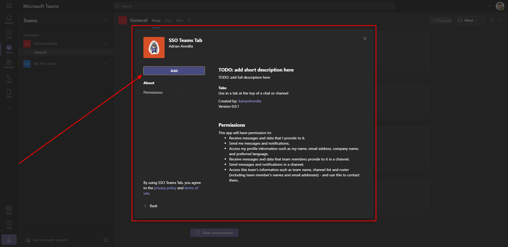
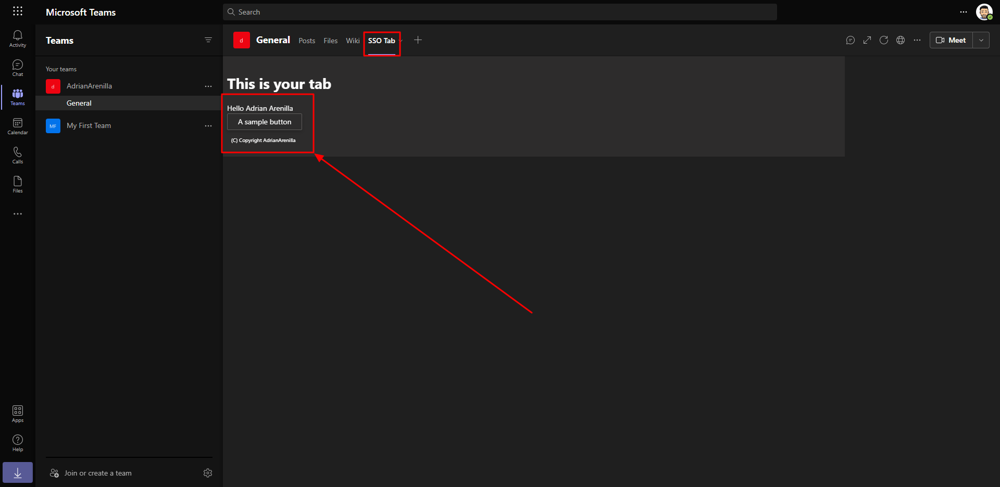
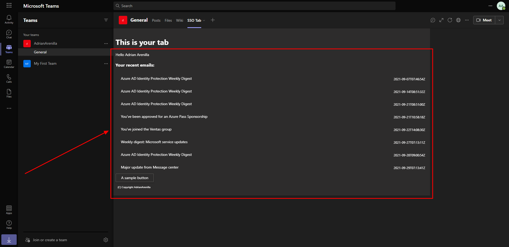

# Microsoft Ms-600 (Adrián Arenilla Seco) - LAB 04

## Exercise 17: Implement single sign-on with Microsoft Teams tabs
### [Go to exercise 17 instructions -->](18-Exercise-17-Implement-single-sign-on-with-Microsoft-Teams-tabs.md)

Create your Microsoft Teams app project.

Install the custom app in Microsoft Teams.

When the tab loads, it will initiate the SSO process with Azure AD and obtain an ID token. This token contains the basic identification information about the current user. The current user's display name is included in this token and is displayed in the tab.

Notice how it's now displaying all your recent emails.

### [<-- Back to readme](../../../../)