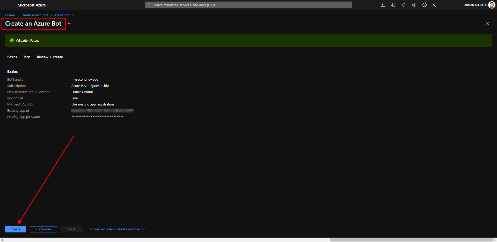
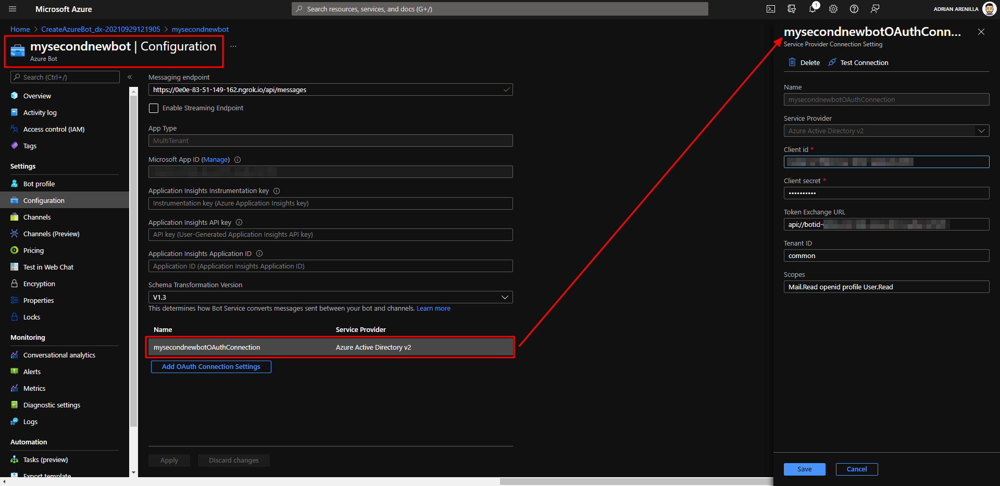
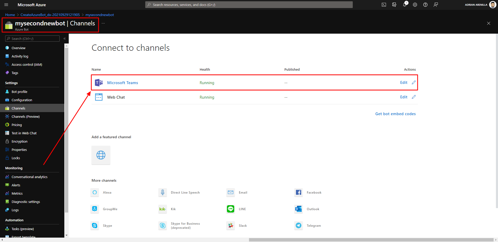
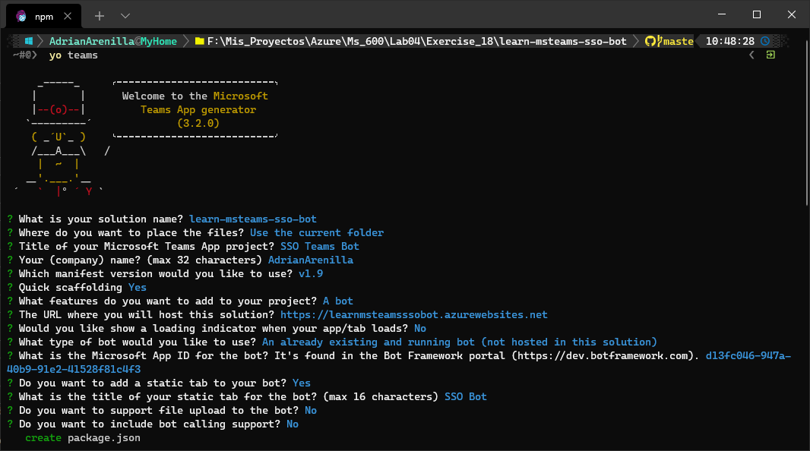
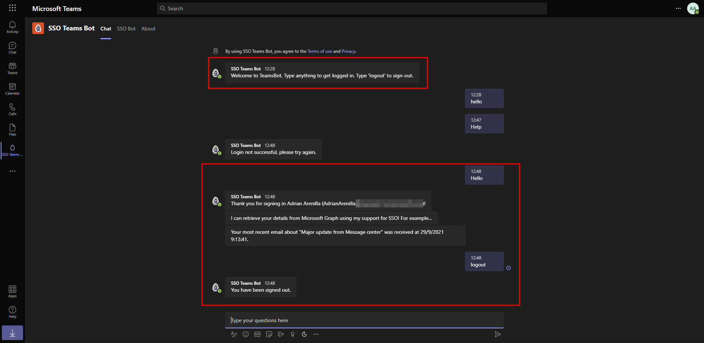

# Microsoft Ms-600 (Adrián Arenilla Seco) - LAB 04

## Exercise 18: Implement single sign-on with Microsoft Teams bots
### [Go to exercise 18 instructions -->](19-Exercise-18-Implement-single-sign-on-with-Microsoft-Teams-bots.md)

Register the bot with the Microsoft Azure Bot Framework.

Configure the bot service connection (token store).

Enable the Microsoft Teams channel for the bot.

Create your Microsoft Teams app project.

You should see the bot post its introductory message. Start the sign in process by entering any message, such as "Hello". You should see the bot display information about the currently signed in user. Finally, enter "logout" to start the sign-out process.

### [<-- Back to readme](../../../../)