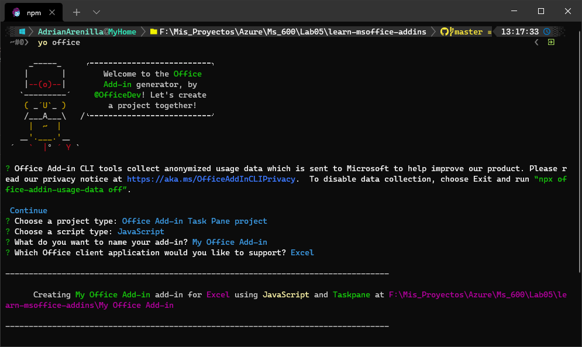
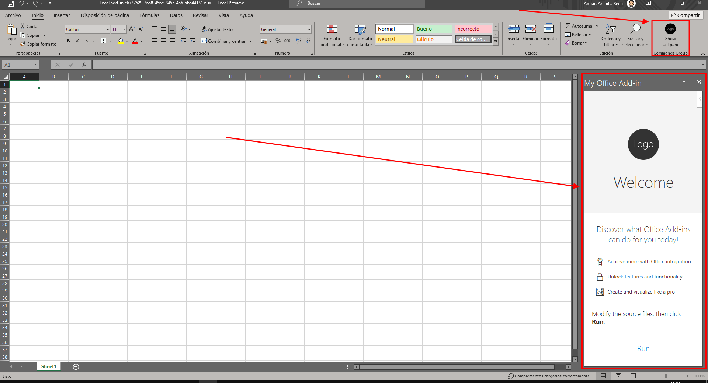
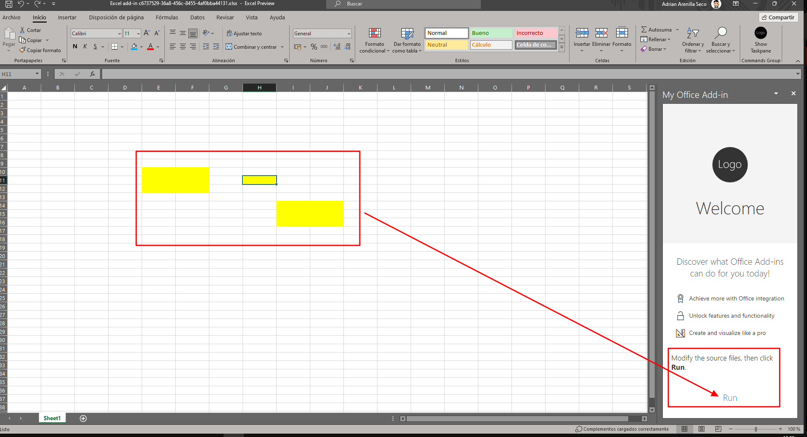

# Microsoft Ms-600 (Adrián Arenilla Seco) - LAB 05

## Exercise 1: Understanding fundamental components and types of Office Add-ins
### [Go to exercise 01 instructions -->](02-Exercise-1-Understanding-fundamental-components-and-types-of-Office-Add-ins.md)

Build an Excel task pane add-in.

In Excel, choose the Show Taskpane button in the ribbon to open the add-in task pane.

Choose the Run link to set the color of the selected range to yellow.

### [<-- Back to readme](../../../../)