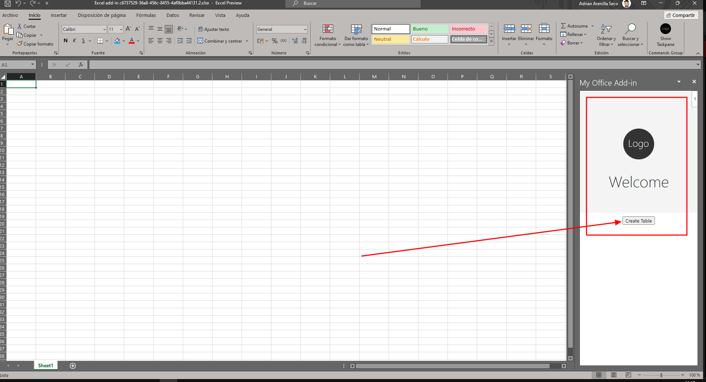
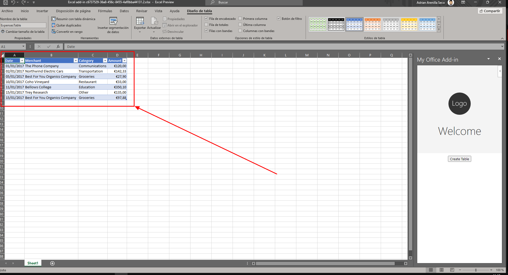
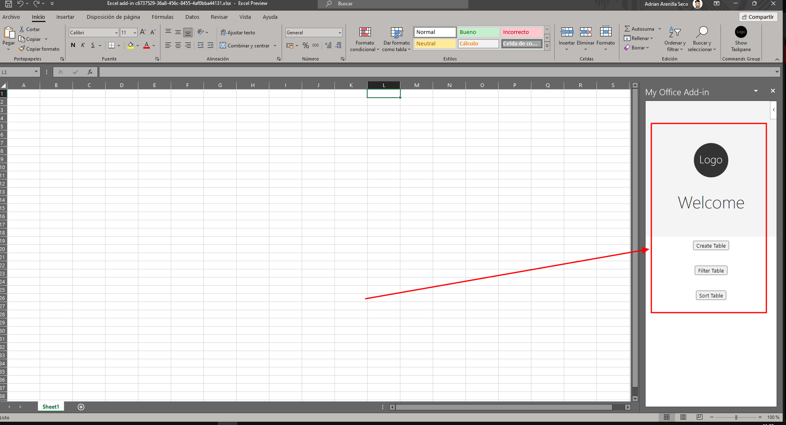
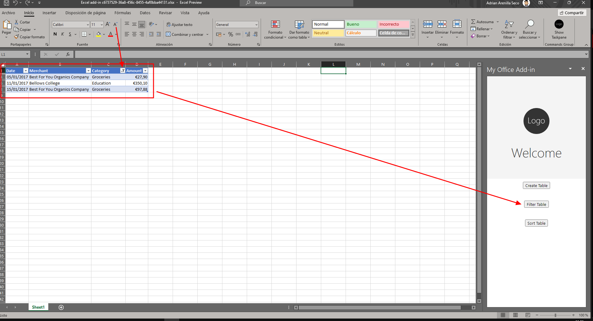
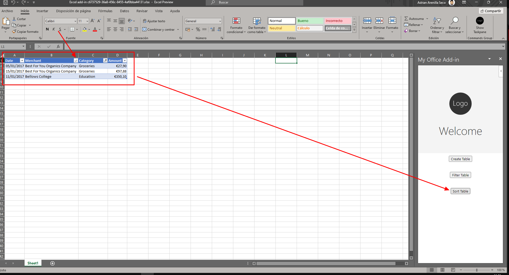
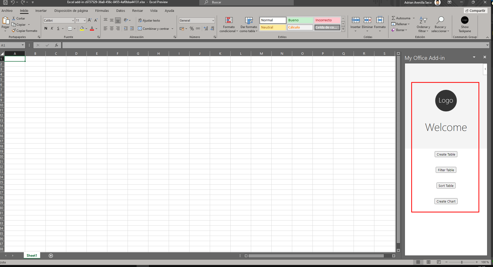
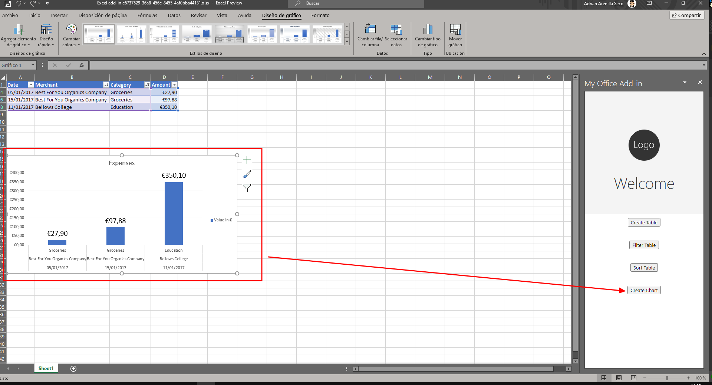
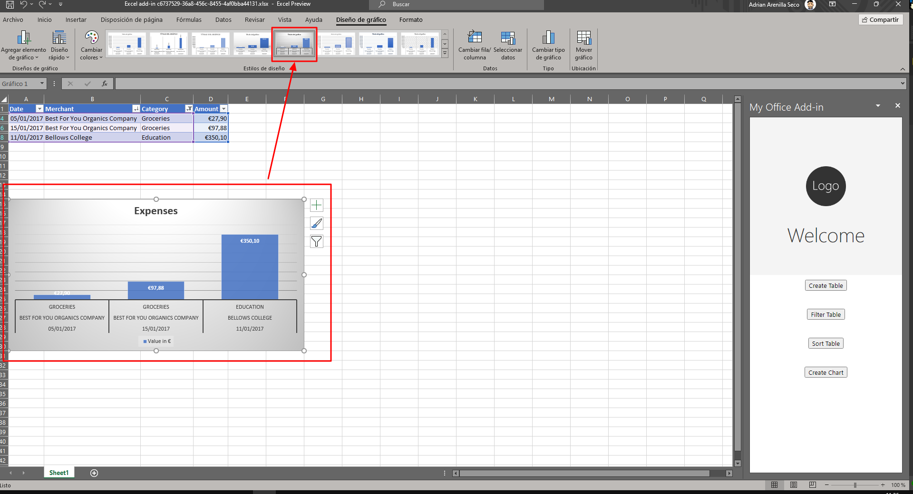

# Microsoft Ms-600 (Adrián Arenilla Seco) - LAB 05

## Exercise 2: Understanding Office JavaScript APIs
### [Go to exercise 02 instructions -->](03-Exercise-2-Understanding-Office-JavaScript-APIs.md)

Create a button table.

Choose the Create Table button for create the table.

Create a button filter and a button sort for the table.

Choose the Filter table button for filter the table.

Choose the Sort table button for filter the table.

Create a button chart.

Choose the Graph button to create a graph of the data in the table.

You can choose the type of graph you want to display.

### [<-- Back to readme](../../../../)